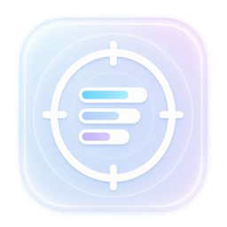

<p align="center">
  
</p>

<h1 align="center">SpendScope</h1>

<p align="center">在 macOS 菜单栏查看 Codex Token 用量、额度状态和使用趋势。</p>

<p align="center">仅在本机运行 · 无需额外登录 · 不上传使用数据</p>

## 关于 SpendScope

SpendScope 是一款面向 Codex 用户的 macOS 菜单栏应用。它读取 Codex CLI 和 Codex macOS 应用保存在本机的使用记录，将分散的 Token 与额度信息整理成容易查看的菜单栏摘要和详细看板。

SpendScope 是第三方本地工具，并非 OpenAI 官方产品。

## 主要功能

- **菜单栏额度**：随时查看 5 小时和 7 天额度的已用或剩余比例，以及距离重置的时间。
- **Token 看板**：汇总今日、近 7 日、近 30 日和累计用量，并区分未缓存输入、缓存输入、可见输出与推理 Token。
- **趋势与日历**：通过趋势图和月度用量日历观察每天的使用变化。
- **使用排行**：查看 Skills、Tools 的调用次数，以及不同项目的 Token 用量与占比。
- **额度提醒**：当剩余额度达到 20%、10% 或 5% 时发送 macOS 通知，可分别监控 5 小时和 7 天额度。
- **自动刷新**：默认每 60 秒读取一次新增记录，也支持随时手动刷新或全量重建本地统计。
- **状态栏定制**：可选择显示的额度、已用/剩余口径、重置倒计时，并支持让详细看板置顶。

## 系统要求

- macOS 14 或更高版本。
- 已在这台 Mac 上使用过 Codex CLI 或 Codex macOS 应用。

SpendScope 依赖本机 Codex 产生的使用记录；如果尚未使用 Codex，应用中暂时不会有可统计的数据。

## 安装

### 从 Releases 安装

1. 前往 [SpendScope Releases](https://github.com/ychp/SpendScope/releases)。
2. 下载发布页面中的 `SpendScope-macOS-unsigned.dmg`。
3. 打开 DMG，将 SpendScope 拖入“应用程序”文件夹。

### 首次打开

当前安装包尚未使用 Apple Developer ID 签名和公证。首次启动时，请在 Finder 的“应用程序”中右键 SpendScope，选择“打开”，然后在系统提示中再次确认。

后续可像普通应用一样直接启动。无需关闭 macOS 的全局安全设置。

### 提示“应用已损坏”

macOS 可能会对从网络下载的未签名应用显示“已损坏，无法打开”。确认 DMG 来自本项目的 [GitHub Releases](https://github.com/ychp/SpendScope/releases) 后，将 SpendScope 拖入“应用程序”文件夹，打开“终端”并执行：

```bash
xattr -dr com.apple.quarantine /Applications/SpendScope.app
```

然后再次双击应用即可。如果没有安装到“应用程序”文件夹，请将命令中的路径替换为 `SpendScope.app` 的实际位置。

## 开始使用

1. 启动 SpendScope，菜单栏中会出现应用图标和额度摘要。
2. 点击菜单栏项目，可以查看今日 Token、额度状态和 Token 构成。
3. 点击“打开看板”，查看用量趋势、用量日历、Skills / Tools 排行和项目用量。
4. 打开“设置”，可以调整状态栏样式、额度提醒、自动刷新和看板置顶。

应用启动后会先显示上次保存的统计，再从本机 Codex 数据中补充新增记录。

## 数据口径

| 指标 | 说明 |
| --- | --- |
| 今日 / 7 日 / 30 日 / 累计 | 对应周期内从本机 Codex 记录中识别出的 Token 用量 |
| 5 小时 / 7 天额度 | Codex 最近一次返回的额度使用比例和重置时间 |
| 未缓存输入 | 没有命中缓存的输入 Token |
| 缓存输入 | 命中缓存的输入 Token |
| 可见输出 | 回复中可见内容使用的输出 Token |
| 推理 | 模型内部推理使用的 Token |
| Skills / Tools | 本机记录中识别出的调用次数 |
| 项目用量 | 按 Codex 会话工作目录汇总的 Token 用量 |

每日用量按 UTC 日期归属，以尽量与 Codex 个人资料中的每日统计保持一致。由于 SpendScope 统计本地记录，而 Codex 个人资料使用服务端汇总并可能进行显示取整，两处数字不一定完全相同。已删除、未同步到本机或无法识别的历史记录也不会出现在 SpendScope 中。

## 数据与隐私

SpendScope 只读取统计所需的本机 Codex 字段，例如 Token 计数、额度窗口、模型、套餐、会话来源、工作目录以及 Skills / Tools 调用标识。

它不会读取、保存或上传以下内容：

- 提示词、消息、回复、摘要和推理正文；
- 工具输入、文件内容或项目代码；
- `auth.json` 等认证文件的内容。

整理后的统计与导入进度只保存在：

```text
~/Library/Application Support/SpendScope/SpendScope.sqlite
```

SpendScope 不会将这些数据上传到网络，也不会修改或删除 Codex 的原始记录。

## 刷新与数据修复

在“设置 → 数据与刷新”中可以执行两种操作：

- **立即刷新**：只读取上次刷新后新增或变化的本机记录，适合日常使用。
- **清空并重抓**：清空 SpendScope 自己保存的统计和导入进度，然后从本机 Codex 数据重新计算。它不会删除 Codex 原始数据。

如果数据长时间没有更新、升级后统计口径发生变化，或某一天的数字明显异常，可以尝试“清空并重抓”。

## 常见问题

### 启动后没有数据

先确认已在这台 Mac 上使用 Codex，然后在 SpendScope 中点击“立即刷新”。设置页的“数据与刷新”区域会显示 Codex CLI、Codex macOS 和线程索引是否可读取。

### 看不到额度信息

额度需要等待 Codex 在本机记录中产生新的额度观测。缺失或已经过期的额度不会被推断为满额，SpendScope 会暂时显示为空。

### 没有收到额度提醒

请确认已在 SpendScope 设置中开启“用量提醒”，并在 macOS“系统设置 → 通知”中允许 SpendScope 发送通知。同一额度周期的同一档位只提醒一次。

### 为什么和 Codex 个人资料中的数字不完全一样

SpendScope 根据本机 Codex 记录计算，Codex 个人资料则来自服务端汇总。日期归属、显示取整、跨设备使用、历史文件是否仍保留在本机等因素都可能造成差异。

## 当前限制

- 暂不提供费用估算、账单或 API Key 消费分析。
- 不会从服务端同步其他设备的 Codex 使用记录。
- Codex 本地数据格式发生不兼容变化时，部分统计可能暂时无法更新；应用会保留已有数据并显示来源异常。
- 当前发布包未签名、未公证，首次打开需要手动确认。

## 反馈问题

如遇到数据异常、无法启动或有功能建议，请在 [GitHub Issues](https://github.com/ychp/SpendScope/issues) 中反馈。为了保护隐私，请不要上传包含提示词、回复内容、认证信息或项目代码的原始 Codex 记录。
