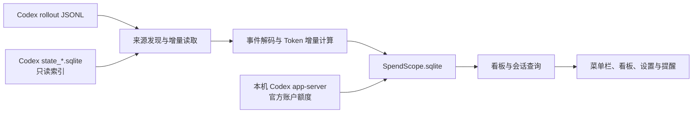
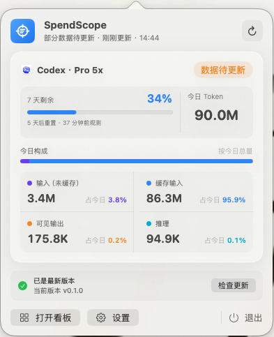
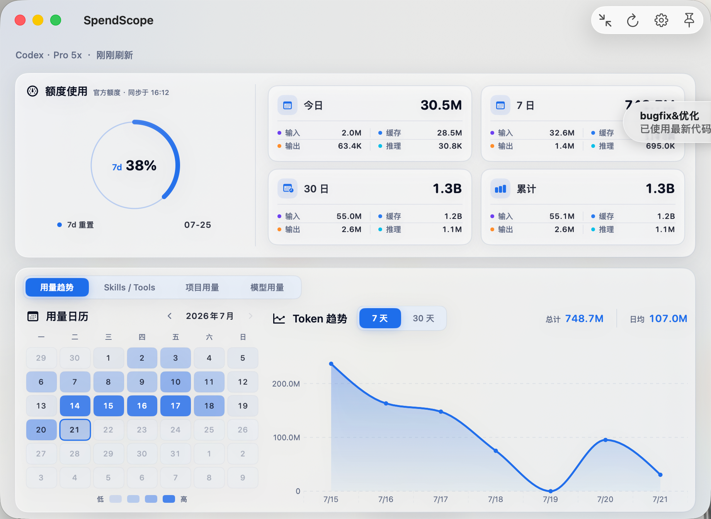
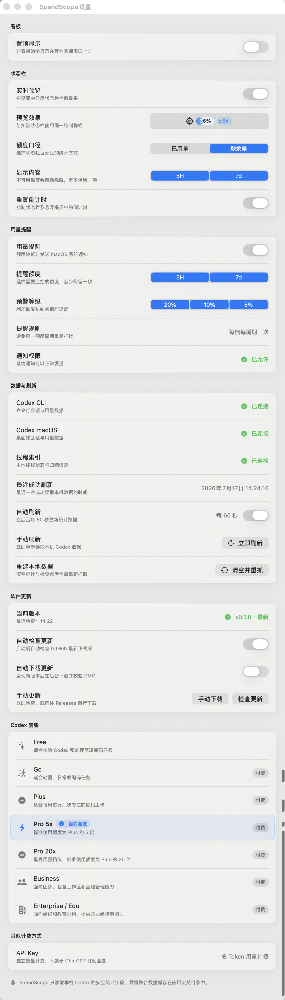

<p align="center">
  
</p>

<h1 align="center">SpendScope</h1>

<p align="center">在 macOS 菜单栏查看 Codex Token 用量、额度状态和使用趋势。</p>

<p align="center">仅在本机运行 · 无需额外登录 · 不上传使用数据</p>

## 关于 SpendScope

SpendScope 是一款面向 Codex 用户的 macOS 菜单栏应用。它读取 Codex CLI 和 Codex macOS 应用保存在本机的使用记录，将分散的 Token 与额度信息整理成容易查看的菜单栏摘要和详细看板。

SpendScope 是第三方本地工具，并非 OpenAI 官方产品。

## 主要功能

- **菜单栏额度**：随时查看 5 小时和 7 天额度的已用或剩余比例，以及距离重置的时间。
- **Token 看板**：汇总今日、近 7 日、近 30 日和累计用量，并区分未缓存输入、缓存输入、可见输出与推理 Token。
- **趋势与日历**：通过趋势图和月度用量日历观察每天的使用变化。
- **使用排行**：查看 Skills、Tools 的调用次数，以及不同项目的 Token 用量与占比。
- **模型与费用**：按模型查看 Token 构成、占比和公开 API 标准价格下的等值费用估算；未收录价格的模型明确标记为未定价。
- **额度提醒**：当剩余额度达到 20%、10% 或 5% 时发送 macOS 通知，可分别监控 5 小时和 7 天额度。
- **自动刷新**：应用启动时会立即刷新一次用量和额度；之后默认每 60 秒读取一次新增用量，用量变化后标记额度待更新，每 120 秒按需检查并刷新额度，没有变化时跳过。可选择仅在系统代理开启时刷新额度；关闭该选项时不会检查代理。因代理未开启而跳过额度刷新时，看板与状态栏弹窗会显示提醒。手动刷新会立即刷新用量，并按相同代理规则刷新额度，也支持全量重建本地统计。
- **状态栏定制**：可选择显示的额度、已用/剩余口径、重置倒计时，并支持让详细看板置顶。
- **软件更新**：启动后可自动检查 GitHub Releases；也可选择自动下载并校验新版 DMG，安装仍由用户确认完成。

## 当前实现

SpendScope 是一个无第三方依赖的原生 macOS App。界面使用 SwiftUI、AppKit 和 Swift Charts，数据层使用系统 SQLite3，异步任务使用 Swift Concurrency 与 Observation。



实现分为四层：

- **采集层**：发现 Codex CLI、Codex Desktop 的活跃和归档 rollout，按文件检查点只读取新增 JSONL。
- **标准化层**：解码 Token、rollout 额度、模型、套餐、会话状态和 Skills / Tools 调用，将累计 Token 转为可聚合增量；官方账户额度通过本机 Codex app-server 单独读取。
- **存储与查询层**：使用应用自有 SQLite 保存去重事件、小时聚合、额度快照、官方额度缓存、来源状态和项目身份，再生成周期、项目、活动和模型排行。
- **展示与系统层**：共享 `DashboardStore` 驱动状态栏、弹窗、看板和设置，并管理额度通知及 GitHub Release 更新检查。

启动时会先展示上一次成功保存的统计，再立即刷新用量和官方额度，最后在后台补齐历史。重复刷新、应用重启和会话归档不会重复累计同一事件。

## 软件界面

### 状态栏


状态栏可以直接显示 5 小时或 7 天额度、已用/剩余比例和重置倒计时。不可用的额度会自动隐藏，显示内容和统计口径都可以在设置中调整。

### 状态栏弹窗



点击状态栏即可查看今日 Token、5 小时与 7 天额度、重置时间和 Token 构成，也可以在这里刷新数据、打开详细看板、进入设置或检查软件更新。

### 详细看板



看板集中展示当前额度、今日/近 7 日/近 30 日/累计 Token，以及用量日历和趋势图。顶部标签可以切换到 Skills / Tools、项目用量和模型用量排行；模型排行同时提供 Token 构成、公开 API 标准价格与费用明细。费用仅为基于本地 Token 的 API 等值估算，不代表 Codex 实际账单，未公开定价的内部模型不会被强行套价。

### 设置



设置页完整包含看板置顶、状态栏展示、额度口径、重置倒计时、用量提醒、数据来源、自动刷新、额度刷新代理检查、数据重建和软件更新。Codex 套餐与其他计费方式区域用于说明订阅和 API Key 的计费差异；模型费用估算统一在详细看板的“模型用量”标签中展示。

## 系统要求

- macOS 14 或更高版本。
- 已在这台 Mac 上使用过 Codex CLI 或 Codex macOS 应用。

SpendScope 依赖本机 Codex 产生的使用记录；如果尚未使用 Codex，应用中暂时不会有可统计的数据。

## 安装

### 从 Releases 安装

1. 前往 [SpendScope Releases](https://github.com/ychp/SpendScope/releases)。
2. 下载发布页面中的 `SpendScope-macOS-unsigned.dmg`。如需查看或自行构建源码，可下载 GitHub 自动生成的 `Source code (zip)` 或 `Source code (tar.gz)`。
3. 打开 DMG，将 SpendScope 拖入“应用程序”文件夹。

发布的应用为通用二进制（Universal Binary），同时支持 Apple 芯片（arm64）和 Intel 芯片（x86_64）的 Mac。

### 首次打开

当前安装包尚未使用 Apple Developer ID 签名和公证。首次启动时，请在 Finder 的“应用程序”中右键 SpendScope，选择“打开”，然后在系统提示中再次确认。

后续可像普通应用一样直接启动。无需关闭 macOS 的全局安全设置。

### 提示“应用已损坏”

macOS 可能会对从网络下载的未签名应用显示“已损坏，无法打开”。确认 DMG 来自本项目的 [GitHub Releases](https://github.com/ychp/SpendScope/releases) 后，将 SpendScope 拖入“应用程序”文件夹，打开“终端”并执行：

```bash
xattr -dr com.apple.quarantine /Applications/SpendScope.app
```

然后再次双击应用即可。如果没有安装到“应用程序”文件夹，请将命令中的路径替换为 `SpendScope.app` 的实际位置。

## 开始使用

1. 启动 SpendScope，菜单栏中会出现应用图标和额度摘要。
2. 点击菜单栏项目，可以查看今日 Token、额度状态和 Token 构成。
3. 点击“打开看板”，查看用量趋势、用量日历、Skills / Tools 排行、项目用量，以及按模型统计的 Token 和 API 等值费用。
4. 打开“设置”，可以调整状态栏样式、额度提醒、自动刷新、软件更新和看板置顶。

应用启动后会先显示上次保存的统计，再立即从本机 Codex 数据中补充新增记录并同步官方额度。

## 数据口径

| 指标 | 说明 |
| --- | --- |
| 今日 / 7 日 / 30 日 / 累计 | 对应周期内从本机 Codex 记录中识别出的 Token 用量 |
| 5 小时 / 7 天额度 | Codex 最近一次返回的额度使用比例和重置时间 |
| 未缓存输入 | 没有命中缓存的输入 Token |
| 缓存输入 | 命中缓存的输入 Token |
| 可见输出 | 回复中可见内容使用的输出 Token |
| 推理 | 模型内部推理使用的 Token |
| Skills / Tools | 本机记录中识别出的调用次数 |
| 项目用量 | 优先按项目名汇总；同名目录通过 Git 仓库指纹识别，属于同一仓库时合并统计；展开后可按最近消息或用量查看任务 |
| 模型用量 | 按模型汇总四类 Token，并提供今日、7 日、30 日和累计排行 |
| API 等值费用 | 按内置公开 API 标准价格目录估算；不等同于 Codex 订阅账单，未定价模型不计入总额 |

每日用量按 UTC 日期归属，以尽量与 Codex 个人资料中的每日统计保持一致。由于 SpendScope 统计本地记录，而 Codex 个人资料使用服务端汇总并可能进行显示取整，两处数字不一定完全相同。已删除、未同步到本机或无法识别的历史记录也不会出现在 SpendScope 中。

## 数据与隐私

SpendScope 只读取统计所需的本机 Codex 字段，例如 Token 计数、额度窗口、模型、套餐、会话来源、工作目录以及 Skills / Tools 调用标识。识别同名项目时还会读取 Git remote、根提交或公共 Git 目录，并且只保存由这些信息生成的哈希指纹，不保存原始 Git 地址或项目路径。

项目用量展开后会显示 Codex 页面上的任务名称。该名称仅从最新 `state_*.sqlite` 的 `threads.name` / `threads.title` 字段只读获取、临时保留在内存中，不会写入 SpendScope 数据库、日志或上传。系统上下文模板不会直接作为名称展示：可识别的 Guardian / 子任务会显示安全的任务类型名称，其余不可用名称回退为匿名任务标识。

除上述只读展示名称外，它不会读取、保存或上传以下内容：

- 提示词、消息、回复、摘要和推理正文；
- 工具输入、文件内容或项目代码；
- `auth.json` 等认证文件的内容。

整理后的统计与导入进度只保存在：

```text
~/Library/Application Support/SpendScope/SpendScope.sqlite
```

SpendScope 不会将这些数据上传到网络，也不会修改或删除 Codex 的原始记录。

刷新官方额度时，SpendScope 会调用本机已安装的 Codex 可执行文件，通过 `app-server --stdio` 请求账户额度；请求不包含 Token 统计、会话内容或项目数据，也不会读取 `auth.json`。启用软件更新检查时，应用还会访问本项目的 GitHub Releases 页面。两类操作都不会上传 SpendScope 保存的统计数据库。

## 刷新与数据修复

在“设置 → 数据与刷新”中可以执行两种操作：

- **立即刷新**：只读取上次刷新后新增或变化的本机记录，适合日常使用。
- **清空并重抓**：清空 SpendScope 自己保存的统计和导入进度，然后从本机 Codex 数据重新计算。它不会删除 Codex 原始数据。

如果数据长时间没有更新、升级后统计口径发生变化，或某一天的数字明显异常，可以尝试“清空并重抓”。

## 常见问题

### 启动后没有数据

先确认已在这台 Mac 上使用 Codex，然后在 SpendScope 中点击“立即刷新”。设置页的“数据与刷新”区域会显示 Codex CLI、Codex macOS 和线程索引是否可读取。

### 看不到额度信息

SpendScope 会优先通过本机 Codex app-server 读取官方账户额度，并缓存最近一次成功结果；实时读取不可用时先使用该缓存，尚无官方缓存时才使用 rollout 中可识别的额度观测。缺失、读取失败或已经过期的额度不会被推断为满额，界面会暂时显示为空。

### 没有收到额度提醒

请确认已在 SpendScope 设置中开启“用量提醒”，并在 macOS“系统设置 → 通知”中允许 SpendScope 发送通知。同一额度周期的同一档位只提醒一次。

### 为什么和 Codex 个人资料中的数字不完全一样

SpendScope 根据本机 Codex 记录计算，Codex 个人资料则来自服务端汇总。日期归属、显示取整、跨设备使用、历史文件是否仍保留在本机等因素都可能造成差异。

## 当前限制

- 费用仅是按本机 Token 和内置公开 API 标准价计算的等值估算，不是 Codex 订阅账单；暂不提供账单对账、预算管理或 API Key 实际消费分析。
- 不会从服务端同步其他设备的 Codex 使用记录。
- Codex 本地数据格式发生不兼容变化时，部分统计可能暂时无法更新；应用会保留已有数据并显示来源异常。
- 当前发布包未签名、未公证，首次打开需要手动确认。

## 工程结构

```text
Sources/SpendScope/
├── App/                  应用入口、生命周期、共享状态和额度提醒
├── Data/
│   ├── Codex/            来源发现、JSONL 解码、增量导入和会话状态
│   ├── Dashboard/        看板与会话查询
│   └── Storage/          SQLite 封装、迁移、事件与检查点
├── Features/
│   ├── Dashboard/        Token 看板、用量日历、活动/项目/模型排行和费用明细
│   ├── MenuBar/          状态栏渲染与弹窗
│   └── Settings/         设置窗口
├── Models/               看板与查询共享模型
├── Resources/            App、状态栏和 Codex 图标
└── Support/              偏好、更新、提醒、模型价格、格式化和视觉系统

Tests/SpendScopeTests/    XCTest 单元与集成测试
SpendScope.xcodeproj/     Xcode 工程和共享 Scheme
script/                   本地构建、运行、调试和日志脚本
.github/workflows/        GitHub Actions 测试与发布流程
docs/                     截图和技术档案
```

按重要程度划分：

- **核心运行与构建**：`Sources/SpendScope/`、`SpendScope.xcodeproj/project.pbxproj` 和共享 Scheme。
- **工程与发布必备**：`Tests/`、`script/`、`.github/`、`README.md`、`docs/` 和 `.gitignore`；它们不进入安装包，但保证项目可测试、可维护、可发布。
- **本机可选或可再生**：`.codex/`、`.worktrees/`、`DerivedData/`、Xcode `xcuserdata/`、`.DS_Store` 等，不影响 App 核心功能。

完整的目录职责、核心文件入口和安全清理边界见 [项目文件结构](docs/PROJECT_STRUCTURE.md)。

核心数据链路对应以下文件：

| 模块 | 入口文件 |
| --- | --- |
| 数据发现 | `Data/Codex/CodexSourceDiscovery.swift` |
| 官方额度读取 | `Data/Codex/CodexAccountRateLimitReader.swift` |
| 增量读取 | `Data/Codex/IncrementalJSONLReader.swift` |
| 事件解码 | `Data/Codex/CodexEventDecoder.swift` |
| Token 计算 | `Data/Codex/UsageAccumulator.swift` |
| 幂等导入 | `Data/Codex/CodexImporter.swift` |
| SQLite 存储 | `Data/Storage/UsageStore.swift` |
| 看板查询 | `Data/Dashboard/DashboardQueryService.swift` |
| 模型价格与估算 | `Support/ModelPricing.swift` |
| 全局状态 | `App/DashboardStore.swift` |

## 本地开发

环境要求：

- macOS 14 或更高版本；
- Xcode 26.6 或兼容的 Swift 6 Xcode；
- 首次使用 Xcode 时已接受许可协议并安装所需组件。

运行完整测试：

```bash
DEVELOPER_DIR=/Applications/Xcode.app/Contents/Developer \
  xcodebuild -project SpendScope.xcodeproj \
  -scheme SpendScope \
  -configuration Debug \
  -destination "platform=macOS,arch=arm64" \
  -derivedDataPath /private/tmp/SpendScope-Tests \
  test
```

构建并运行：

```bash
./script/build_and_run.sh
```

构建、启动并验证进程：

```bash
./script/build_and_run.sh --verify
```

调试与日志模式：

```bash
./script/build_and_run.sh --debug
./script/build_and_run.sh --logs
./script/build_and_run.sh --telemetry
```

默认 DerivedData 位于 `/private/tmp/SpendScope-DerivedData`，也可以覆盖：

```bash
SPENDSCOPE_DERIVED_DATA=/private/tmp/My-SpendScope-Data ./script/build_and_run.sh
```

## 测试范围

当前测试覆盖：

- Codex 事件白名单与隐私边界；
- 累计 Token 增量、计数回退、套餐和额度标准化；
- JSONL 半行、分块、追加、截断、替换和归档移动；
- SQLite 迁移、事务、检查点和事件幂等性；
- 四周期、趋势、额度、活动/项目/模型排行和 API 等值费用查询；
- 会话状态、新鲜度和归档关系；
- 用量与额度拆分刷新、官方额度缓存、并发控制、全量重建和错误状态；
- 状态栏展示、额度提醒和软件更新校验。

测试数据均为匿名合成数据，不包含真实 Codex 对话。

## 发布流程

项目版本统一维护在 `Config/Version.xcconfig`：`MARKETING_VERSION` 保存用户可见的语义化版本，`CURRENT_PROJECT_VERSION` 保存每次发布递增的正整数构建号。

发布新版本前，只需在这个文件中更新用户可见版本号和递增后的构建号，并将修改提交到默认分支。Xcode 的 Debug / Release 构建、App Bundle、Codex 客户端声明和 GitHub Actions 都会读取这份配置，不需要再修改工程文件或 Swift 源码。

`.github/workflows/unsigned-release.yml` 提供手动触发的 GitHub Actions 工作流。运行时不需要填写 Tag，只需输入面向用户的版本亮点；多条亮点使用 `|` 分隔。预发布版本可勾选 `prerelease`；只有修复同版本 Release 的附件时才勾选 `replace_existing`。

工作流会：

1. 从 `Config/Version.xcconfig` 读取版本号和构建号，正式版生成 `v<版本>` 标签，预发布版生成 `v<版本>-beta` 标签；
2. 校验工作流运行于默认分支，并确认 Xcode 实际构建版本与统一配置一致；
3. 默认阻止覆盖已有同版本 Release；
4. 运行完整测试；
5. 构建同时支持 `arm64` 和 `x86_64` 的 Universal Release App；
6. 校验两种架构并制作拖拽安装式 DMG 及其 SHA-256 文件；
7. 生成包含更新亮点、安装说明、芯片支持、未签名打开方式、附件说明和完整变更链接的中文版本说明；
8. 创建标题为 `SpendScope v<版本号>` 的 GitHub Release，Tag 指向触发工作流的源码提交。

发布附件包括：

- `SpendScope-macOS-unsigned.dmg`；
- `SpendScope-macOS-unsigned.dmg.sha256`；
- GitHub 根据标签自动生成的 `Source code (zip)`；
- GitHub 根据标签自动生成的 `Source code (tar.gz)`。

工作流不再重复上传自定义源码压缩包，也不会生成内容重叠的 `SHA256SUMS.txt`。更新已有 Release 时会清理旧命名的源码附件，避免 Assets 中出现两套源码包。

## 反馈问题

如遇到数据异常、无法启动或有功能建议，请在 [GitHub Issues](https://github.com/ychp/SpendScope/issues) 中反馈。为了保护隐私，请不要上传包含提示词、回复内容、认证信息或项目代码的原始 Codex 记录。

## 技术档案

更完整的架构决策、数据口径、增量导入、数据库迁移、错误策略和演进记录见 [技术档案](docs/TECHNICAL_ARCHIVE.md)。
