<p align="center">
  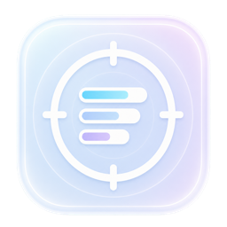
</p>

<h1 align="center">SpendScope</h1>

<p align="center">在 macOS 菜单栏看清 Codex Token 用量、额度状态和使用趋势。</p>

<p align="center">仅在本机运行 · 无需额外登录 · 不上传使用数据</p>

SpendScope 是一款面向 Codex 用户的原生 macOS 菜单栏应用。它读取 Codex CLI 和 Codex macOS 应用保存在本机的使用记录，将分散的 Token、额度、工作区和调用数据整理成随时可查的菜单栏摘要与详细看板。

SpendScope 是第三方本地工具，并非 OpenAI 官方产品。

## 核心功能

- **额度常驻菜单栏**：直接查看 7 天额度、已用或剩余比例，以及重置倒计时。
- **Token 全景看板**：汇总今日、近 7 日、近 30 日、累计及可选的当前订阅周期用量，拆分未缓存输入、缓存输入、可见输出与推理 Token。
- **趋势与用量日历**：通过 7 天、30 天、订阅周期趋势图，以及月度热力日历和悬浮明细定位使用高峰。
- **多维使用分析**：按 Skills、Tools、工作区和模型查看排行，支持今日、7 日、30 日与累计范围。
- **额度提醒与自动刷新**：在剩余额度达到 20%、10% 或 5% 时发送 macOS 通知，并增量读取新增记录。

## 亮点功能

- **从工作区下钻到每次回复**：工作区详情覆盖目录、任务、回复、状态、耗时、模型、Token 构成，以及每次回复调用过的完整 Skills / Tools。
- **本地优先且边界清晰**：不读取提示词、回复正文、推理正文、工具参数、文件内容、项目代码或认证文件；聚合结果只保存在本机。
- **可靠的增量统计**：基于检查点和事件去重读取活跃及归档记录；文件移动、重复扫描和应用重启不会重复累计。
- **模型费用透明估算**：按模型展示 Token 构成和公开 API 标准价格下的等值费用；未定价模型不会被强行套价，估算不冒充 Codex 实际账单。
- **原生 macOS 体验**：提供清爽浅色、科技深色和跟随系统三种色系，支持看板收起、置顶、状态栏内容定制、数据源健康状态、全量重建进度和 GitHub Releases 更新检查。

> 菜单栏、看板、排行、工作区详情、设置项、刷新机制、数据口径与隐私边界的逐项说明，见 [完整功能说明](docs/FEATURES.md)。

## 软件界面

### 菜单栏与弹窗

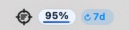

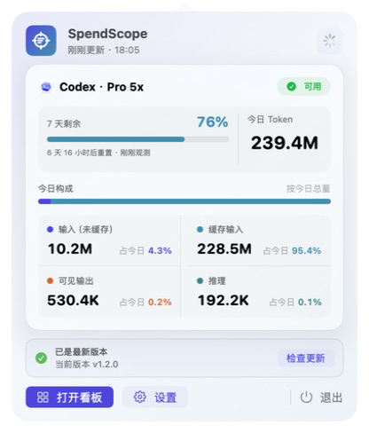

状态栏设置中的实时预览与实际菜单栏使用同一套绘制样式。无需打开主窗口即可查看额度和今日用量；弹窗还提供刷新、打开看板、进入设置、检查更新和退出入口。

### 详细看板

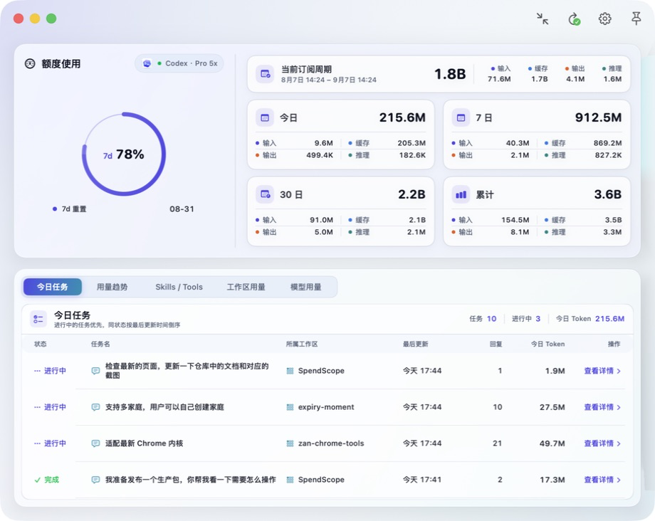

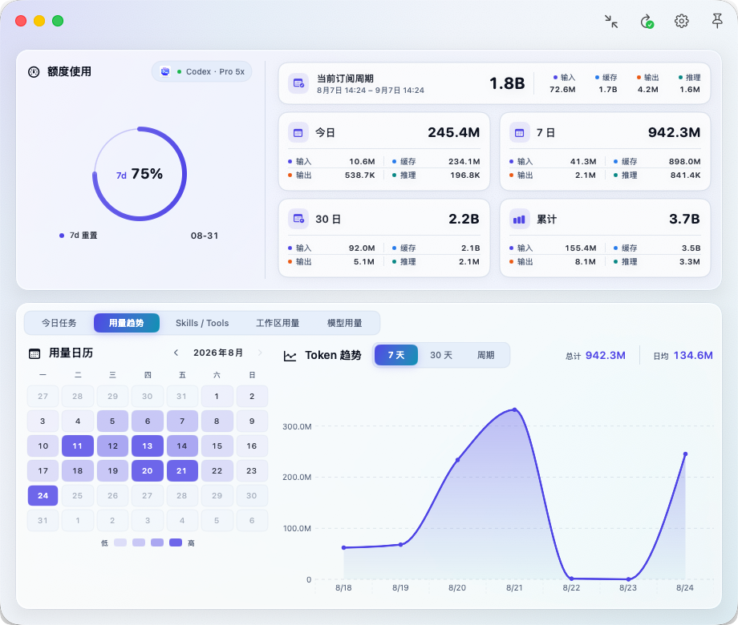

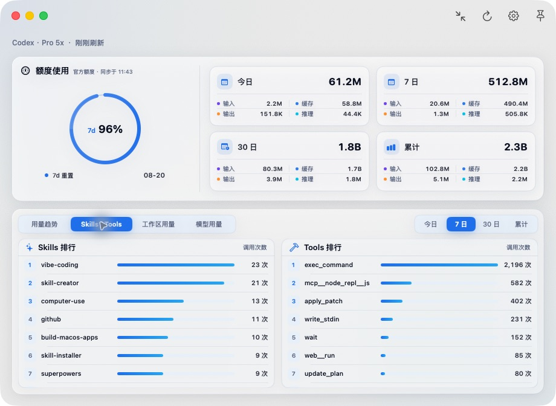

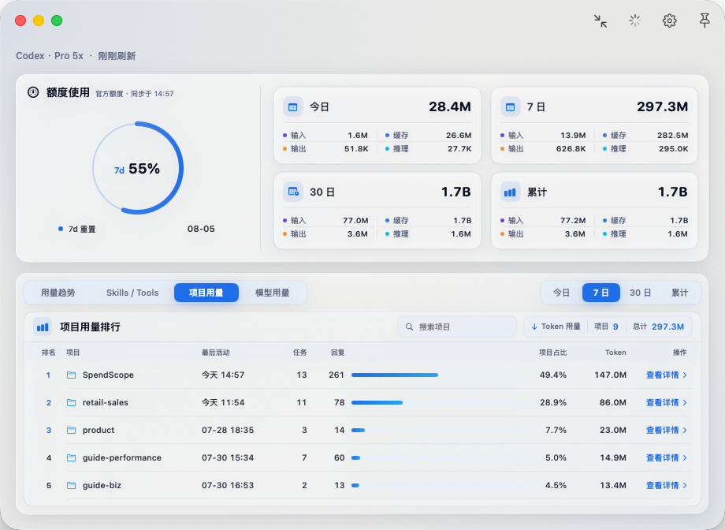

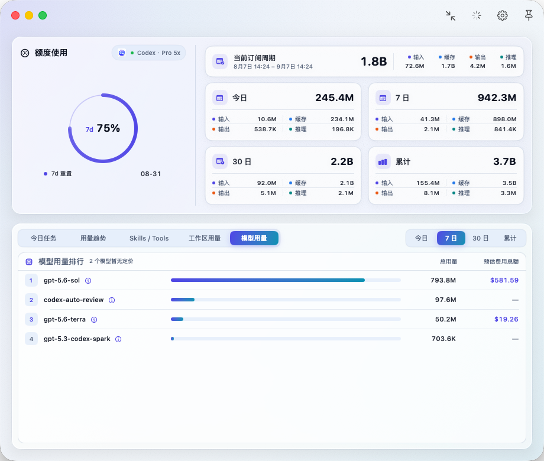

详细看板在概览区同时展示 7 天额度、今日、7 日、30 日、累计和可选的当前订阅周期用量；下方包含今日任务、用量趋势、Skills / Tools、工作区用量和模型用量五个分析页，并可在今日、7 日、30 日和累计范围间切换排行。今日任务按状态和最后更新时间排序，可继续查看任务的 Token 构成、工作区目录与回复明细。

首次载入时使用与真实内容同构的轻量骨架，减少布局跳动；看板也可收起为仅保留额度的紧凑窗口。对应截图和全部悬浮明细见[完整功能说明](docs/FEATURES.md)。

### 工作区与回复详情

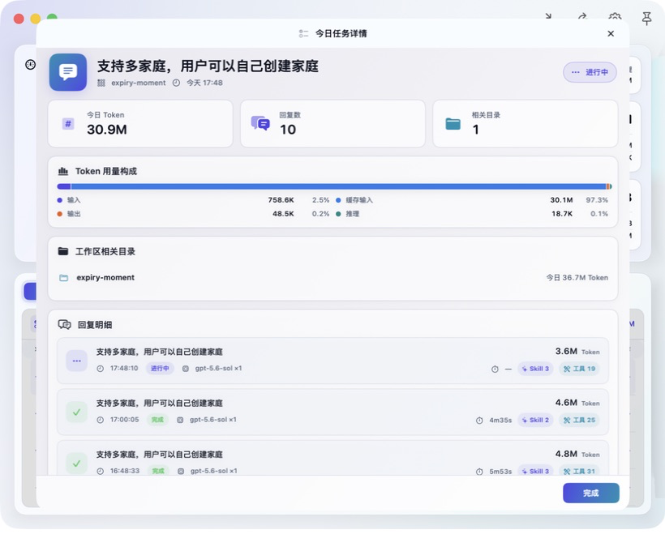

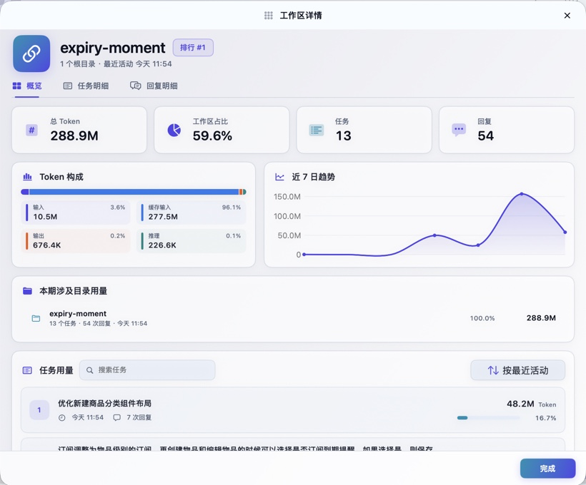

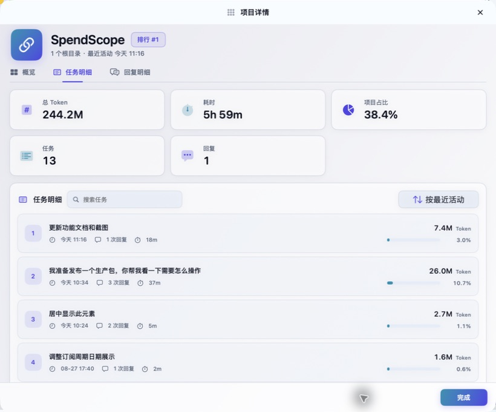

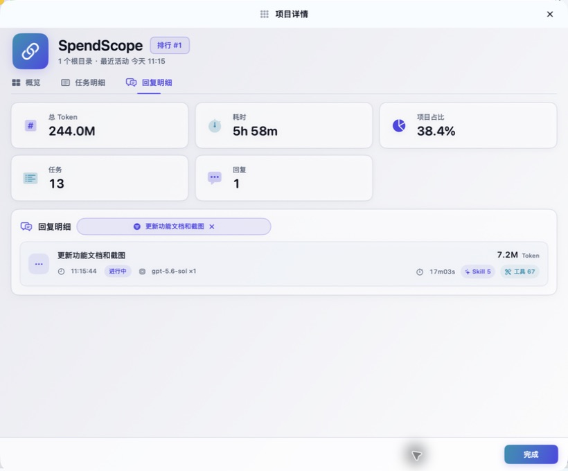

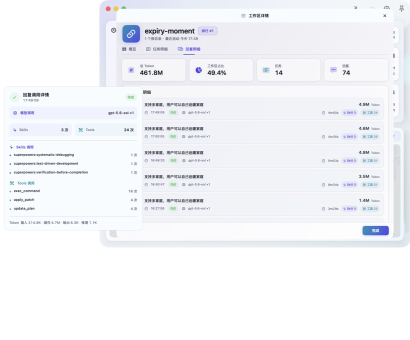

今日任务和工作区排行都可以打开独立详情窗口，继续查看任务和回复级用量；子 agent 的用量会并入对应主任务，以及实际创建它的主回复，但子 agent 自己的完成事件不会提前结束仍在运行的主任务。回复中的模型会同时展示去重后的调用次数；将鼠标停在任务或回复上，还能在详情窗口外查看包含子 agent 调用在内的完整模型、Token、Skills / Tools 明细。

### 设置

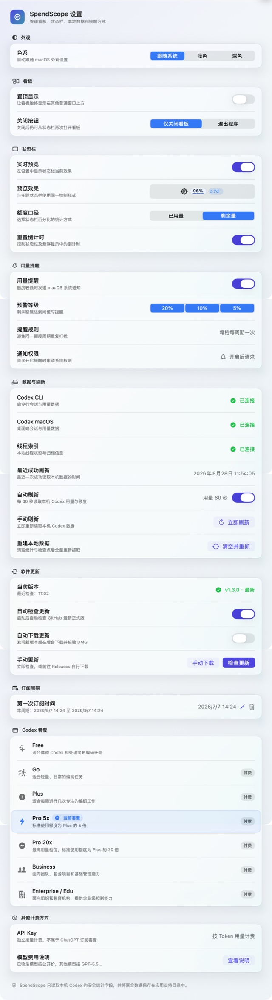

设置页覆盖外观、看板行为、状态栏、提醒、数据源、刷新与重建、软件更新、订阅周期、套餐说明和隐私提示。所有悬浮明细与确认弹窗截图见[完整功能说明](docs/FEATURES.md)。

## 系统要求

- macOS 14 或更高版本。
- 已在这台 Mac 上使用过 Codex CLI 或 Codex macOS 应用。

SpendScope 依赖本机 Codex 产生的使用记录。如果尚未使用 Codex，应用中暂时不会有可统计的数据。

## 安装

1. 前往 [SpendScope Releases](https://github.com/ychp/SpendScope/releases)。
2. 下载 `SpendScope-macOS-unsigned.dmg`。
3. 打开 DMG，将 SpendScope 拖入“应用程序”文件夹。

发布包是同时支持 Apple 芯片（arm64）和 Intel 芯片（x86_64）的 Universal Binary。

### 首次打开

当前安装包尚未使用 Apple Developer ID 签名和公证。首次启动时，请在 Finder 的“应用程序”中右键 SpendScope，选择“打开”，然后在系统提示中再次确认。无需关闭 macOS 的全局安全设置。

如果系统提示“应用已损坏”，请先确认 DMG 来自本项目的 GitHub Releases，再执行：

```bash
xattr -dr com.apple.quarantine /Applications/SpendScope.app
```

如果没有安装到“应用程序”文件夹，请将路径替换为 `SpendScope.app` 的实际位置。

## 开始使用

1. 启动 SpendScope，菜单栏中会出现应用图标和额度摘要。
2. 点击菜单栏项目，查看今日 Token、额度状态和 Token 构成。
3. 点击“打开看板”，查看趋势、日历和多维排行；从工作区排行继续进入任务与回复详情。
4. 打开“设置”，按需调整色系、状态栏、额度提醒、自动刷新、更新检查和看板置顶。

应用会先展示上一次成功保存的统计，再从本机 Codex 数据中增量补充用量记录和 7 天额度。

## 数据与隐私

SpendScope 只读取统计所需的最小字段，包括 Token 计数、额度窗口、模型、套餐、会话状态、工作目录、工作区根目录组合、Codex 工作区名称，以及 Skills / Tools 调用标识。

它不会读取、保存或上传：

- 提示词、消息、回复、摘要和推理正文；
- 工具输入、工具输出、文件内容或项目代码；
- `auth.json` 等认证文件的内容；
- 原始 Git remote、完整项目路径或完整工作区路径。

整理后的统计与导入进度只保存在：

```text
~/Library/Application Support/SpendScope/SpendScope.sqlite
```

SpendScope 不会修改或删除 Codex 原始记录。额度只从本机 Codex 记录读取；启用更新检查时会访问本项目的 GitHub Releases，并且不会上传 SpendScope 的统计数据库。详细说明见 [完整功能说明：数据与隐私](docs/FEATURES.md#数据与隐私边界)。

## 当前限制

- API 等值费用不是 Codex 订阅账单，暂不支持账单对账、预算管理或 API Key 实际消费分析。
- 只统计当前 Mac 上仍可读取的 Codex 本地记录，不会同步其他设备的数据。
- Codex 本地格式发生不兼容变化时，部分统计可能暂时停止更新；应用会保留已有数据并显示来源异常。
- 当前发布包未签名、未公证，首次打开需要手动确认。

## 本地开发

开发环境需要 macOS 14 或更高版本，以及 Xcode 26.6 或兼容的 Swift 6 Xcode。

构建、启动并验证本次产物：

```bash
./script/build_and_run.sh --verify
```

运行完整测试：

```bash
DEVELOPER_DIR=/Applications/Xcode.app/Contents/Developer \
  xcodebuild -project SpendScope.xcodeproj \
  -scheme SpendScope \
  -configuration Debug \
  -destination "platform=macOS,arch=arm64" \
  -derivedDataPath /private/tmp/SpendScope-Tests \
  test
```

更多调试、构建、目录职责和发布约束见项目文档。

## 项目文档

- [完整功能说明](docs/FEATURES.md)：所有用户可见功能、设置、数据口径、刷新机制和限制。
- [技术档案](docs/TECHNICAL_ARCHIVE.md)：架构、事件白名单、Token 口径、存储迁移和兼容策略。
- [项目文件结构](docs/PROJECT_STRUCTURE.md)：目录职责、核心入口和可清理的生成物。

## 反馈问题

如遇到数据异常、无法启动或有功能建议，请在 [GitHub Issues](https://github.com/ychp/SpendScope/issues) 中反馈。为了保护隐私，请不要上传包含提示词、回复内容、认证信息或项目代码的原始 Codex 记录。
