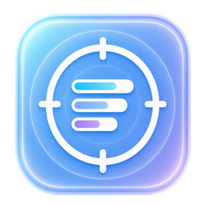
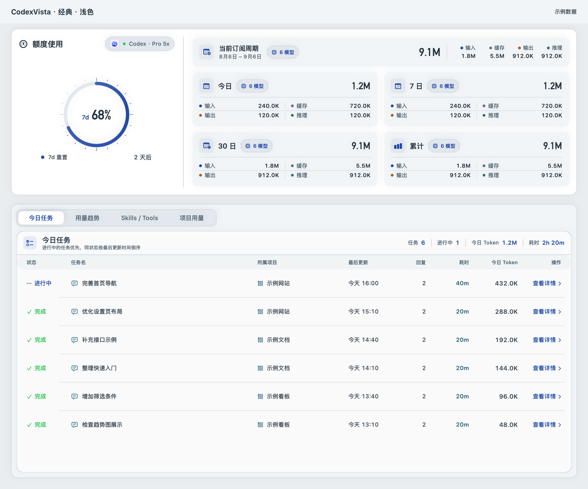
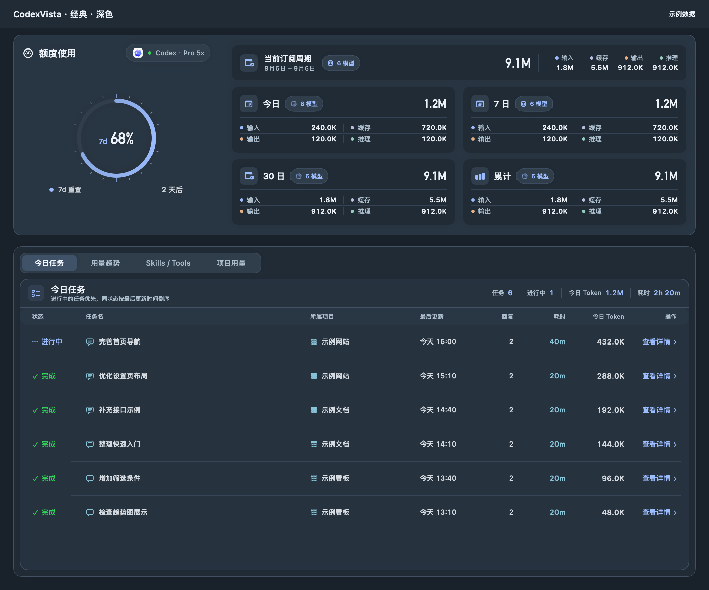
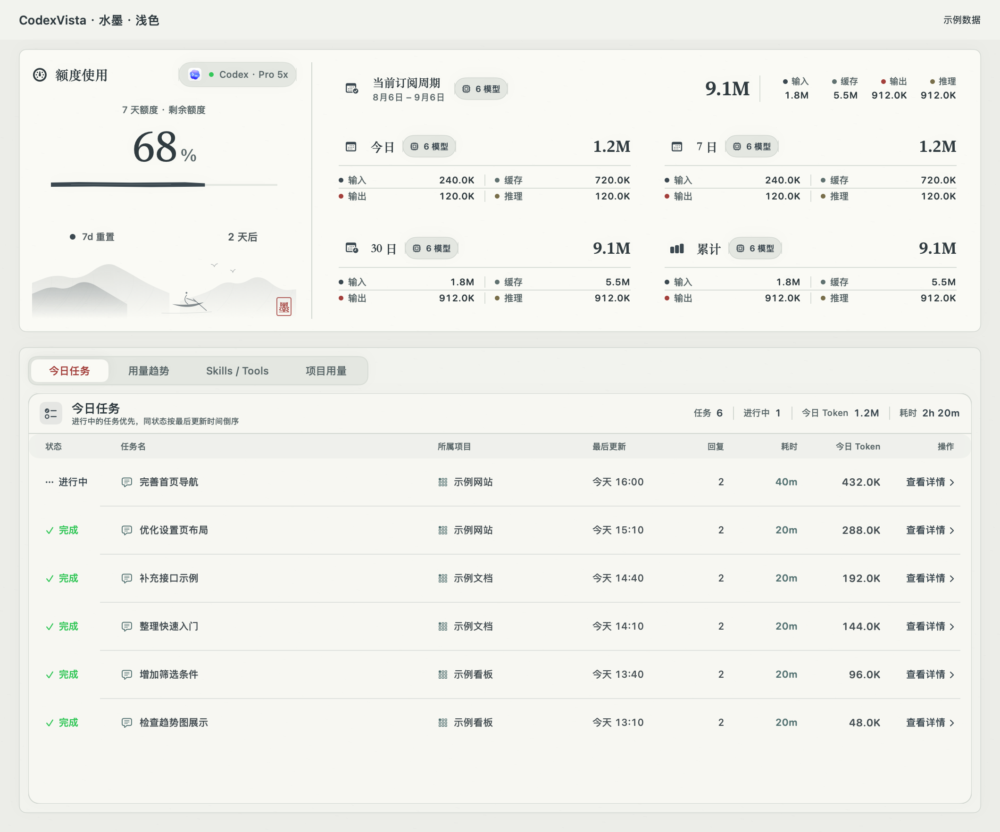
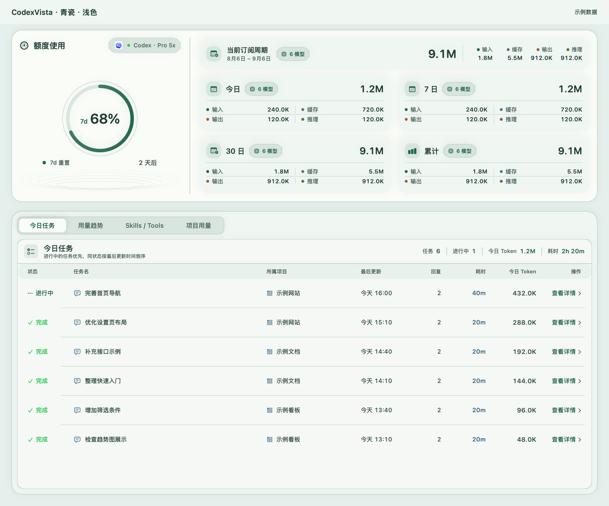
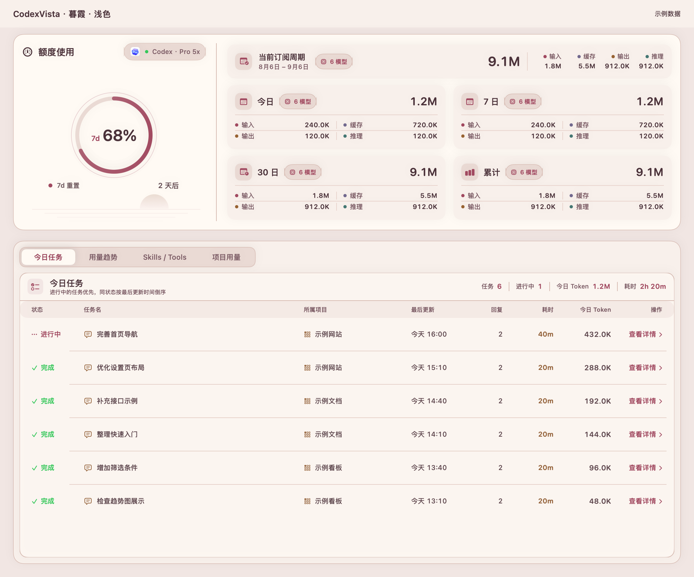
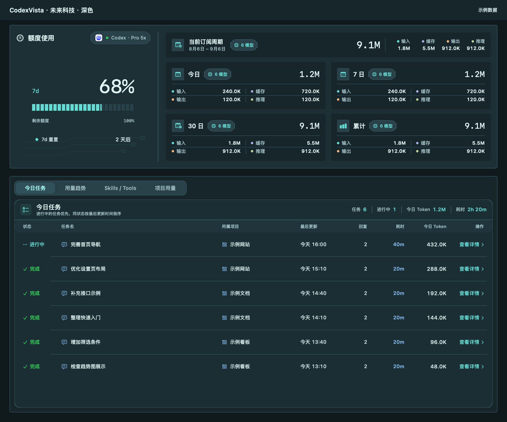
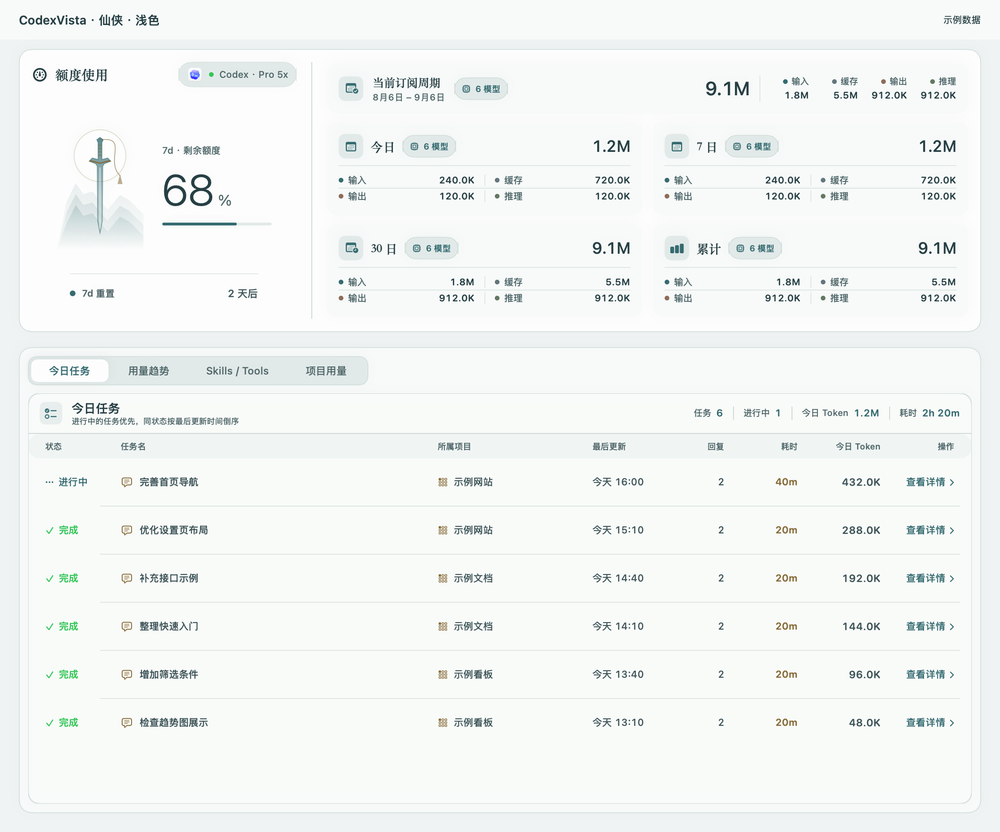
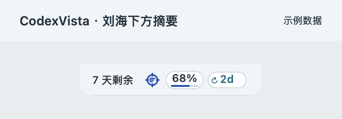

<p align="center">
  
</p>

<h1 align="center">CodexVista</h1>

<p align="center">在 macOS 菜单栏看清 Codex Token 用量、额度状态和使用趋势。</p>

<p align="center">仅在本机运行 · 无需额外登录 · 不上传使用数据</p>

CodexVista 是一款面向 Codex 用户的原生 macOS 菜单栏应用。它读取 Codex CLI 和 Codex macOS 应用保存在本机的使用记录，将分散的 Token、额度、项目和调用数据整理成随时可查的菜单栏摘要与详细看板。

CodexVista 是第三方本地工具，并非 OpenAI 官方产品。

## 核心功能

- **额度常驻菜单栏**：直接查看 7 天额度、已用或剩余比例，以及重置倒计时。
- **刘海摘要**：默认在状态栏展示，可在设置中选择将额度与倒计时移到刘海下方，点击打开用量弹窗；无刘海屏幕自动回退状态栏。
- **Token 全景看板**：汇总今日、近 7 日、近 30 日、累计及可选的当前订阅周期用量，拆分未缓存输入、缓存输入、可见输出与推理 Token。
- **趋势与用量日历**：通过 7 天、30 天、订阅周期趋势图，以及月度热力日历和悬浮明细定位使用高峰。
- **多维使用分析**：按 Skills、Tools、项目和模型查看排行，并按项目统计 AI 工作时长；模型排行还覆盖可选的当前订阅周期。
- **额度提醒与自动刷新**：在剩余额度达到 20%、10% 或 5% 时发送 macOS 通知，并增量读取新增记录。

## 亮点功能

- **今日任务与回复下钻**：今日任务按状态与更新时间排序，支持独立任务详情；项目详情覆盖目录、任务、回复、状态、耗时、模型、Token 构成，以及每次回复调用过的完整 Skills / Tools。
- **本地优先且边界清晰**：不读取提示词、回复正文、推理正文、工具参数、文件内容、项目代码或认证文件；聚合结果只保存在本机。
- **可靠的增量统计**：基于检查点和事件去重读取活跃及归档记录；文件移动、重复扫描和应用重启不会重复累计。
- **模型费用透明估算**：按模型展示 Token 构成和公开 API 标准价格下的等值费用；未收录独立价格的模型按 GPT-5.5 参考价估算并标记 `≈`，估算不冒充 Codex 实际账单。
- **原生 macOS 体验**：提供经典、水墨、青瓷、暮霞、未来科技和仙侠六款皮肤；经典、青瓷、暮霞支持浅色、深色和跟随系统，水墨与仙侠固定浅色，未来科技固定深色，支持看板置顶、状态栏内容定制、数据源健康状态、全量重建进度和 GitHub Releases 更新检查。

> 菜单栏、看板、排行、项目详情、设置项、刷新机制、数据口径与隐私边界的逐项说明，见 [完整功能说明](docs/FEATURES.md)。

## 软件界面

以下图片于 2026-09-04 从当前源码的 SwiftUI / AppKit 组件导出，统一使用匿名示例数据。截图覆盖最新平面统计分组、六款皮肤、模型费用和任务详情；顶部“示例数据”是文档标识。独立悬浮卡展示组件内容，窗口位置和系统标题栏以实际运行为准。生成方法和完整清单见[截图说明](docs/images/README.md)。

### 今日任务与用量趋势


顶部同时展示 7 天额度、今日、7 日、30 日、累计及可选的当前订阅周期用量。四类 Token 以清晰的分组细线与分类色展示；切换皮肤会保留已经放大的看板尺寸。

下方提供今日任务、用量趋势、Skills / Tools 和项目用量四个分析页。今日任务优先显示进行中的任务，再按最后更新时间排序；点击可查看目录、Token 构成、耗时与回复明细。


### 六款皮肤

| 经典浅色 | 经典深色 |
| --- | --- |
|  |  |

| 水墨 | 青瓷 |
| --- | --- |
|  |  |

| 暮霞 | 未来科技 |
| --- | --- |
|  |  |



在“设置 → 外观”通过两列预览卡切换皮肤。经典、青瓷、暮霞支持跟随系统、浅色和深色；水墨与仙侠固定浅色，未来科技固定深色。状态栏、刘海、弹窗、设置与详情同步跟随外观。全部九组配色及交互规范见[外观设计说明](docs/design/README.md)。

### 菜单栏与刘海摘要


默认在状态栏展示摘要，也可在“设置 → 状态栏与刘海 → 展示位置”选择“刘海下方”。摘要显示在摄像头遮挡区域下方，菜单栏保留图标入口；无刘海屏幕自动回退状态栏。设置预览与实际摘要共用绘制组件。



### 模型与调用分析


每个周期用量卡均提供模型数量入口：悬浮预览前 5 名，点击可固定并展开全部。表头费用始终包含该周期的全部模型，未收录独立价格的模型以 `≈` 标记参考估算。


### 项目、任务与回复详情


项目名与关联目录随 Codex 项目配置刷新；明确的项目身份会保留改名或目录变更前的历史归属。目录只展示安全名称，Token 统计位于项目、任务和回复层级。


任务和回复行均可悬浮查看完整模型、Skills / Tools、Token 和 API 等值费用。子 agent 用量并入对应主任务与创建它的主回复；子 agent 完成不会提前结束仍在运行的主任务。更多明细见[完整功能说明](docs/FEATURES.md)。

### 设置


设置还提供额度提醒、来源健康状态、自动刷新、清空并重抓、软件更新、第一次订阅时间、套餐与模型费用说明。分区截图见[功能说明](docs/FEATURES.md#提醒与个性化设置)，完整内容见[设置长图](docs/images/codexvista-settings.png)。

## 系统要求

- macOS 14 或更高版本。
- 已在这台 Mac 上使用过 Codex CLI 或 Codex macOS 应用。

CodexVista 依赖本机 Codex 产生的使用记录。如果尚未使用 Codex，应用中暂时不会有可统计的数据。

## 安装

1. 前往 [CodexVista Releases](https://github.com/ychp-ai/CodexVista/releases)。
2. 下载 `CodexVista-macOS-unsigned.dmg`。
3. 打开 DMG，将 CodexVista 拖入“应用程序”文件夹。

发布包是同时支持 Apple 芯片（arm64）和 Intel 芯片（x86_64）的 Universal Binary。

### 从 SpendScope 升级

应用已更名为 CodexVista，安装包名和 Bundle ID 同步变更。旧版内置下载器仍使用旧附件名，因此请从上述 Releases 页面手动下载一次新安装包。

安装前先退出 SpendScope，启动 CodexVista 后会接续旧版数据库与支持的偏好设置，保留旧数据库且不覆盖已存在的 CodexVista 数据。确认统计和设置正常后，可移除旧的 SpendScope.app，避免同时运行两个应用；不要删除旧数据目录作为安装步骤。通知权限需按新应用重新授权。

### 首次打开

当前安装包尚未使用 Apple Developer ID 签名和公证。首次启动时，请在 Finder 的“应用程序”中右键 CodexVista，选择“打开”，然后在系统提示中再次确认。无需关闭 macOS 的全局安全设置。

如果系统提示“应用已损坏”，请先确认 DMG 来自本项目的 GitHub Releases，再执行：

```bash
xattr -dr com.apple.quarantine /Applications/CodexVista.app
```

如果没有安装到“应用程序”文件夹，请将路径替换为 `CodexVista.app` 的实际位置。

## 开始使用

1. 启动 CodexVista，默认在状态栏显示额度摘要；可在“设置 → 状态栏与刘海 → 展示位置”选择“刘海下方”。
2. 点击刘海摘要或菜单栏图标，查看今日 Token、额度状态和 Token 构成。
3. 点击“打开看板”，查看趋势、日历和多维排行；从项目排行继续进入任务与回复详情。
4. 打开“设置”，按需调整色系、状态栏、额度提醒、自动刷新、更新检查和看板置顶。

应用会先展示上一次成功保存的统计，再从本机 Codex 数据中增量补充用量记录和 7 天额度。

## 数据与隐私

CodexVista 只读取统计所需的最小字段，包括 Token 计数、额度窗口、模型、套餐、会话状态、工作目录、项目根目录组合、Codex 项目名称，以及 Skills / Tools 调用标识。

它不会读取、保存或上传以下内容：

- 提示词、消息、回复、摘要和推理正文；
- 工具输入、工具输出、文件内容或项目代码；
- `auth.json` 等认证文件的内容。

项目路径和 Git 元数据仅用于本地身份识别，不保存或上传原始 remote 和完整路径；数据库中只保留派生 ID、哈希指纹、安全名称和目录数量。

整理后的统计与导入进度只保存在：

```text
~/Library/Application Support/CodexVista/CodexVista.sqlite
```

首次启动新版时，会自动接续旧版 SpendScope 的本地统计数据和偏好设置。迁移保留旧数据库，且不会覆盖已经存在的 CodexVista 数据；通知权限由 macOS 按新应用标识重新管理。

CodexVista 不会修改或删除 Codex 原始记录。额度只从本机 Codex 记录读取；启用更新检查时会访问本项目的 GitHub Releases，并且不会上传 CodexVista 的统计数据库。详细说明见 [完整功能说明：数据与隐私](docs/FEATURES.md#数据与隐私边界)。

## 当前限制

- API 等值费用不是 Codex 订阅账单，暂不支持账单对账、预算管理或 API Key 实际消费分析。
- 只统计当前 Mac 上仍可读取的 Codex 本地记录，不会同步其他设备的数据。
- Codex 本地格式发生不兼容变化时，部分统计可能暂时停止更新；应用会保留已有数据并显示来源异常。
- 当前发布包未签名、未公证，首次打开需要手动确认。

## 本地开发

开发环境需要 macOS 14 或更高版本，以及 Xcode 26.6 或兼容的 Swift 6 Xcode。

构建、启动并验证本次产物：

```bash
./script/build_and_run.sh --verify
```

运行完整测试：

```bash
DEVELOPER_DIR=/Applications/Xcode.app/Contents/Developer \
  xcodebuild -project CodexVista.xcodeproj \
  -scheme CodexVista \
  -configuration Debug \
  -destination "platform=macOS,arch=arm64" \
  -derivedDataPath /private/tmp/CodexVista-Tests \
  test
```

更新文档截图（需要 Python 3、完整 Xcode 和已登录的 macOS 图形会话）：

```bash
python3 script/export_screenshots.py
```

脚本使用独立应用和匿名数据生成图片及来源清单，不读取本机 Codex 记录。详细流程见[截图维护说明](docs/images/README.md)。发布流程及约束见[技术档案](docs/TECHNICAL_ARCHIVE.md#18-构建与发布)。

## 项目文档

- [完整功能说明](docs/FEATURES.md)：所有用户可见功能、设置、数据口径、刷新机制和限制。
- [技术档案](docs/TECHNICAL_ARCHIVE.md)：架构、事件白名单、Token 口径、存储迁移和兼容策略。
- [项目文件结构](docs/PROJECT_STRUCTURE.md)：目录职责、核心入口和可清理的生成物。
- [外观设计说明](docs/design/README.md)：六款皮肤、九组配色和共享交互规范。
- [截图维护说明](docs/images/README.md)：导出方法、匿名数据和图片覆盖清单。

## 反馈问题

如遇到数据异常、无法启动或有功能建议，请在 [GitHub Issues](https://github.com/ychp-ai/CodexVista/issues) 中反馈。为了保护隐私，请不要上传包含提示词、回复内容、认证信息或项目代码的原始 Codex 记录。
