# CodexVista 完整功能说明

本文档记录 CodexVista 当前已经实现的用户功能、数据口径、刷新机制与产品边界。项目首页和快速开始见 [README](../README.md)，底层实现与维护约束见 [技术档案](TECHNICAL_ARCHIVE.md)。

本文中的主界面截图保留更名前 v1.3.0 的界面，仅供布局参考；当前应用名称已统一为 CodexVista；Token、额度、任务状态和耗时会随本机数据变化，关联目录展示以当前文字说明为准。

## 功能总览

| 区域 | 能力 |
| --- | --- |
| macOS 状态栏 | 展示 7 天额度、已用或剩余比例、重置倒计时 |
| 刘海摘要 | 在刘海下沿显示相同额度与倒计时，点击打开用量弹窗，无刘海时自动回退状态栏 |
| 状态栏弹窗 | 查看今日 Token、额度、Token 构成、刷新状态和更新状态 |
| 详细看板 | 查看额度、周期汇总、今日任务、趋势、日历、活动、项目和模型分析 |
| 项目详情 | 下钻目录、任务、回复、状态、耗时、模型与 Skills / Tools 调用 |
| 设置 | 管理色系、看板、状态栏、提醒、刷新、数据重建、套餐说明和软件更新 |
| 本地数据层 | 增量读取、事件去重、SQLite 聚合、来源健康检查和安全降级 |

## 弹窗与悬浮窗覆盖清单

下表覆盖当前版本全部业务弹窗、悬浮明细和系统提示。普通 macOS Help 提示内容直接列在表中；其余交互均在对应章节提供截图。

| 触发入口 | 交互类型 | 展示内容 | 截图 |
| --- | --- | --- | --- |
| 点击菜单栏项目 | 状态栏弹窗 | 套餐、7 天额度、今日 Token 构成、刷新、更新、看板、设置与退出 | [截图](images/codexvista-popover.png) |
| 悬浮周期卡模型数量；点击后固定 | 模型排行弹窗 | 当前卡片时间范围内的模型、Token、占比和 API 等值费用 | [截图](images/codexvista-model-hover-details.png) |
| 悬浮模型 Token 数值 | 模型 Token 明细 | 未缓存输入、缓存输入、可见输出、推理输出和总量 | [同组截图](images/codexvista-model-cost-hover-details.png) |
| 悬浮模型费用 | 模型费用明细 | 四类 Token、对应单价、分项估算、总额和参考价标记 | [截图](images/codexvista-model-cost-hover-details.png) |
| 悬浮看板趋势节点 | 图表内悬浮卡 | 日期或周期、总 Token、四类 Token 和 API 等值费用 | [截图](images/codexvista-trend-hover.png) |
| 悬浮日历日期 | 日历弹窗 | 当日总 Token 与四类 Token 构成 | [截图](images/codexvista-calendar-day-hover.png) |
| 悬浮热力图例 | 图例弹窗 | 颜色等级对应的 Token 区间和当月峰值 | [截图](images/codexvista-calendar-legend-hover.png) |
| 悬浮命名空间 Skill | Skill 细分弹窗 | 细分 Skill、直接使用次数和总调用次数 | [截图](images/codexvista-skill-breakdown-hover.png) |
| 点击今日任务 | 独立详情窗口 | 今日 Token、耗时、项目目录和回复明细 | [截图](images/codexvista-today-task-detail.png) |
| 点击项目排行 | 独立详情窗口 | 项目概览、任务、回复、趋势和关联目录 | [截图](images/codexvista-project-overview.png) |
| 悬浮项目趋势节点 | 图表内提示卡 | 日期、Token 和 7 日占比 | [截图](images/codexvista-project-trend-hover.png) |
| 悬浮项目任务行 | 窗口外侧悬浮面板 | 任务模型、Token、完整 Skills / Tools 和 API 等值费用 | [截图](images/codexvista-task-activity-detail.png) |
| 悬浮项目回复行 | 窗口外侧悬浮面板 | 单次回复状态、耗时、模型、Token、Skills / Tools 和费用 | [截图](images/codexvista-reply-activity-detail.png) |
| 悬浮今日任务回复行 | 窗口外侧悬浮面板 | 今日任务内单次回复的模型、Token 和调用明细 | [截图](images/codexvista-today-task-reply-hover.png) |
| 点击“模型费用说明” | 计费说明弹窗 | 已收录模型单价、参考价规则、估算边界和官方价格链接 | [截图](images/codexvista-model-pricing-popover.png) |
| 点击“清空并重抓” | 破坏性操作确认框 | 明确清理范围，并说明不会删除 Codex 原始数据 | [截图](images/codexvista-rebuild-confirmation.png) |
| 悬浮刷新、设置、置顶、关闭、排序、筛选等控件 | macOS Help 提示 | 控件用途；刷新提示还包含结果说明与 `⌘R` 快捷键 | 系统标准样式 |
| 额度达到预警阈值 | macOS 系统通知 | 剩余额度、阈值和本地时区重置时间 | 系统通知中心 |

## 状态栏与弹窗

### 状态栏摘要

- 状态栏额度固定显示 7 天窗口。
- 可在“已用比例”和“剩余比例”之间切换。
- 可选择是否显示额度重置倒计时；状态栏按天显示 `xd`，不足一天按小时显示 `xh`。
- 可关闭实时额度预览，仅保留 CodexVista 图标与名称。
- 暂无有效额度时自动隐藏对应指标，避免将过期数据展示为满额。
- 跟随 macOS 外观绘制状态栏内容。


### 状态栏弹窗

默认在状态栏展示摘要。“设置 → 状态栏与刘海 → 展示位置”可选择“状态栏”或“刘海下方”，选择会被保存。刘海模式在摄像头遮挡区域下方显示 32 pt 高的黑色摘要，状态栏保留图标入口。切换屏幕、合盖或断开刘海屏幕后重新定位或回退；关闭实时预览后隐藏摘要，仅保留状态栏图标。摘要与状态栏共享额度口径和重置倒计时设置，每 30 秒更新显示时间，数据采集仍遵循原有刷新设置。

刘海摘要保持黑色背景，说明文字和图标使用白色，额度使用浅紫色底配深紫色数字，重置倒计时使用暖黄色，以提高小尺寸内容的辨识度；设置预览同步使用该配色。

状态栏与刘海摘要的重置倒计时统一使用 11.5 pt 字号，并为两位数时间预留显示宽度。

刘海摘要宽度随内容自适应，左右各保留 12 pt 边距；关闭倒计时后自动收窄，始终对齐刘海中心。

- 展示当前识别到的 Codex 套餐、数据更新时间和来源可用状态。
- 展示今日 Token 总量，以及 7 天剩余额度和重置时间。
- 将今日 Token 拆分为未缓存输入、缓存输入、可见输出与推理，并展示各自占比。
- 支持手动刷新；刷新中显示进度状态。
- 支持打开详细看板、打开设置、检查或安装更新，以及退出应用。
- 对加载中、无数据、数据过期、读取失败和格式不兼容状态分别给出提示与恢复入口。

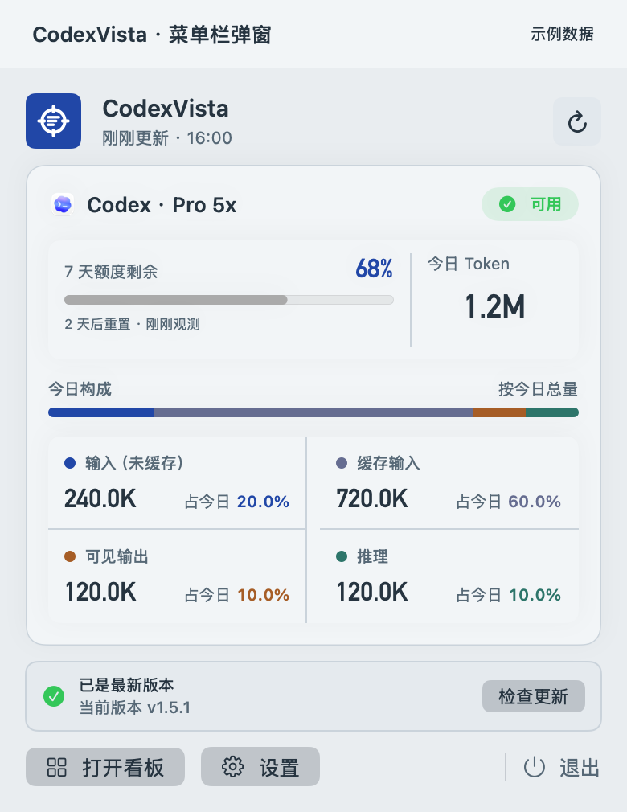

## 详细看板

### 额度与周期汇总

- 用环形图展示从本机记录读取的 7 天剩余额度、重置时间和数据新鲜度。
- 汇总今日、近 7 日、近 30 日和累计 Token。
- 在项目排行、项目详情、今日任务列表和任务详情中展示耗时；项目耗时跟随今日、7 日、30 日和累计范围，进行中的回复计至最近一次刷新。
- 设置第一次订阅时间后，额外展示按该时刻逐月锚定的当前订阅周期 Token 和周期起止时间。
- 每个周期卡常驻显示未缓存输入、缓存输入、可见输出和推理 Token；普通周期使用 2×2 明细矩阵，当前订阅周期使用横向明细。
- 工具栏支持立即刷新、打开设置和看板置顶。
- 刷新按钮集中展示刷新中、成功、部分更新和失败状态；悬浮提示包含结果说明与 `⌘R` 快捷键。
- 支持加载、正常、空数据、过期、失败和格式不兼容等状态；首次读取本地统计时使用与真实看板布局一致的动画骨架反馈进度。

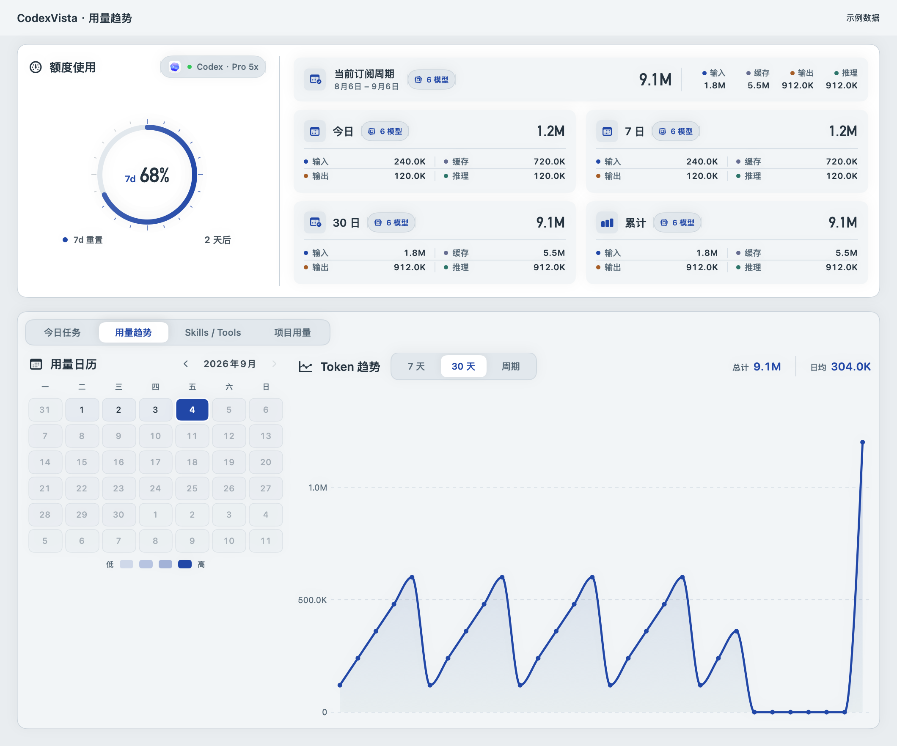

### 今日任务

- 汇总今天产生 Token 用量的任务，展示任务名、所属项目、状态、最后更新时间、回复数和今日 Token。
- 进行中的任务优先；相同状态按最后更新时间倒序排列。
- 点击任务后打开独立详情窗口，展示四类 Token 构成、回复数、项目相关目录和回复明细。
- 回复明细与项目详情共用同一套行内容和窗口外调用悬浮面板，可查看每次回复的状态、耗时、模型、Token 以及完整 Skills / Tools 调用。

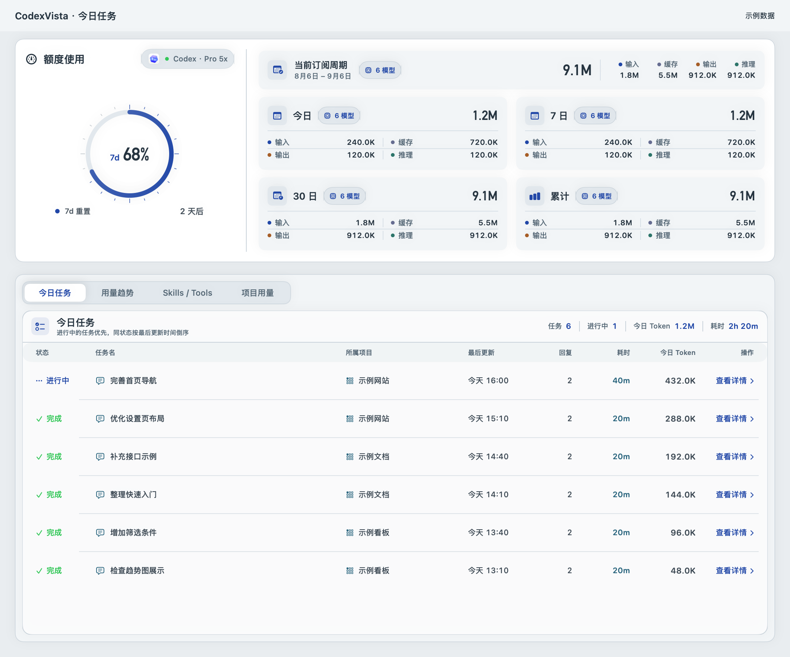

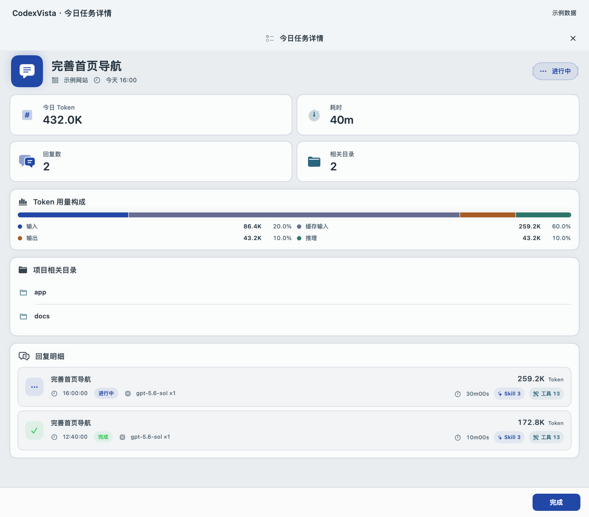

### 用量趋势与日历

- 趋势图支持 7 天、30 天和订阅周期范围；设置第一次订阅时间后，可按逐月锚定的每个订阅周期查看 Token 总量。
- 日趋势展示区间总计与日均 Token，周期趋势展示总计与周期均值。
- 悬浮趋势节点可查看当日或当期总 Token、四类 Token 构成，以及按模型公开 API 单价计算的等值预计花费；含参考价模型时以 `≈` 标记。
- 月度热力日历支持前后切换月份，并限制在已有数据范围内。
- 悬浮日历日期可查看当日 Token 明细；悬浮热力图例可查看各颜色对应的用量区间。
- 每日统计按 UTC 日期归属，以尽量接近 Codex 服务端的每日统计口径。


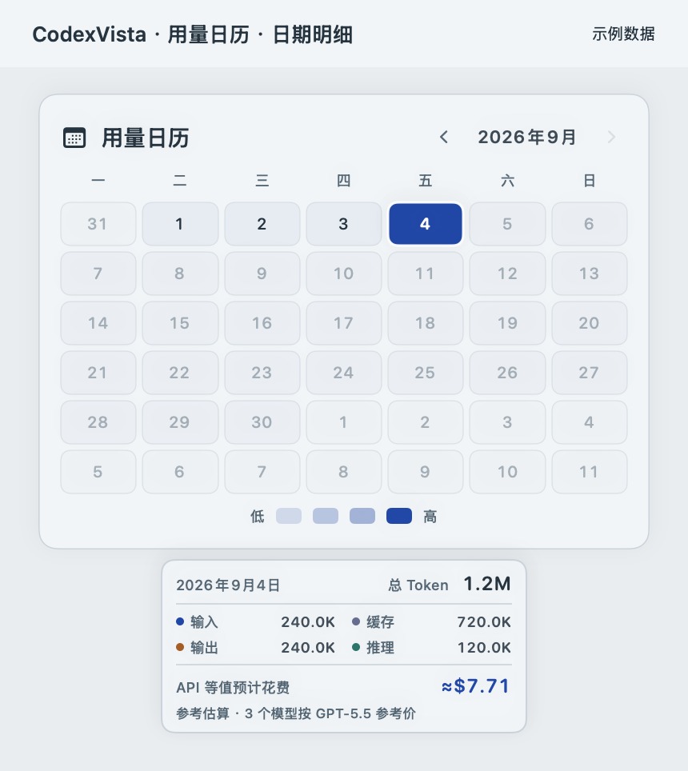

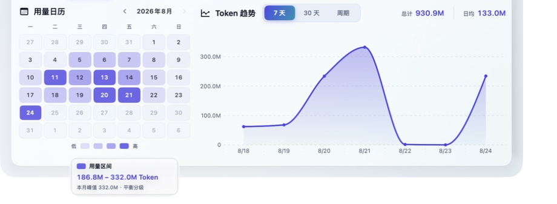

### Skills / Tools 排行

- 分别统计 Skills 与 Tools 的调用次数。
- 支持今日、7 日、30 日和累计范围。
- 带命名空间的 Skill 先按命名空间汇总，避免同一组 Skill 因细分名称不同被拆散。
- 悬浮汇总 Skill 可查看各细分 Skill 和“直接使用”的调用次数。
- Tools 按完整名称独立排行。

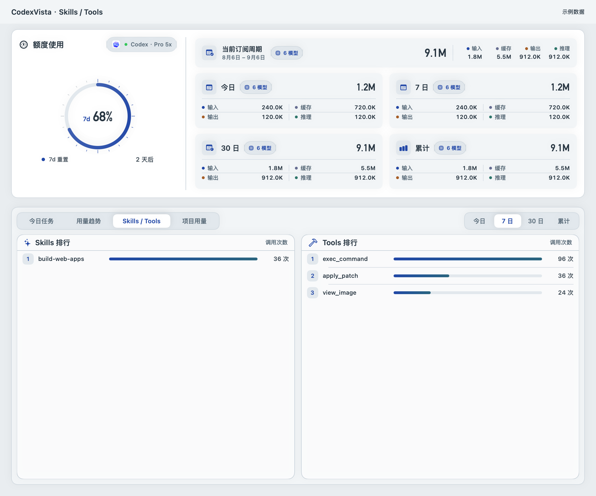


### 项目用量排行

- 支持今日、7 日、30 日和累计范围。
- 按 Token 用量排序，并展示占比、根目录数量、任务数、回复数和最近活动时间。
- 支持按项目名称搜索。
- 优先使用 Codex `local-projects` 中的项目名称；已归档项目可继续保留此前识别到的安全名称。
- 通过固定项目 ID 关联当前配置与历史根目录集合；改名、添加或替换关联目录后，即使没有新增用量，也会随手动或自动刷新同步名称和目录列表，历史用量仍归属于原项目。
- 当前配置优先于旧备份；已确认的历史关联在重启、归档和全量重建后保留。根目录集合同时对应多个 Codex 项目时，不自动选择归属。
- 使用每次 turn 的 `workspace_roots` 根目录组合区分项目；旧记录缺少该字段时以会话工作目录建立“工作目录推测”项目。
- Git 主目录和关联 worktree 按仓库身份合并，避免同一仓库被重复拆分。
- 缺少明确项目配置时，同名单目录仅在共享项目路径或 Git 仓库身份时合并；已明确属于不同 Codex 项目的记录不会因同名或共享工作目录而被合并。
- 经确认的历史临时项目可通过本地派生 ID 别名并入目标项目，别名在全量重建后保留。

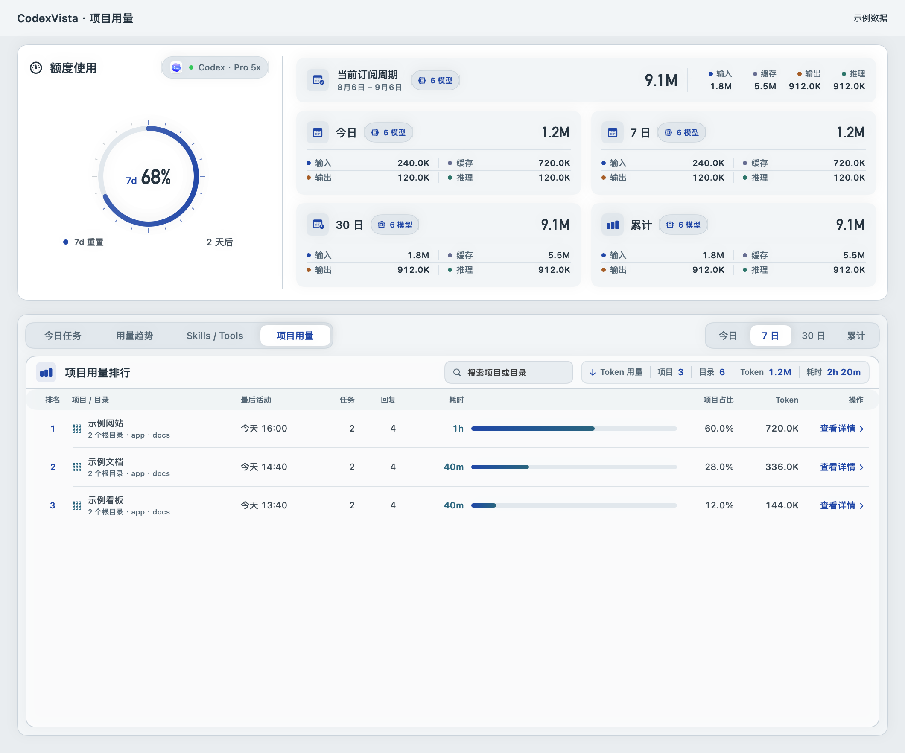

### 项目详情

从项目排行打开独立详情窗口后，可以查看：

- **顶部摘要**：项目排名、Token、全局占比、根目录数量、任务数、回复数和最近活动时间。
- **概览**：当前关联目录、任务和回复数量、四类 Token 构成与近 7 日趋势；目录只展示名称，不展示目录 Token 或占比；任务列表集中在“任务明细”中展示。
- **任务明细**：任务名称、最后活动时间、回复数、项目内占比和 Token；子 agent 自动并入对应主任务；支持搜索，并可按“最近消息”或“用量”排序；悬浮任务行可查看该任务汇总后的模型、Skill、Tool 和四类 Token，点击任务行可快速进入该任务的回复明细。
- **回复明细**：每次回复的时间、状态、耗时、模型及调用次数、Token、Skill 调用数和 Tool 调用数；子 agent 的 Token、模型及调用活动并入实际创建它的主回复，但生命周期状态仍由主回复自身事件决定，避免子 agent 完成时提前结束仍在运行的主任务；默认按时间倒序展示；从任务明细进入时仅显示所选任务，并可通过标题旁的筛选标签恢复显示全部回复。
- **调用悬浮详情**：悬浮任务或回复行时，在详情窗口外侧分别展示任务汇总或单次回复的模型调用、完整 Skills / Tools 名称和各自调用次数；任务与回复悬浮窗都会按各模型实际 Token 归属展示未缓存输入、缓存输入、可见输出、推理输出的 Token 数量、API 等值费用明细与总额，参考价模型会明确标记为参考估算，任务中未归属到回复的 Token 会提示未计入估算；两类明细共用同一面板，面板会根据屏幕空间选择右、左、下或上方。

详情窗口会与原看板保持关联：打开详情时锁定原看板，拖动详情窗口时原看板同步移动。

内部“命令权限检查”任务不会出现在任务列表中，也不计入任务数、回复数和最后活动时间；它产生的 Token 仍计入项目真实用量。无法明确归属到某次回复的历史 Token 仍计入任务和项目总量，但不会被错误分配给具体回复。

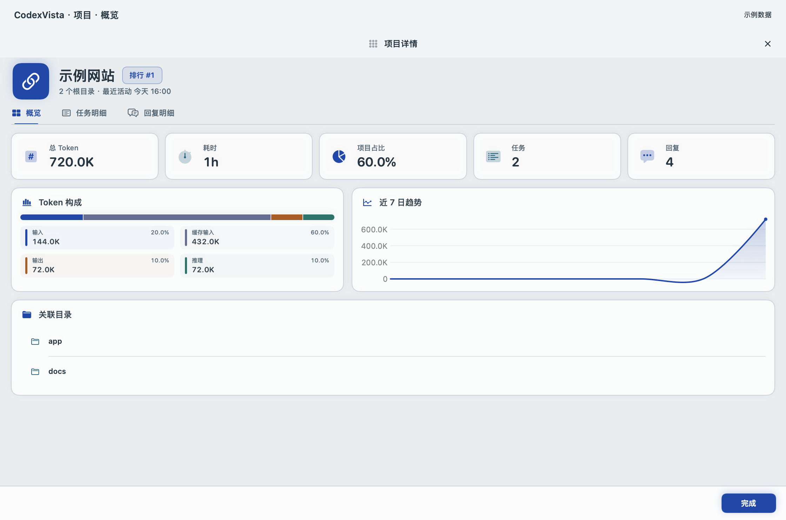


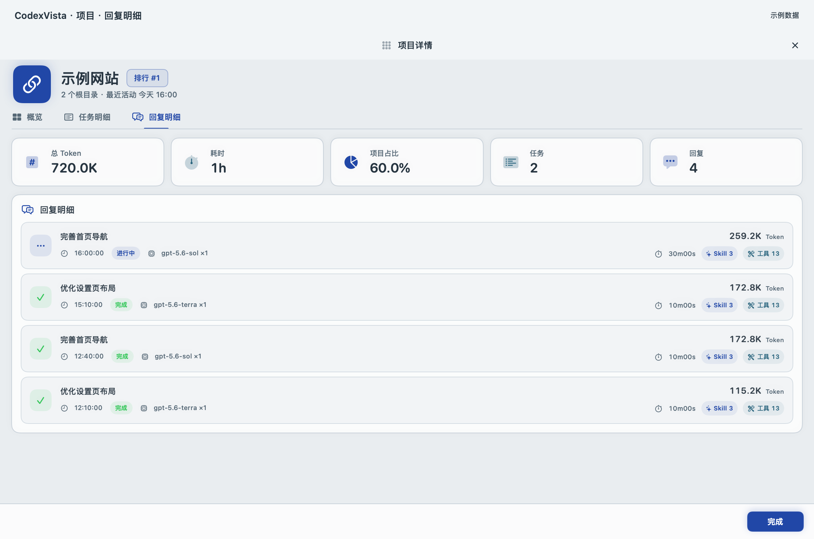

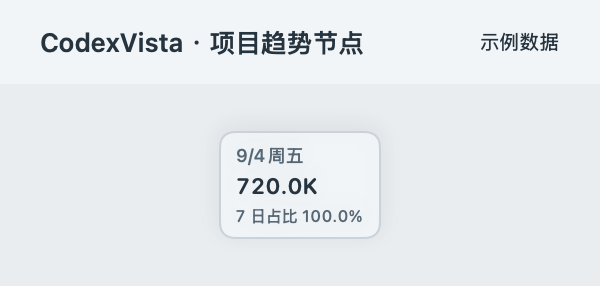

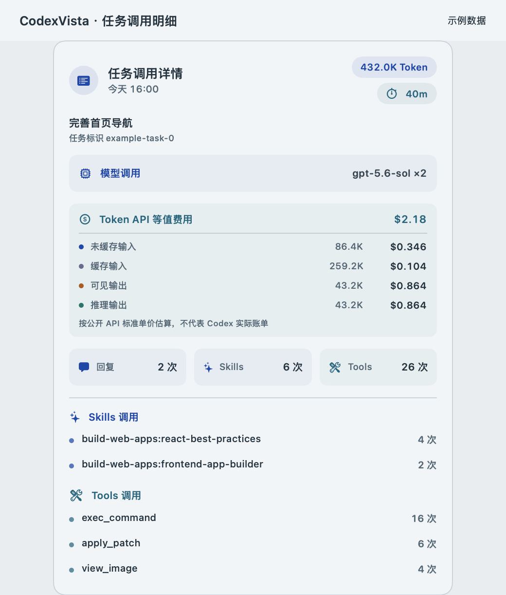

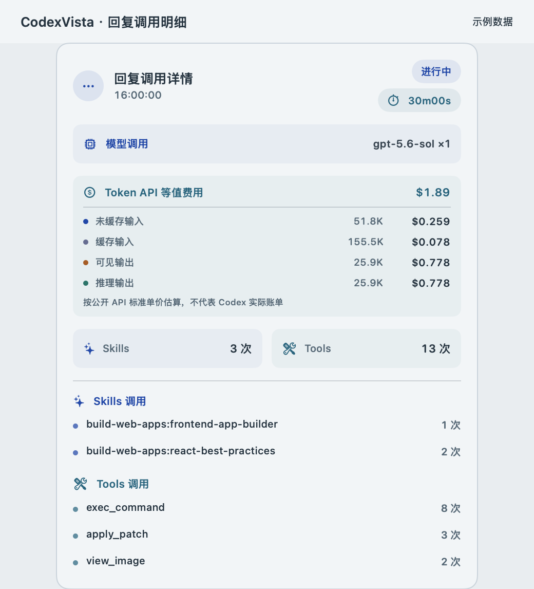

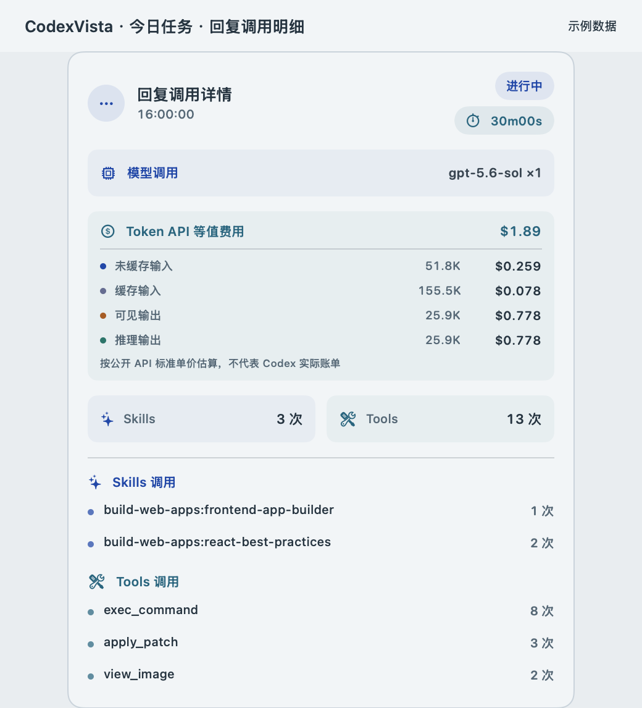

### 模型用量与费用

- 模型排行入口分别位于今日、7 日、30 日、累计和可选的当前订阅周期用量卡中，排行自动继承所在卡片的时间范围。
- 悬浮模型数量入口展示该时间范围 Token 用量前 5 名；超过 5 个模型时显示省略提示和未展示数量。点击模型入口、省略提示或“固定并展开全部”后，悬浮窗保持显示并展开完整排行；取消固定后恢复前 5 名预览。
- 按模型汇总总 Token、占比、四类 Token 构成和 API 等值费用。
- 排行表头展示当前周期全部模型的预估费用总计，不随前 5 名预览截断；弹窗高度按可见内容调整，更多模型入口整合在列表底部。
- 悬浮 Token 数值可查看该模型的四类 Token 明细。
- 悬浮费用可查看各类 Token、单价和分项估算。
- 已收录模型的标准 API 价格规则和官方价格页面链接集中放在“设置 → 其他计费方式 → 模型费用说明”。
- 未收录独立公开价格的模型统一按 GPT-5.5 参考价估算，其费用计入总额并以 `≈` 标记。
- 长上下文倍率、缓存写入和工具调用等无法从当前聚合事件可靠还原的附加费用不计入总额。

API 等值费用只用于理解同等 Token 若按公开 API 标准价格计费的大致规模，不代表 Codex 订阅的实际账单。

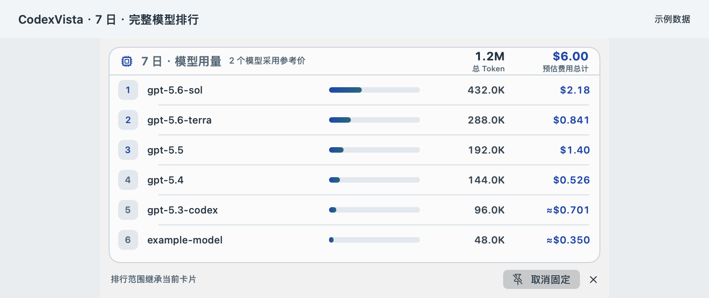

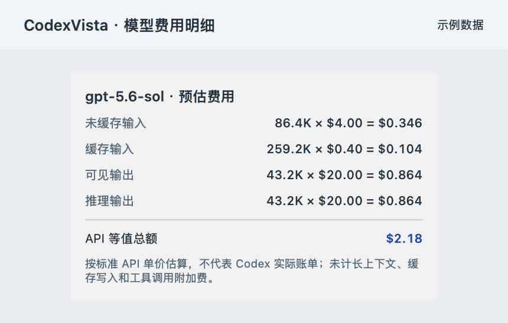

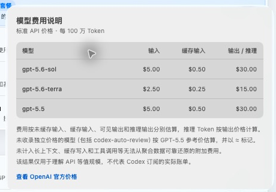

## 刷新、额度与数据修复

### 启动与自动刷新

- 启动时先加载上一次成功保存的本地统计，避免等待全量扫描后才显示界面。
- 随后立即增量读取新增或变化的 Codex 记录，其中同时包含用量和 7 天额度观测。
- 默认每 60 秒检查一次新增用量和额度。
- 单次读取暂时只得到部分数据时，会在同一次刷新内再确认一次；确认期间保持刷新中，仅在连续两次结果都不完整时展示“部分更新”。
- 自动刷新可以在设置中关闭。

### 本地额度读取

- 从本机 rollout 的 `token_count` 记录读取额度观测，不发起独立账户额度请求。
- 只展示 `codex` 默认额度池中的 7 天窗口（10080 分钟）。
- Spark 等模型专属额度池不会覆盖或进入账户额度展示。
- 额度缺失、无效或已过期时不会推断为 100%。

### 手动操作

- **立即刷新**：增量读取上次刷新后新增或变化的本机记录，其中同时更新用量和 7 天额度。
- **清空并重抓**：清空 CodexVista 自己保存的统计和导入检查点，从本机 Codex 数据重新计算；不会删除 Codex 原始数据。
- 全量重建会显示清理、扫描、逐文件导入和生成统计结果等阶段；发现记录后展示已处理文件数、总文件数和进度。

“清空并重抓”会先展示确认弹窗，明确说明只清空 CodexVista 自己保存的聚合统计与检查点，不删除 Codex 原始数据。


### 数据源健康状态

设置页会分别显示 Codex CLI、Codex macOS 和线程索引的检测结果，包括已连接、未检测到、部分不可用和格式不兼容。线程索引不可用时，应用会尽量降级到文件系统发现，不阻断全部导入。

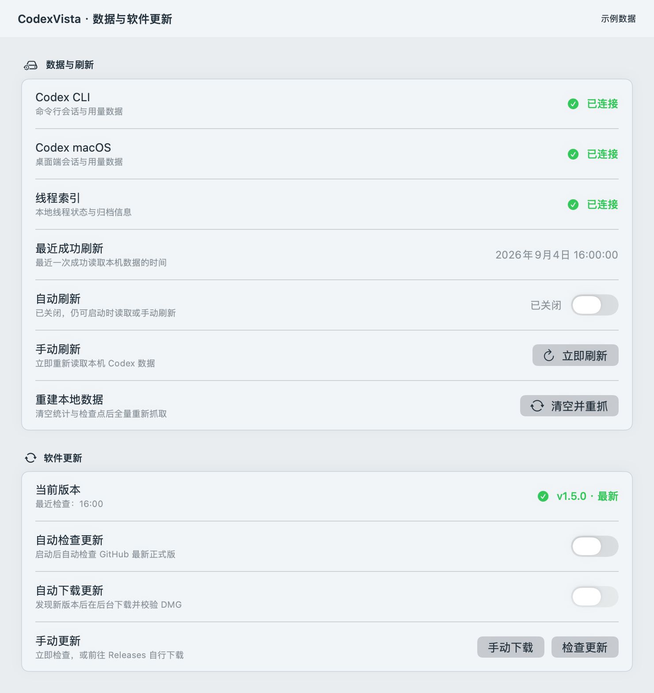

## 提醒与个性化设置

以下截图均来自 CodexVista v1.3.0。先按功能分区展示便于阅读的裁剪图，最后提供从顶部到隐私提示的完整设置页长截图。

### 额度提醒

- 额度提醒固定监控 7 天窗口。
- 可选择在剩余 20%、10% 和 5% 时提醒。
- 通知中的重置时间直接显示为本地时区的月、日、小时和分钟。
- 同一额度周期的同一档位只通知一次；进入新的重置周期后重新计算。
- 开启时请求 macOS 通知权限；设置页会显示授权状态，并提供进入系统设置的入口。


### 界面设置

- 皮肤可选择经典、水墨、青瓷、暮霞、未来科技或仙侠；经典、青瓷、暮霞支持跟随系统、浅色和深色，水墨和仙侠仅支持浅色，未来科技仅支持深色，看板、状态栏弹窗、设置与项目详情同步生效。外观设置用两列预览卡选择皮肤。固定明暗的皮肤只显示对应色系，切回支持明暗切换的皮肤后恢复此前偏好。青瓷使用瓷白与青绿、圆润数字和涟漪；暮霞使用胭脂、暖灰与落日余晖；未来科技使用电光青、分段额度条、等宽数字与电路细线；仙侠使用月白青玉配色、宋体标题与清晰的无衬线数字；额度区左侧以长剑、金色剑穗、月轮与渐隐远山组成一幅竖向小景，右侧展示剩余量和细额度条，重置时间独立置于底部。经典采用铝灰与钴蓝、仪表刻度和 DIN 数字；水墨采用册页留白与雾白纸纹、居中额度读数及细笔触额度条、独立重置行、远山孤舟与飞鸟、右下角朱砂落款；右侧统计使用轻量分组细线，减少嵌套边框与图标底块；设置中的当前套餐同步使用纸色底、朱砂细边框与印章式徽标。
- 状态栏与刘海摘要跟随六款皮肤及有效色系，额度、倒计时、底色和边角同步适配；切换皮肤立即更新。设置中的预览与实际摘要使用同一绘图实现，弹窗的字体与 Token 分类颜色和看板一致。
- 设置看板是否始终置顶。
- 设置点击看板关闭按钮时是仅关闭看板，还是直接退出 CodexVista。
- 选择在状态栏或刘海下方展示摘要，并控制是否显示实时额度；无刘海屏幕自动回退状态栏。
- 在已用比例与剩余比例之间切换。
- 设置是否显示重置倒计时。
- 状态栏设置区提供实时预览。

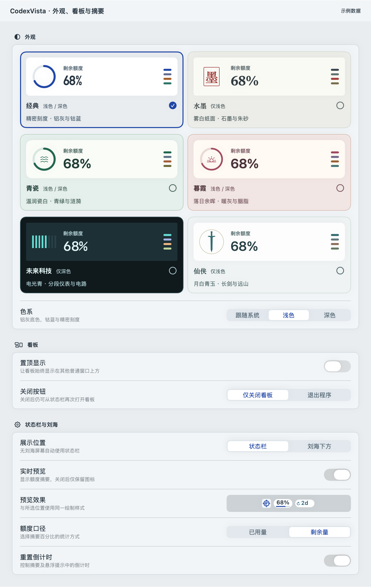

### 套餐与计费说明

- 根据本机记录展示当前识别到的 Codex 套餐。
- 可设置或清除第一次订阅时间；设置后按同一订阅日和时刻逐月计算当前订阅周期，不按固定 30 天估算。
- 设置页说明 Free、Go、Plus、Pro 5x、Pro 20x、Business、Enterprise / Edu 等套餐类别与 API Key 独立按量计费的差异。
- “其他计费方式”集中展示模型 API 标准单价、费用估算边界和官方价格链接；看板周期用量卡中的模型排行只保留用量与费用明细。
- 套餐说明不参与账单计算，API 等值费用也不代表 Codex 实际账单。

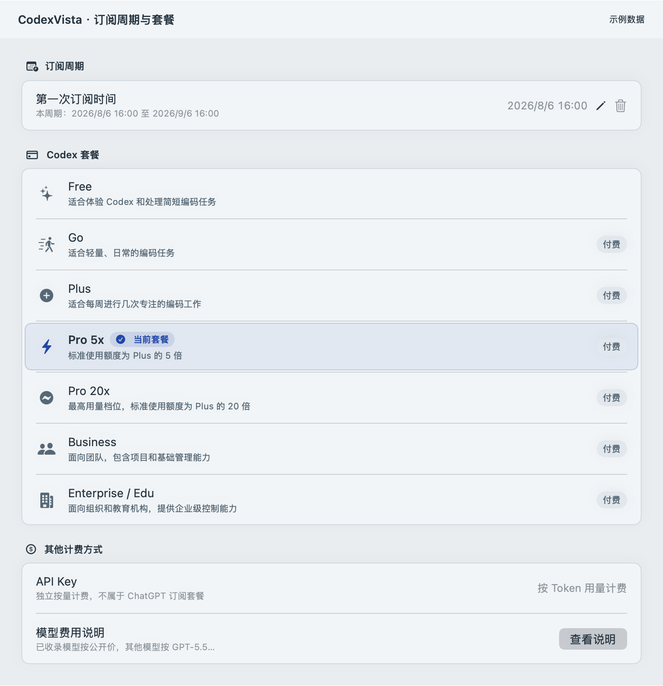

### 软件更新

- 默认在启动后检查 GitHub Releases 的最新正式版本，可关闭自动检查。
- 可选择发现新版本后自动下载 DMG。
- 自动下载会读取随发布包提供的 SHA-256 校验信息，并在打开前验证安装包完整性。
- 支持手动检查、前往 Releases 下载、下载更新和打开已下载的安装包。
- 安装仍由用户确认完成；当前 DMG 未签名、未公证。

### 完整设置页长截图

下图覆盖外观、看板、状态栏、额度提醒、数据与刷新、软件更新、订阅周期、Codex 套餐、其他计费方式和底部隐私提示。

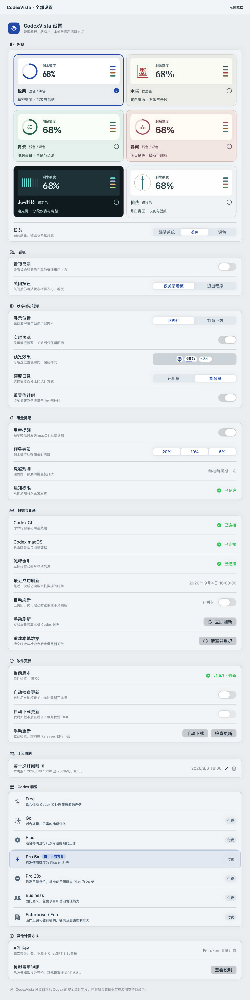

## 数据口径

| 指标 | 口径 |
| --- | --- |
| 今日 / 7 日 / 30 日 / 累计 | 对应周期内从本机 Codex 记录识别出的 Token 用量 |
| 耗时 | 当前项目范围内可见任务的回复生命周期累计时长；未结束的回复计至最近一次刷新，子 Agent 归并到主回复且不重复计时，不代表人类实际投入时间 |
| 7 天额度 | 本机 rollout 中 `codex` 默认额度池的最近一次有效 10080 分钟窗口观测 |
| 未缓存输入 | 未命中缓存的输入 Token |
| 缓存输入 | 命中缓存的输入 Token |
| 可见输出 | 输出 Token 中扣除推理 Token 后的可见部分 |
| 推理 | 模型内部推理使用的 Token |
| Skills / Tools | 白名单事件中识别出的调用次数；可按线程与回复标识归属到具体回复 |
| 项目用量 | 保留每次 turn 的原始根集合归属；有明确 Codex 项目配置时合并该项目的历史根集合，并汇总任务和回复 |
| 关联目录 | 优先展示最新项目配置中的目录名称，缺少配置时使用会话工作目录；不代表各目录的实际 Token 消耗 |
| 模型用量 | 按模型汇总四类 Token，并生成今日、7 日、30 日、累计和可选当前订阅周期的排行 |
| API 等值费用 | 已收录模型按公开 API 标准价格估算；其他模型按 GPT-5.5 参考价估算并标记 `≈` |

Codex 的 `total_token_usage` 是线程内累计快照，CodexVista 只计算相邻快照的正增量；计数回退时开启新分段，不产生负 Token。重复刷新、文件移动、会话归档和应用重启不会重复累计已导入事件。

CodexVista 根据本机文件计算，Codex 个人资料使用服务端汇总。日期归属、显示取整、跨设备使用、历史文件是否仍保留在本机等因素都可能造成两处数字不同。

## 数据与隐私边界

### 会读取的最小字段

- Token 计数、时间、模型、套餐和额度窗口；
- 会话与回复标识、生命周期状态和耗时；
- 工作目录、项目根目录组合和 Codex 本地项目名称；
- Skills / Tools 的类型、名称、时间与回复归属；
- 为识别主目录与 worktree 而读取的 Git remote、根提交或公共 Git 目录。

项目路径和 Git 信息只用于生成稳定身份与展示名称。CodexVista 数据库只保存派生 ID、哈希指纹、安全名称和根目录数量，不保存原始 Git remote、完整项目路径或完整项目根目录路径。

### 任务名称

项目详情中的任务名称优先从最新 `state_*.sqlite` 的 `threads.name` / `threads.title` 字段只读获取，并仅在内存中临时保留。名称不会写入 CodexVista 数据库、日志或网络请求。

系统上下文模板不会直接显示为名称。子任务可使用安全的代理昵称、角色或任务类型生成回退名称；其他不可用名称回退为匿名任务标识。CodexVista 不会读取第一条用户消息生成任务名称。

### 不会读取或保存的内容

- 提示词、消息、回复、摘要和推理正文；
- 工具参数、工具输出、文件内容或项目代码；
- `auth.json` 等认证文件内容；
- Codex 原始 JSON、完整数据库行或其他未进入统计白名单的字段。

### 本地存储与网络

聚合统计、本地额度观测、来源状态和导入检查点保存在：

```text
~/Library/Application Support/CodexVista/CodexVista.sqlite
```

首次启动新版时，会自动接续旧版 SpendScope 的本地统计数据和偏好设置。迁移保留旧数据库，且不会覆盖已经存在的 CodexVista 数据；通知权限由 macOS 按新应用标识重新管理。

CodexVista 不修改或删除 Codex 原始文件和数据库，也不会为额度展示启动 Codex 服务或发起账户额度请求。软件更新检查和下载会访问本项目的 GitHub Releases，但不会上传 CodexVista 保存的统计数据库、会话内容或项目数据。

## 可靠性与兼容策略

- JSONL 按文件检查点增量读取，只推进到已提交的完整换行；未写完的半行留到下次处理。
- 使用事件指纹去重；活跃记录转入归档目录、重复扫描或重启应用不会重复累计。
- 事件、聚合、上下文和检查点在同一 SQLite 事务中提交，失败时整体回滚。
- 保留来源状态与最近成功时间，区分缺失、降级、格式不兼容和读取失败。
- 刷新失败或数据源暂时异常时保留上一次成功统计，不用静态示例数字替代真实数据。
- SQLite 结构通过显式迁移升级，已有数据库无需手动删除。
- 项目配置迁移至数据库结构 v17 时保留已有用量、检查点和安全目录信息；旧版应用不能直接读取升级后的数据库，请勿直接降级。

## 当前限制

- API 等值费用不是 Codex 订阅账单；暂不提供账单对账、预算管理或 API Key 实际消费分析。
- 只统计当前 Mac 上仍可读取的本地记录，不提供账号体系、云同步、跨设备汇总或服务端历史补齐。
- 已删除、未同步到本机或当前格式无法识别的历史记录不会进入统计。
- Codex 本地数据格式发生不兼容变化时，部分统计可能暂时无法更新；应用会保留已有数据并提示来源异常。
- 当前发布 DMG 未使用 Apple Developer ID 签名和公证，首次打开需要用户手动确认。
