# SpendScope 完整功能说明

本文档记录 SpendScope 当前已经实现的用户功能、数据口径、刷新机制与产品边界。项目首页和快速开始见 [README](../README.md)，底层实现与维护约束见 [技术档案](TECHNICAL_ARCHIVE.md)。

## 功能总览

| 区域 | 能力 |
| --- | --- |
| macOS 状态栏 | 展示 7 天额度、已用或剩余比例、重置倒计时 |
| 状态栏弹窗 | 查看今日 Token、额度、Token 构成、刷新状态和更新状态 |
| 详细看板 | 查看额度、四周期汇总、趋势、日历、活动、工作区和模型分析 |
| 工作区详情 | 下钻目录、任务、回复、状态、耗时、模型与 Skills / Tools 调用 |
| 设置 | 管理色系、看板、状态栏、提醒、刷新、数据重建、套餐说明和软件更新 |
| 本地数据层 | 增量读取、事件去重、SQLite 聚合、来源健康检查和安全降级 |

## 状态栏与弹窗

### 状态栏摘要

- 状态栏额度固定显示 7 天窗口。
- 可在“已用比例”和“剩余比例”之间切换。
- 可选择是否显示额度重置倒计时；状态栏按天显示 `xd`，不足一天按小时显示 `xh`。
- 可关闭实时额度预览，仅保留 SpendScope 图标与名称。
- 暂无有效额度时自动隐藏对应指标，避免将过期数据展示为满额。
- 跟随 macOS 外观绘制状态栏内容。


### 状态栏弹窗

- 展示当前识别到的 Codex 套餐、数据更新时间和来源可用状态。
- 展示今日 Token 总量，以及 7 天剩余额度和重置时间。
- 将今日 Token 拆分为未缓存输入、缓存输入、可见输出与推理，并展示各自占比。
- 支持手动刷新；刷新中显示进度状态。
- 支持打开详细看板、打开设置、检查或安装更新，以及退出应用。
- 对加载中、无数据、数据过期、读取失败和格式不兼容状态分别给出提示与恢复入口。


## 详细看板

### 额度与周期汇总

- 用环形图展示从本机记录读取的 7 天剩余额度、重置时间和数据新鲜度。
- 汇总今日、近 7 日、近 30 日和累计 Token。
- 设置第一次订阅时间后，额外展示按该时刻逐月锚定的当前订阅周期 Token 和周期起止时间。
- 每个周期同时展示未缓存输入、缓存输入、可见输出和推理 Token。
- 工具栏支持立即刷新、打开设置、看板置顶，以及将看板收起为仅显示额度的紧凑窗口。
- 支持加载、正常、空数据、过期、失败和格式不兼容等状态；首次读取本地统计时使用与真实看板布局一致的动画骨架反馈进度。


### 用量趋势与日历

- 趋势图支持 7 天、30 天和订阅周期范围；设置第一次订阅时间后，可按逐月锚定的每个订阅周期查看 Token 总量。
- 日趋势展示区间总计与日均 Token，周期趋势展示总计与周期均值。
- 悬浮趋势节点可查看当日或当期总 Token、四类 Token 构成，以及按模型公开 API 单价计算的等值预计花费；含未定价模型时标记为部分估算。
- 月度热力日历支持前后切换月份，并限制在已有数据范围内。
- 悬浮日历日期可查看当日 Token 明细；悬浮热力图例可查看各颜色对应的用量区间。
- 每日统计按 UTC 日期归属，以尽量接近 Codex 服务端的每日统计口径。

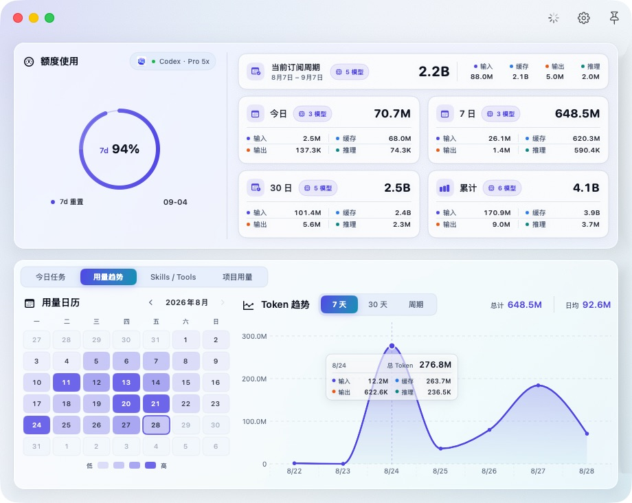

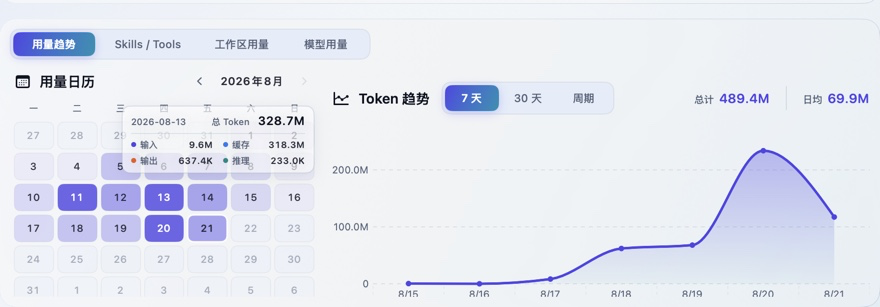

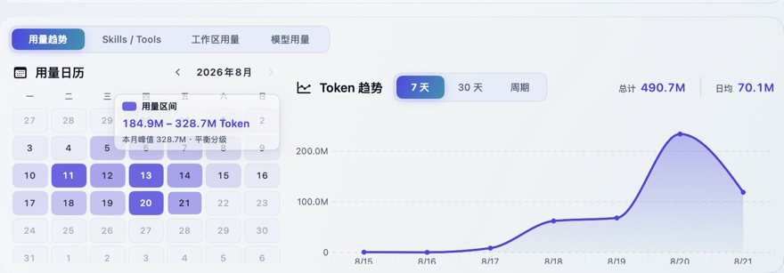

### Skills / Tools 排行

- 分别统计 Skills 与 Tools 的调用次数。
- 支持今日、7 日、30 日和累计范围。
- 带命名空间的 Skill 先按命名空间汇总，避免同一组 Skill 因细分名称不同被拆散。
- 悬浮汇总 Skill 可查看各细分 Skill 和“直接使用”的调用次数。
- Tools 按完整名称独立排行。


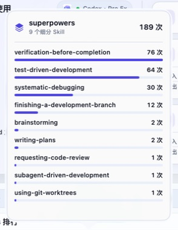

### 工作区用量排行

- 支持今日、7 日、30 日和累计范围。
- 按 Token 用量排序，并展示占比、根目录数量、任务数、回复数和最近活动时间。
- 支持按工作区名称搜索。
- 优先使用 Codex `local-projects` 中的工作区名称；已归档工作区可继续保留此前识别到的安全名称。
- 使用每次 turn 的 `workspace_roots` 根目录组合区分工作区；旧记录缺少该字段时以会话工作目录建立“工作目录推测”工作区。
- Git 主目录和关联 worktree 按仓库身份合并，避免同一仓库被重复拆分。
- 同名单目录仅在共享项目路径或 Git 仓库身份时合并；只有名称相同但目录身份不同的工作区仍保持分离。
- 经确认的历史临时工作区可通过本地派生 ID 别名并入目标工作区，别名在全量重建后保留。


### 工作区详情

从工作区排行打开独立详情窗口后，可以查看：

- **顶部摘要**：工作区排名、Token、全局占比、根目录数量、任务数、回复数和最近活动时间。
- **概览**：本期涉及目录及其用量、任务和回复数量、四类 Token 构成、近 7 日趋势和任务列表。
- **任务明细**：任务名称、最后活动时间、回复数、工作区内占比和 Token；子 agent 自动并入对应主任务；支持搜索，并可按“最近消息”或“用量”排序；悬浮任务行可查看该任务汇总后的模型、Skill、Tool 和四类 Token。
- **回复明细**：每次回复的时间、状态、耗时、模型及调用次数、Token、Skill 调用数和 Tool 调用数；子 agent 活动并入实际创建它的主回复，默认按时间倒序展示。
- **调用悬浮详情**：悬浮任务或回复行时，在详情窗口外侧分别展示任务汇总或单次回复的模型调用、四类 Token，以及完整 Skills / Tools 名称和各自调用次数；两类明细共用同一面板，面板会根据屏幕空间选择右、左、下或上方。

详情窗口会与原看板保持关联：打开详情时锁定原看板，拖动详情窗口时原看板同步移动。

内部“命令权限检查”任务不会出现在任务列表中，也不计入任务数、回复数和最后活动时间；它产生的 Token 仍计入工作区真实用量。无法明确归属到某次回复的历史 Token 仍计入任务和工作区总量，但不会被错误分配给具体回复。


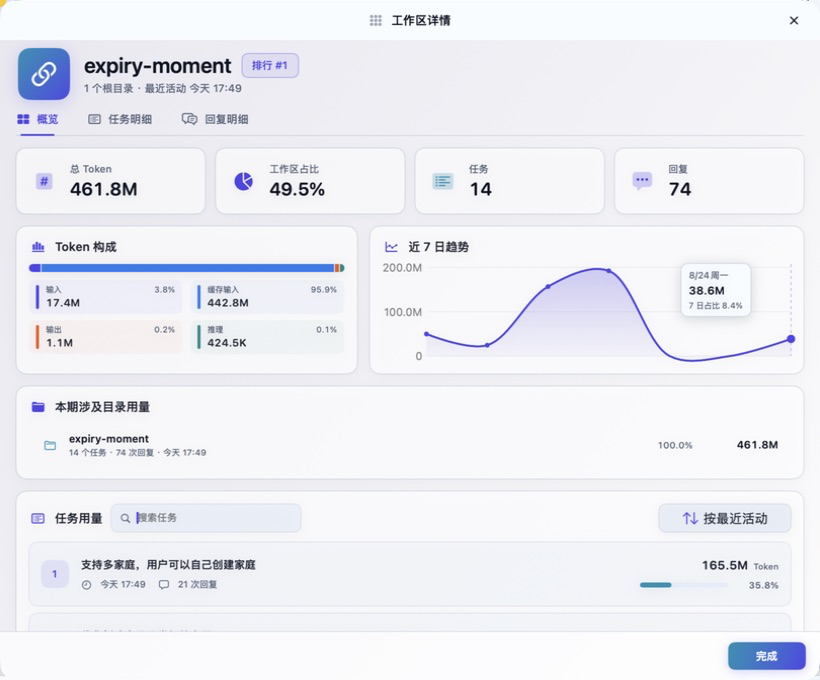


### 模型用量与费用

- 支持今日、7 日、30 日和累计范围。
- 按模型汇总总 Token、占比、四类 Token 构成和 API 等值费用。
- 悬浮 Token 数值可查看该模型的四类 Token 明细。
- 悬浮费用可查看各类 Token、单价和分项估算。
- 可查看已收录模型的标准 API 价格规则，以及官方价格页面链接。
- 未收录公开价格的模型明确标记为未定价，其 Token 不计入费用总额，不按相似名称猜价。
- 长上下文倍率、缓存写入和工具调用等无法从当前聚合事件可靠还原的附加费用不计入总额。

API 等值费用只用于理解同等 Token 若按公开 API 标准价格计费的大致规模，不代表 Codex 订阅的实际账单。


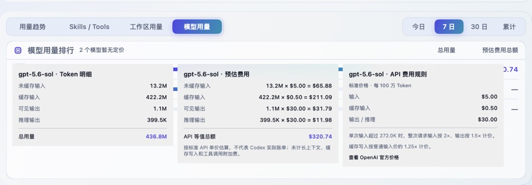

## 刷新、额度与数据修复

### 启动与自动刷新

- 启动时先加载上一次成功保存的本地统计，避免等待全量扫描后才显示界面。
- 随后立即增量读取新增或变化的 Codex 记录，其中同时包含用量和 7 天额度观测。
- 默认每 60 秒检查一次新增用量和额度。
- 单次读取暂时只得到部分数据时，会在同一次刷新内再确认一次；确认期间保持刷新中，仅在连续两次结果都不完整时展示“部分更新”。
- 自动刷新可以在设置中关闭。

### 本地额度读取

- 从本机 rollout 的 `token_count` 记录读取额度观测，不发起独立账户额度请求。
- 只展示 `codex` 默认额度池中的 7 天窗口（10080 分钟）。
- Spark 等模型专属额度池不会覆盖或进入账户额度展示。
- 额度缺失、无效或已过期时不会推断为 100%。

### 手动操作

- **立即刷新**：增量读取上次刷新后新增或变化的本机记录，其中同时更新用量和 7 天额度。
- **清空并重抓**：清空 SpendScope 自己保存的统计和导入检查点，从本机 Codex 数据重新计算；不会删除 Codex 原始数据。
- 全量重建会显示清理、扫描、逐文件导入和生成统计结果等阶段；发现记录后展示已处理文件数、总文件数和进度。

“清空并重抓”会先展示确认弹窗，明确说明只清空 SpendScope 自己保存的聚合统计与检查点，不删除 Codex 原始数据。

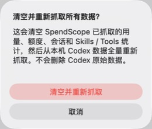

### 数据源健康状态

设置页会分别显示 Codex CLI、Codex macOS 和线程索引的检测结果，包括已连接、未检测到、部分不可用和格式不兼容。线程索引不可用时，应用会尽量降级到文件系统发现，不阻断全部导入。

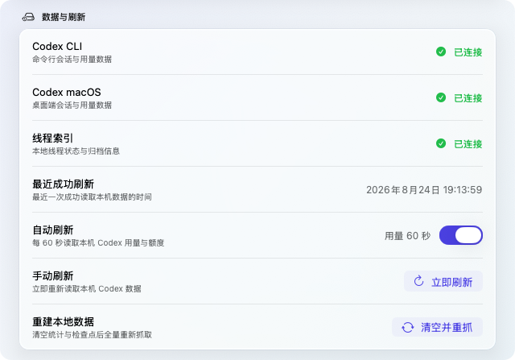

## 提醒与个性化设置

### 额度提醒

- 额度提醒固定监控 7 天窗口。
- 可选择在剩余 20%、10% 和 5% 时提醒。
- 通知中的重置时间直接显示为本地时区的月、日、小时和分钟。
- 同一额度周期的同一档位只通知一次；进入新的重置周期后重新计算。
- 开启时请求 macOS 通知权限；设置页会显示授权状态，并提供进入系统设置的入口。

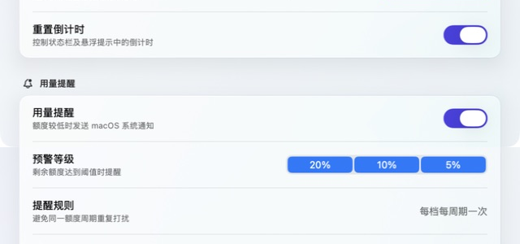

### 界面设置

- 可在跟随 macOS 系统、清爽浅色和科技深色之间切换；看板、状态栏弹窗、设置与工作区详情同步生效。
- 设置看板是否始终置顶。
- 设置点击看板关闭按钮时是仅关闭看板，还是直接退出 SpendScope。
- 设置状态栏是否显示实时额度。
- 在已用比例与剩余比例之间切换。
- 设置是否显示重置倒计时。
- 状态栏设置区提供实时预览。

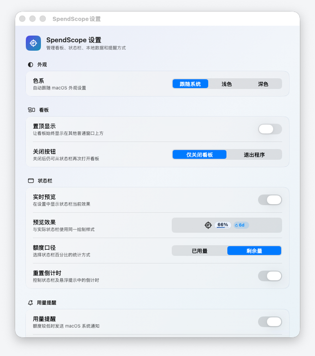

### 套餐与计费说明

- 根据本机记录展示当前识别到的 Codex 套餐。
- 可设置或清除第一次订阅时间；设置后按同一订阅日和时刻逐月计算当前订阅周期，不按固定 30 天估算。
- 设置页说明 Free、Go、Plus、Pro 5x、Pro 20x、Business、Enterprise / Edu 等套餐类别与 API Key 独立按量计费的差异。
- 套餐说明不参与账单计算；模型费用估算统一在看板的“模型用量”页展示。

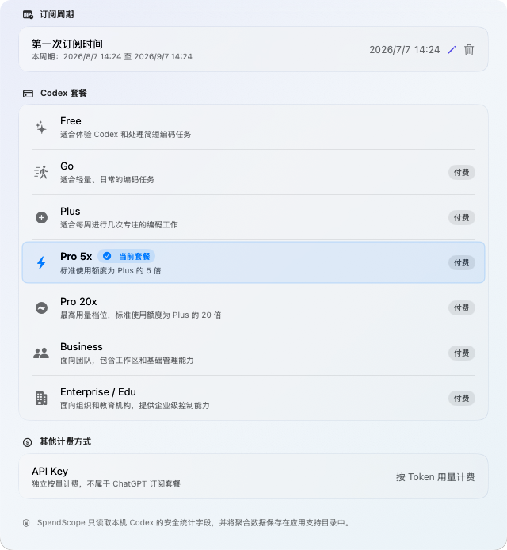

### 软件更新

- 默认在启动后检查 GitHub Releases 的最新正式版本，可关闭自动检查。
- 可选择发现新版本后自动下载 DMG。
- 自动下载会读取随发布包提供的 SHA-256 校验信息，并在打开前验证安装包完整性。
- 支持手动检查、前往 Releases 下载、下载更新和打开已下载的安装包。
- 安装仍由用户确认完成；当前 DMG 未签名、未公证。

## 数据口径

| 指标 | 口径 |
| --- | --- |
| 今日 / 7 日 / 30 日 / 累计 | 对应周期内从本机 Codex 记录识别出的 Token 用量 |
| 7 天额度 | 本机 rollout 中 `codex` 默认额度池的最近一次有效 10080 分钟窗口观测 |
| 未缓存输入 | 未命中缓存的输入 Token |
| 缓存输入 | 命中缓存的输入 Token |
| 可见输出 | 输出 Token 中扣除推理 Token 后的可见部分 |
| 推理 | 模型内部推理使用的 Token |
| Skills / Tools | 白名单事件中识别出的调用次数；可按线程与回复标识归属到具体回复 |
| 工作区用量 | 按每次 turn 的工作区根目录组合归属，并在工作区内继续汇总目录、任务和回复 |
| 模型用量 | 按模型汇总四类 Token，并生成四个时间范围的排行 |
| API 等值费用 | 按内置公开 API 标准价格估算；未定价模型不计入总额 |

Codex 的 `total_token_usage` 是线程内累计快照，SpendScope 只计算相邻快照的正增量；计数回退时开启新分段，不产生负 Token。重复刷新、文件移动、会话归档和应用重启不会重复累计已导入事件。

SpendScope 根据本机文件计算，Codex 个人资料使用服务端汇总。日期归属、显示取整、跨设备使用、历史文件是否仍保留在本机等因素都可能造成两处数字不同。

## 数据与隐私边界

### 会读取的最小字段

- Token 计数、时间、模型、套餐和额度窗口；
- 会话与回复标识、生命周期状态和耗时；
- 工作目录、工作区根目录组合和 Codex 本地工作区名称；
- Skills / Tools 的类型、名称、时间与回复归属；
- 为识别主目录与 worktree 而读取的 Git remote、根提交或公共 Git 目录。

工作区路径和 Git 信息只用于生成稳定身份与展示名称。SpendScope 数据库只保存派生 ID、哈希指纹、安全名称和根目录数量，不保存原始 Git remote、完整项目路径或完整工作区路径。

### 任务名称

工作区详情中的任务名称优先从最新 `state_*.sqlite` 的 `threads.name` / `threads.title` 字段只读获取，并仅在内存中临时保留。名称不会写入 SpendScope 数据库、日志或网络请求。

系统上下文模板不会直接显示为名称。子任务可使用安全的代理昵称、角色或任务类型生成回退名称；其他不可用名称回退为匿名任务标识。SpendScope 不会读取第一条用户消息生成任务名称。

### 不会读取或保存的内容

- 提示词、消息、回复、摘要和推理正文；
- 工具参数、工具输出、文件内容或项目代码；
- `auth.json` 等认证文件内容；
- Codex 原始 JSON、完整数据库行或其他未进入统计白名单的字段。

### 本地存储与网络

聚合统计、本地额度观测、来源状态和导入检查点保存在：

```text
~/Library/Application Support/SpendScope/SpendScope.sqlite
```

SpendScope 不修改或删除 Codex 原始文件和数据库，也不会为额度展示启动 Codex 服务或发起账户额度请求。软件更新检查和下载会访问本项目的 GitHub Releases，但不会上传 SpendScope 保存的统计数据库、会话内容或项目数据。

## 可靠性与兼容策略

- JSONL 按文件检查点增量读取，只推进到已提交的完整换行；未写完的半行留到下次处理。
- 使用事件指纹去重；活跃记录转入归档目录、重复扫描或重启应用不会重复累计。
- 事件、聚合、上下文和检查点在同一 SQLite 事务中提交，失败时整体回滚。
- 保留来源状态与最近成功时间，区分缺失、降级、格式不兼容和读取失败。
- 刷新失败或数据源暂时异常时保留上一次成功统计，不用静态示例数字替代真实数据。
- SQLite 结构通过显式迁移升级，已有数据库无需手动删除。

## 当前限制

- API 等值费用不是 Codex 订阅账单；暂不提供账单对账、预算管理或 API Key 实际消费分析。
- 只统计当前 Mac 上仍可读取的本地记录，不提供账号体系、云同步、跨设备汇总或服务端历史补齐。
- 已删除、未同步到本机或当前格式无法识别的历史记录不会进入统计。
- Codex 本地数据格式发生不兼容变化时，部分统计可能暂时无法更新；应用会保留已有数据并提示来源异常。
- 当前发布 DMG 未使用 Apple Developer ID 签名和公证，首次打开需要用户手动确认。
