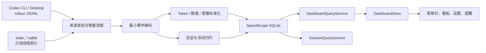

# SpendScope 技术档案

更新日期：2026-07-17

本文档合并并取代原 `docs/superpowers/specs` 与 `docs/superpowers/plans` 中 2026-07-10 至 2026-07-14 的设计规格和实施计划。内容以当前代码为准，同时保留对后续维护仍有价值的设计背景、架构约束、数据口径、兼容策略和演进记录。

## 1. 产品定位

SpendScope 是一款仅在本机运行的原生 macOS 菜单栏应用，用于观察 Codex CLI 与 Codex Desktop 产生的 Token 用量、额度窗口和使用活动。

核心目标：

- 自动发现本机 Codex 活跃与归档会话数据。
- 展示今日、近 7 日、近 30 日和累计 Token。
- 将 Token 拆分为未缓存输入、缓存输入、可见输出和推理输出。
- 展示 5 小时与 7 天额度、重置时间和数据新鲜度。
- 展示每日趋势、月度日历、Skills / Tools 调用排行和项目用量。
- 支持手动刷新、60 秒自动刷新和从本机原始记录全量重建。
- 在额度剩余 20%、10% 或 5% 时发送本机通知。
- 所有统计数据保留在本机，不上传 Codex 使用记录。

当前非目标：

- 费用估算、账单对账、预算管理或 API Key 消费分析。
- 云同步、账号体系、团队看板或跨设备汇总。
- 从 Codex 服务端补齐本机不存在的历史记录。
- Mac App Store 分发。

## 2. 技术基线

| 项目 | 当前约束 |
| --- | --- |
| 平台 | macOS 14.0 及以上 |
| 工程 | 原生 Xcode macOS App，`SpendScope.xcodeproj` |
| 语言 | Swift 6 |
| UI | SwiftUI、AppKit、Swift Charts |
| 状态 | Observation、Swift Concurrency |
| 存储 | 系统 SQLite3，无第三方依赖 |
| Bundle ID | `com.ychp.SpendScope` |
| 当前版本 | `0.1.0 (1)` |
| 发布架构 | Universal Binary：`arm64` + `x86_64` |
| 发布渠道 | GitHub Releases，当前为未签名、未公证 DMG |

工程使用共享 Scheme `SpendScope`。本地 DerivedData 默认写入 `/private/tmp/SpendScope-DerivedData`，避免文稿目录的文件提供程序扩展属性影响本地构建和签名。

## 3. 总体架构



设计边界：

- rollout JSONL 是 Token 分类、额度和生命周期事件的统计事实来源。
- Codex SQLite 仅用于发现线程、补充归档状态、模型和子代理关系，不是精细统计的唯一来源。
- Codex SQLite 缺失、被锁或格式暂时不兼容时，文件系统发现仍应继续工作。
- 所有 Codex 文件和数据库始终只读；SpendScope 只写自己的 SQLite。
- 数据导入、查询和 UI 状态解耦，生产界面不使用预览数字兜底。

## 4. 工程目录与职责

```text
Sources/SpendScope/
├── App/                 应用入口、生命周期、共享状态、额度提醒
├── Data/
│   ├── Codex/           来源发现、JSONL 解码、增量导入、状态归约
│   ├── Dashboard/       看板和会话查询
│   └── Storage/         SQLite 封装、迁移、持久化和检查点
├── Features/
│   ├── Dashboard/       看板、趋势日历、活动排行、项目用量
│   ├── MenuBar/         菜单栏状态项和弹窗
│   └── Settings/        设置窗口
├── Models/              UI 与查询层共享模型
├── Resources/           App、菜单栏和 Codex 图标
└── Support/             偏好设置、更新、提醒、格式化和视觉系统
```

主要组件：

| 组件 | 职责 |
| --- | --- |
| `SpendScopeApp` | 组合菜单栏、看板与设置 Scene，注入共享服务 |
| `DashboardStore` | Main Actor 上发布加载、正常、空、过期、失败和不兼容状态 |
| `CodexSourceDiscovery` | 合并文件系统与线程索引，生成 rollout 清单和来源健康状态 |
| `IncrementalJSONLReader` | 按字节偏移分块读取完整 JSONL 行，不加载整文件 |
| `CodexEventDecoder` | 只解码统计白名单事件和字段，忽略消息正文 |
| `UsageAccumulator` | 将累计计数转换为非重叠 Token 增量 |
| `SessionStateReducer` | 归约活动、归档和子代理关系等正交事实 |
| `CodexImporter` | 串行协调发现、读取、解码、去重和原子提交 |
| `UsageStore` | 管理 SQLite 迁移、事件、聚合、检查点和来源状态 |
| `DashboardQueryService` | 生成四周期、趋势、额度、活动排行和项目统计 |
| `SessionQueryService` | 提供不含对话内容的会话筛选与新鲜度查询 |
| `UsageReminderController` | 请求通知权限、评估阈值并持久化去重状态 |
| `AppUpdateService` | 检查 GitHub Release、下载 DMG 并校验 SHA-256 |

## 5. Codex 数据源

默认 Codex 根目录为用户目录下的 `.codex`，主要读取：

- `sessions/YYYY/MM/DD/rollout-*.jsonl`：活跃会话。
- `archived_sessions/rollout-*.jsonl`：归档会话。
- 最新可识别的 `state_*.sqlite`：线程索引和关系补充。

来源识别：

- CLI 通常为 `source = "cli"`、`originator = "codex-tui"`。
- Desktop 通常为 `source = "vscode"`、`originator = "Codex Desktop"`。
- 子代理来源可能是结构化对象；按明确的 originator 归入 CLI 或 Desktop。
- 无法确认时保存为 `unknown`，不猜测。

索引读取使用 SQLite 只读模式和短 busy timeout，只提取线程 ID、rollout 路径、来源、模型、时间、归档状态、工作目录及子代理关系等安全字段。索引异常会降级文件发现，而不是阻断全部导入。

## 6. 事件白名单与隐私边界

允许进入标准化模型的记录：

- `session_meta`：线程 ID、来源、格式版本、工作目录等会话上下文。
- `turn_context`：当前 turn 与模型。
- `event_msg.token_count`：累计 Token、套餐和额度窗口。
- `task_started`、`task_complete`、`turn_aborted(reason: interrupted)`、`thread_rolled_back`：生命周期事实。
- 经白名单识别的 Skills / Tools 活动标识。

禁止读取、持久化或上传：

- Prompt、用户消息、模型回复、摘要和推理正文。
- 工具输入、文件内容和项目代码。
- `auth.json`、凭证和认证信息。
- 线程标题或第一条用户消息。
- 原始 Git remote 或项目路径；项目识别仅保存派生哈希和安全展示名。

应用自有数据库位于：

```text
~/Library/Application Support/SpendScope/SpendScope.sqlite
```

软件更新功能只访问本项目 GitHub Releases，不随请求发送 Token、会话或项目统计。

## 7. Token 统计口径

rollout 中的 `total_token_usage` 是线程内累计快照，不能逐行相加。每个线程保存上一份计数，先计算正增量：

```text
delta_input     = current.input     - previous.input
delta_cached    = current.cached    - previous.cached
delta_output    = current.output    - previous.output
delta_reasoning = current.reasoning - previous.reasoning
```

第一份有效快照相对零值计算。若任一累计分量回退，则开启新的计数分段，并把当前快照相对零值计算，避免负增量。

界面使用四类互不重叠口径：

```text
未缓存输入 = max(delta_input - delta_cached, 0)
缓存输入   = max(delta_cached, 0)
可见输出   = max(delta_output - delta_reasoning, 0)
推理输出   = max(delta_reasoning, 0)
总量       = 未缓存输入 + 缓存输入 + 可见输出 + 推理输出
```

`last_token_usage.total_tokens` 只可用于诊断，不作为聚合依据。所有 Token 在存储层使用 `Int64`，转换到 UI 的 `Int` 时执行溢出保护。

模型归属优先级：最近的 `turn_context.model`、线程索引模型、`Unknown Model`。跨模型切换产生的增量归属到当前 Token 快照对应模型。

## 8. 套餐与额度语义

套餐解析保留原始值和是否推断标记。当前明确映射：

| 原始值 | 展示值 |
| --- | --- |
| `free` | Free |
| `plus` | Plus |
| `prolite` | Pro 5x |
| `pro` | Pro 20x |

未知或缺失值按产品规则回退为推断 Free，历史事件保持当时套餐，不随当前套餐变化而重写。

额度按 `window_minutes` 匹配，不依赖 primary / secondary 顺序：

- 300 分钟：5 小时额度。
- 10080 分钟：7 天额度。

数据源提供已用百分比，标准化为：

```text
remaining = clamp(1 - used_percent / 100, 0, 1)
```

重置时间已过但没有新观测时，不推断额度恢复为 100%；对应额度从可信展示中移除并记录问题。额度提醒只使用数值合法、重置时间仍在未来且具有观测时间的快照。

## 9. 会话与活动状态

会话不压缩成单一状态，而是保存：

- 活动状态：`running`、`completed`、`interrupted`、`rolledBack`、`unknown`。
- 归档状态：`active`、`archived`。
- 子代理关系状态：只保存 Codex 明确提供的值，例如 `open`。

主展示状态由查询层按“已归档、运行中、已中断、已回滚、已完成、未知”派生。归档不覆盖最后活动事实；子代理关系 `open` 不等于任务正在运行。

历史记录可能乱序导入。Reducer 只接受时间更新的事件；同一时间使用稳定事件键决定顺序。最后明确事件为 `task_started` 且没有结束事件时仍保存 running，连续 5 分钟没有新记录只标记为 stale，不擅自推断完成或失败。

Skills / Tools 活动使用独立检查点和事件表，按今日、7 日、30 日和累计范围生成调用次数排行。

## 10. 项目识别与项目用量

项目信息来自会话工作目录，但不保存完整工作目录内容。项目归并采用安全派生标识：

- 优先识别 Git 仓库，并基于 remote、根提交或公共 Git 目录生成仓库指纹。
- 同一 Git 仓库的不同 worktree 可合并统计。
- 非 Git 目录或无法确认的目录使用项目级回退标识。
- 数据库只保存项目 ID、展示名和可选仓库指纹，不保存原始 remote。

看板按四个时间范围展示项目 Token、占比、项目数量和总量。

## 11. 增量导入与幂等性

### 11.1 文件身份与检查点

- rollout 文件使用 device ID 与 inode 形成稳定身份，路径可变化。
- 活跃文件移动到 `archived_sessions` 时更新路径，不重新计数。
- 每个文件保存已提交换行符后的字节偏移量。
- 文件尾部未完成的半行留到下次刷新，不越过它保存检查点。
- 文件截断或替换时创建新的读取代次并重新验证。
- Token 与活动分别维护检查点，避免新增活动解析要求重放 Token 数据。

### 11.2 事件去重

标准化事件使用稳定 SHA-256 指纹。Token 指纹以线程、计数分段和累计计数等稳定事实为基础，防止文件复制、父历史重写、归档移动和重复扫描造成重复统计。

事件插入使用幂等语义；只有首次成功插入的事件才更新聚合。业务事件、会话状态、线程上下文和文件偏移在同一 SQLite 事务中提交，失败时整体回滚。

### 11.3 刷新顺序

1. 打开应用数据库并执行迁移。
2. 立即查询上次成功保存的快照。
3. 发现 Codex 来源。
4. 前台优先导入当天更新文件和最新额度候选。
5. 发布首份真实快照。
6. 后台补齐历史数据并再次发布。
7. 默认每 60 秒执行一次增量刷新。

`CodexImporter` 与数据客户端都串行化导入操作；并发刷新会合并或排队，不同时扫描同一来源。手动刷新、自动刷新和全量重建共享同一统计口径。

## 12. SQLite 数据模型与迁移

当前数据库迁移版本为 8。主要表：

| 表 | 用途 |
| --- | --- |
| `schema_migrations` | 已应用迁移版本 |
| `source_files` | 文件身份、路径、大小、Token/活动偏移、上下文和错误 |
| `thread_checkpoints` | 线程模型、套餐、累计计数和计数分段 |
| `usage_events` | 去重后的四类 Token 增量、模型、套餐和项目标识 |
| `hourly_usage` | 按小时、模型和套餐聚合的 Token |
| `quota_snapshots` | 额度观测、窗口、剩余比例、重置时间和套餐 |
| `session_state_events` | 白名单生命周期事实 |
| `sessions` | 活动、归档、子代理关系等会话物化状态 |
| `activity_events` | Skills / Tools 活动事件 |
| `source_status` | CLI、Desktop、索引和文件健康状态 |

迁移演进：

- v2：重建基础事件、聚合、额度、会话和检查点结构。
- v3：增加独立活动检查点及 Skills / Tools 事件。
- v4：修正额度池语义，无法无损修复的旧派生数据通过重抓恢复。
- v5：增加项目身份，并从原始 rollout 重建历史项目归属。
- v6：调整累计 Token 指纹，折叠复制或重写的父历史。
- v7：增加 Git 仓库身份，用于合并同仓库 worktree。
- v8：当前结构版本，启动时校验关键表和字段。

迁移需要改变历史统计语义时，允许清空 SpendScope 派生数据并从未修改的 Codex rollout 重建；绝不删除 Codex 原始数据。

## 13. 查询与时间边界

`DashboardQueryService` 生成：

- 今日：当前统计日。
- 7 日：包含今日的最近 7 个统计日。
- 30 日：包含今日的最近 30 个统计日。
- 累计：全部已导入事件。
- 趋势和日历：按日汇总四类 Token。
- 模型占比、活动排行和项目用量。
- 5 小时与 7 天最新可信额度。

当前每日用量采用 UTC 日期边界，以尽量接近 Codex 服务端日统计。UI 的周期访问按稳定 ID 查找并提供零值回退，避免加载中或不完整数据造成数组越界。

`SessionQueryService` 支持按展示状态、活动状态、归档状态、来源、模型、套餐和更新时间筛选。查询结果只包含线程短 ID、时间、状态、新鲜度、来源、模型、套餐和 Token 汇总，不包含对话内容。

## 14. UI 信息架构与演进

### 14.1 菜单栏

状态项可配置显示：

- 5 小时和 / 或 7 天额度。
- 已用或剩余百分比。
- 重置倒计时。
- 无可信额度时的中性状态。

弹窗展示当前套餐、刷新状态、两档额度、今日 Token 构成，以及刷新、看板、设置、更新和退出入口。

### 14.2 详细看板

看板从早期 `1040 × 700` 滚动原型收敛为紧凑原生布局：

- 默认与最小窗口约束为 `920 × 620`。
- 不使用页面级 `ScrollView`。
- 顶部复合卡左侧展示 5 小时与 7 天额度，右侧以 2×2 四宫格展示今日、7 日、30 日、累计。
- 每个周期展示总量和四类 Token，用量占比通过安全的 `0...1` 计算。
- 趋势范围只影响趋势图，不改变顶部四周期或额度。
- 当前趋势支持 7 天和 30 天；月度用量日历提供更长时间观察。
- 顶部标签可切换 Token 概览、Skills / Tools 排行和项目用量。

四类视觉语义保持一致：未缓存输入、缓存输入、可见输出和推理分别使用固定主题色。

### 14.3 设置

设置页管理：

- 看板置顶。
- 菜单栏显示项、额度口径与倒计时。
- 自动刷新和手动刷新。
- 清空 SpendScope 派生数据并从 Codex 重抓。
- 两档额度及 20%、10%、5% 提醒开关。
- 来源健康状态。
- 自动检查和自动下载更新。

## 15. 应用状态、提醒与更新

`DashboardLoadState` 区分：`loading`、`loaded`、`empty`、`stale`、`failed` 和 `unsupported`。存在部分来源问题时继续展示最后成功数据并明确标记，不回退为预览数字。

提醒规则：

- 默认监控 5 小时与 7 天窗口，可分别关闭。
- 可配置 20%、10%、5% 阈值。
- 同一额度窗口的同一或更宽松阈值只通知一次。
- 观察到新的重置时间后开始新的提醒周期。
- 过期、无重置时间、无观测时间或非法比例不触发通知。
- 通知检查点保存在 UserDefaults，不写入 Codex 数据。

更新规则：

- 从 `https://github.com/ychp/SpendScope/releases/latest` 获取最新版本。
- 比较语义化版本，包括预发布标识。
- 下载 `SpendScope-macOS-unsigned.dmg`。
- 使用 Release 提供的 SHA-256 校验信息验证下载文件。
- 安装仍由用户确认，不在后台替换正在运行的应用。

## 16. 失败与兼容策略

- Codex 根目录不存在：显示未检测到数据。
- 单个 rollout 不可读：保留其他来源和上次有效数据。
- JSON 尾行不完整：等待下一次刷新。
- 单行 JSON 损坏：暂停该文件后续导入，不越过未知累计状态。
- Codex SQLite 被锁：短暂重试后退回文件发现。
- 未知事件：忽略。
- 已知统计事件字段不兼容：标记来源不支持并保留已有统计。
- SQLite 事务失败：回滚事件、聚合、状态和检查点。
- 模型缺失：使用 `Unknown Model`。
- 套餐缺失：使用推断 Free。
- 额度过期：不展示为满额，不发送提醒。
- 没有真实数据：显示空状态，不展示静态预览数字。

## 17. 测试策略

测试只使用手写或生成的匿名化最小数据，不复制真实对话。

覆盖范围：

- 事件解码、字段缺失、未知载荷和隐私白名单。
- 累计计数转增量、计数回退、四类 Token 拆分和溢出。
- 文件追加、半行、分块边界、截断、替换和归档移动。
- 重复刷新、应用重启、父历史复制和事件指纹幂等性。
- SQLite 迁移、事务回滚、腐坏字段和结构校验。
- 今日、7 日、30 日、累计、趋势、额度和项目查询。
- 会话状态乱序、归档正交性、子代理和 stale 新鲜度。
- `DashboardStore` 并发刷新合并与加载状态转换。
- 额度提醒阈值、去重、权限和投递失败。
- GitHub Release 版本解析、DMG 下载和校验失败。
- 菜单栏渲染、格式化和偏好配置。

常用验证命令：

```bash
DEVELOPER_DIR=/Applications/Xcode.app/Contents/Developer \
  xcodebuild -project SpendScope.xcodeproj \
  -scheme SpendScope \
  -configuration Debug \
  -destination "platform=macOS,arch=arm64" \
  -derivedDataPath /private/tmp/SpendScope-Tests \
  test

./script/build_and_run.sh --verify
```

发布前还需验证 Release Universal Binary 同时含有 `arm64` 和 `x86_64`。

## 18. 构建与发布

本地开发入口为 `script/build_and_run.sh`，支持运行、LLDB、日志、Telemetry 和启动验证。

GitHub Actions 手动发布流程：

1. 校验语义化版本标签与工程 `MARKETING_VERSION` 一致。
2. 在 macOS 26 runner 上运行测试。
3. 使用 `ARCHS='arm64 x86_64'` 和 `ONLY_ACTIVE_ARCH=NO` 构建 Release。
4. 使用 `lipo` 校验两种架构。
5. 创建包含 `SpendScope.app` 与 Applications 快捷方式的压缩 DMG。
6. 为 DMG 生成独立 SHA-256 校验文件，文件内容只引用 DMG 文件名，便于下载后直接校验。
7. 根据手动输入的版本亮点生成结构化中文版本说明，包含安装、芯片支持、未签名打开方式、附件、已知限制和完整变更链接。
8. 创建或更新 GitHub Release，标题固定为 `SpendScope v<版本号>`。

当前产物：

- `SpendScope-macOS-unsigned.dmg`
- `SpendScope-macOS-unsigned.dmg.sha256`
- GitHub 自动生成的 `Source code (zip)`
- GitHub 自动生成的 `Source code (tar.gz)`

GitHub 已为每个 Release 标签自动提供 ZIP 和 tar.gz 源码快照，因此工作流不再上传重复的自定义源码包，也不再生成与 DMG 独立校验文件内容重叠的 `SHA256SUMS.txt`。更新已有 Release 时会清理这些旧附件。

当前 DMG 未使用 Developer ID 签名或 Apple 公证。用户首次打开可能需要右键选择“打开”，或对可信下载执行：

```bash
xattr -dr com.apple.quarantine /Applications/SpendScope.app
```

正式无警告分发需要 Apple Developer Program、Developer ID Application 签名和公证。

## 19. 关键设计演进

| 日期 | 决策 |
| --- | --- |
| 2026-07-10 | 建立原生 SwiftUI/AppKit 工程、菜单栏、看板、设置和统一运行脚本 |
| 2026-07-10 | 看板从滚动式 1040 × 700 收敛为 920 × 620 紧凑布局 |
| 2026-07-10 | 周期扩展为今日、7 日、30 日、累计四宫格 |
| 2026-07-11 | 强化双额度环和周期总量视觉层级 |
| 2026-07-11 | 四类 Token 增加占比，并统一非重叠统计口径 |
| 2026-07-12 | 趋势范围移入趋势卡，底部趋势扩展为全宽 |
| 2026-07-14 | 从静态预览切换到索引辅助的增量 JSONL 导入与本地 SQLite |
| 后续实现 | 增加活动排行、项目/仓库归并、额度提醒、更新检查和 UTC 日统计 |

## 20. 维护原则

- 修改 Token 口径、事件指纹、额度池或项目身份语义时，必须评估数据库迁移和历史重抓。
- 引入原生 framework、dylib 或命令行工具时，必须验证同时支持 `arm64` 与 `x86_64`。
- 增加新的 Codex 字段前，先确认其统计必要性和隐私边界。
- 不以未知字段或缺失生命周期事件推断用户状态。
- 所有刷新入口必须保持幂等，检查点必须与业务数据原子提交。
- README 面向用户；本文档面向开发与维护，架构变化应同步更新本文档。
