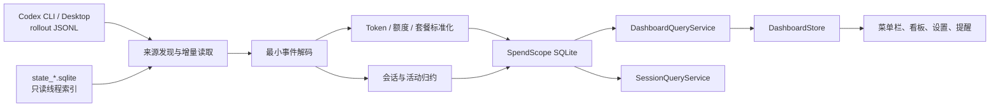

# SpendScope 技术档案

更新日期：2026-08-21

本文档合并并取代原 `docs/superpowers/specs` 与 `docs/superpowers/plans` 中 2026-07-10 至 2026-07-14 的设计规格和实施计划。内容以当前代码为准，同时保留对后续维护仍有价值的设计背景、架构约束、数据口径、兼容策略和演进记录。

## 1. 产品定位

SpendScope 是一款仅在本机运行的原生 macOS 菜单栏应用，用于观察 Codex CLI 与 Codex Desktop 产生的 Token 用量、额度窗口和使用活动。

核心目标：

- 自动发现本机 Codex 活跃与归档会话数据。
- 展示今日、近 7 日、近 30 日和累计 Token。
- 将 Token 拆分为未缓存输入、缓存输入、可见输出和推理输出。
- 展示 7 天额度、重置时间和数据新鲜度。
- 展示每日趋势、月度日历、Skills / Tools 调用排行、工作区用量、回复级调用明细和模型用量。
- 设置第一次订阅时间后，趋势可按同一日和时刻逐月锚定并汇总每个订阅周期；周期悬浮明细按模型价格目录展示 API 等值预计花费，并保留未定价模型提示。
- 根据内置公开 API 标准价格目录提供按模型的 API 等值费用估算。
- 支持手动刷新、60 秒自动读取本机用量与额度，以及从本机原始记录全量重建。
- 在额度剩余 20%、10% 或 5% 时发送本机通知。
- 所有统计数据保留在本机，不上传 Codex 使用记录。

当前非目标：

- Codex 订阅账单还原、账单对账、预算管理或 API Key 实际消费分析。
- 云同步、账号体系、团队看板或跨设备汇总。
- 从 Codex 服务端补齐本机不存在的历史记录。
- Mac App Store 分发。

## 2. 技术基线

| 项目 | 当前约束 |
| --- | --- |
| 平台 | macOS 14.0 及以上 |
| 工程 | 原生 Xcode macOS App，`SpendScope.xcodeproj` |
| 语言 | Swift 6 |
| UI | SwiftUI、AppKit、Swift Charts |
| 状态 | Observation、Swift Concurrency |
| 存储 | 系统 SQLite3，无第三方依赖 |
| Bundle ID | `com.ychp.SpendScope` |
| 版本来源 | `Config/Version.xcconfig` |
| 发布架构 | Universal Binary：`arm64` + `x86_64` |
| 发布渠道 | GitHub Releases，当前为未签名、未公证 DMG |

工程使用共享 Scheme `SpendScope`。本地运行脚本根据工作区路径将 DerivedData 隔离到 `/private/tmp/SpendScope-DerivedData-<工作区指纹>`，避免文稿目录的文件提供程序扩展属性影响本地构建和签名，也避免不同 worktree 复用旧产物。源码、资源、工程配置或脚本输入发生变化时，脚本会先 clean 当前工作区的构建目录，再构建并验证实际运行的是本次生成的精确二进制。

## 3. 总体架构


```mermaid
flowchart LR
    A["Codex CLI / Desktop<br/>rollout JSONL"] --> C["来源发现与增量读取"]
    B["state_*.sqlite<br/>只读线程索引"] --> C
    C --> D["最小事件解码"]
    D --> E["Token / 额度 / 套餐标准化"]
    D --> F["会话与活动归约"]
    E --> G["SpendScope SQLite"]
    F --> G
    G --> H["DashboardQueryService"]
    G --> I["SessionQueryService"]
    H --> J["DashboardStore"]
    J --> K["菜单栏、看板、设置、提醒"]
```

设计边界：

- rollout JSONL 是 Token 分类、额度和生命周期事件的统计事实来源。
- Codex SQLite 仅用于发现线程、补充归档状态、模型和子代理关系，不是精细统计的唯一来源。
- Codex SQLite 缺失、被锁或格式暂时不兼容时，文件系统发现仍应继续工作。
- 所有 Codex 文件和数据库始终只读；SpendScope 只写自己的 SQLite。
- 数据导入、查询和 UI 状态解耦，生产界面不使用预览数字兜底。

## 4. 工程目录与职责

```text
Sources/SpendScope/
├── App/                 应用入口、生命周期、共享状态、额度提醒
├── Data/
│   ├── Codex/           来源发现、JSONL 解码、增量导入、状态归约
│   ├── Dashboard/       看板和会话查询
│   └── Storage/         SQLite 封装、迁移、持久化和检查点
├── Features/
│   ├── Dashboard/       看板、趋势日历、活动/工作区/模型排行和费用明细
│   ├── MenuBar/         菜单栏状态项和弹窗
│   └── Settings/        设置窗口
├── Models/              UI 与查询层共享模型
├── Resources/           App、菜单栏和 Codex 图标
└── Support/             偏好设置、更新、提醒、模型价格、格式化和视觉系统
```

主要组件：

| 组件 | 职责 |
| --- | --- |
| `SpendScopeApp` | 组合菜单栏、看板与设置 Scene，注入共享服务 |
| `DashboardStore` | Main Actor 上发布加载、正常、空、过期、失败和不兼容状态 |
| `CodexSourceDiscovery` | 合并文件系统与线程索引，生成 rollout 清单和来源健康状态 |
| `IncrementalJSONLReader` | 按字节偏移分块读取完整 JSONL 行，不加载整文件 |
| `CodexEventDecoder` | 只解码统计白名单事件和字段，忽略消息正文 |
| `UsageAccumulator` | 将累计计数转换为非重叠 Token 增量 |
| `SessionStateReducer` | 归约活动、归档和子代理关系等正交事实 |
| `CodexImporter` | 串行协调发现、读取、解码、去重和原子提交 |
| `UsageStore` | 管理 SQLite 迁移、事件、聚合、检查点和来源状态 |
| `DashboardQueryService` | 生成四周期、趋势、额度、活动/工作区/模型排行和费用估算 |
| `SessionQueryService` | 提供不含对话内容的会话筛选与新鲜度查询 |
| `ProjectDetailView` | 展示工作区概览、目录用量、任务明细、回复明细，以及任务级和回复级完整 Skill / 工具调用列表 |
| `ProjectDetailWindowController` | 管理锁定原看板的工作区详情窗口，以及窗口外侧的非激活悬浮面板 |
| `ModelPricingCatalog` | 为明确支持的模型提供 API 标准价格和等值费用计算规则 |
| `UsageReminderController` | 请求通知权限、评估阈值并持久化去重状态 |
| `AppUpdateService` | 检查 GitHub Release、下载 DMG 并校验 SHA-256 |

## 5. Codex 数据源

默认 Codex 根目录为用户目录下的 `.codex`，主要读取：

- `sessions/YYYY/MM/DD/rollout-*.jsonl`：活跃会话。
- `archived_sessions/rollout-*.jsonl`：归档会话。
- 最新可识别的 `state_*.sqlite`：线程索引和关系补充。

7 天额度与 Token 用量使用同一条本地读取路径，来自 rollout 的 `event_msg.token_count` 记录。应用不启动 Codex app-server，也不发起独立账户额度请求。

来源识别：

- CLI 通常为 `source = "cli"`、`originator = "codex-tui"`。
- Desktop 通常为 `source = "vscode"`、`originator = "Codex Desktop"`。
- 子代理来源可能是结构化对象；按明确的 originator 归入 CLI 或 Desktop。
- 无法确认时保存为 `unknown`，不猜测。

索引读取使用 SQLite 只读模式和短 busy timeout，只提取线程 ID、rollout 路径、来源、模型、时间、归档状态、工作目录及子代理关系等安全字段。工作区名称从 Codex 全局状态的 `local-projects` 读取；同时读取原子写入留下的历史状态快照以恢复已归档工作区，并将名称与根集合派生哈希写入安全目录表。工作区任务列表优先读取 `threads.name` / `threads.title` 作为页面展示名称；任务名称会规范为空白折叠后的单行文本、最多 120 个字符，只在内存中参与看板组装，不进入 SpendScope 数据库或日志。以 `The following is the Codex` 开头的系统上下文模板不会作为名称透传：子任务可由 `agent_nickname`、`agent_role` 或 `source.subagent.thread_spawn` 中的安全代理元数据生成 `Codex 子任务 · <名称>`，Guardian 回退为 `命令权限检查`，其余继续使用匿名任务标识。父子关系优先读取 `thread_spawn_edges.parent_thread_id`；索引未保留历史边时，只白名单解码子线程首条 `session_meta` 中的线程 ID、父线程 ID 和创建时间。看板按根线程聚合主任务与所有层级的子代理，并用子线程创建时间匹配父线程的 `spawn_agent` 调用所在回复；缺少该活动事件时，回退到创建时最近启动的父回复。匹配会递归到根主回复，Token、模型、生命周期以及 Skill / Tool 调用一起汇总；多模型按稳定名称顺序展示。关系缺失或成环时保留原线程，Guardian 仍按内部任务口径隔离。不得读取第一条用户消息生成名称。索引异常会降级文件发现，而不是阻断全部导入。

## 6. 事件白名单与隐私边界

允许进入标准化模型的记录：

- `session_meta`：线程 ID、来源、格式版本、工作目录等会话上下文。
- `turn_context`：当前 turn、模型和 `workspace_roots` 根目录组合。
- `event_msg.token_count`：累计 Token、套餐和额度窗口。
- `task_started`、`task_complete`、`turn_aborted(reason: interrupted)`、`thread_rolled_back`：生命周期事实。
- 经白名单识别的 Skills / Tools 活动类型、名称、时间、线程和当前回复标识。

禁止读取、持久化或上传：

- Prompt、用户消息、模型回复、摘要和推理正文。
- 工具输入、文件内容和项目代码。
- `auth.json`、凭证和认证信息。
- 第一条用户消息，以及展示名称之外的线程内容或预览。
- 原始 Git remote、项目路径或完整工作区根路径；目录与工作区识别仅保存派生哈希、安全展示名和根目录数量。

应用自有数据库位于：

```text
~/Library/Application Support/SpendScope/SpendScope.sqlite
```

额度读取不会访问网络、认证文件或系统代理配置。软件更新功能会访问本项目 GitHub Releases，但不携带 SpendScope 保存的 Token、会话或项目统计。

## 7. Token 统计口径

rollout 中的 `total_token_usage` 是线程内累计快照，不能逐行相加。每个线程保存上一份计数，先计算正增量：

```text
delta_input     = current.input     - previous.input
delta_cached    = current.cached    - previous.cached
delta_output    = current.output    - previous.output
delta_reasoning = current.reasoning - previous.reasoning
```

第一份有效快照相对零值计算。若任一累计分量回退，则开启新的计数分段，并把当前快照相对零值计算，避免负增量。

界面使用四类互不重叠口径：

```text
未缓存输入 = max(delta_input - delta_cached, 0)
缓存输入   = max(delta_cached, 0)
可见输出   = max(delta_output - delta_reasoning, 0)
推理输出   = max(delta_reasoning, 0)
总量       = 未缓存输入 + 缓存输入 + 可见输出 + 推理输出
```

`last_token_usage.total_tokens` 只可用于诊断，不作为聚合依据。所有 Token 在存储层使用 `Int64`，转换到 UI 的 `Int` 时执行溢出保护。

模型归属优先级：最近的 `turn_context.model`、线程索引模型、`Unknown Model`。跨模型切换产生的增量归属到当前 Token 快照对应模型。

回复级统计先以 `turn_context.turn_id` 为线程内归属键：当前累计快照算出的每一份增量都绑定到当时的 turn，仍然使用上述累计差值，避免一轮回复中多次 `token_count` 重复相加。生命周期事件提供开始、完成、中断或回滚时间，Skills / Tools 活动同样先按 `(thread_id, turn_id)` 归入线程内回复；查询层再把子线程的独立 turn 映射到实际创建它的父回复，统一计算状态、耗时、模型、Token 和调用次数。模型调用以 `(thread_id, turn_id, model)` 去重，同一调用产生的多条 Token 增量只计一次，合并进主回复的子代理 turn 则各自计数。没有明确 turn 的历史 Token 保留在任务总量中，没有明确 turn 的活动不进入回复调用明细，二者都不会被猜测归属。

## 8. 套餐与额度语义

套餐解析保留原始值和是否推断标记。当前明确映射：

| 原始值 | 展示值 |
| --- | --- |
| `free` | Free |
| `plus` | Plus |
| `prolite` | Pro 5x |
| `pro` | Pro 20x |

未知或缺失值按产品规则回退为推断 Free，历史事件保持当时套餐，不随当前套餐变化而重写。

额度按 `window_minutes` 匹配，不依赖 primary / secondary 顺序：

- 10080 分钟：7 天额度。

数据源提供已用百分比，标准化为：

```text
remaining = clamp(1 - used_percent / 100, 0, 1)
```

重置时间已过但没有新观测时，不推断额度恢复为 100%；对应额度从可信展示中移除并记录问题。额度提醒只使用数值合法、重置时间仍在未来且具有观测时间的快照。

额度展示只使用 rollout 中 `limit_id = codex` 的 10080 分钟窗口。Spark 等模型专属额度池和其他窗口不会进入账户额度结果；观测已过期时不回退猜测为满额。

## 9. 会话与活动状态

会话不压缩成单一状态，而是保存：

- 活动状态：`running`、`completed`、`interrupted`、`rolledBack`、`unknown`。
- 归档状态：`active`、`archived`。
- 子代理关系状态：只保存 Codex 明确提供的值，例如 `open`。

主展示状态由查询层按“已归档、运行中、已中断、已回滚、已完成、未知”派生。归档不覆盖最后活动事实；子代理关系 `open` 不等于任务正在运行。

历史记录可能乱序导入。Reducer 只接受时间更新的事件；同一时间使用稳定事件键决定顺序。最后明确事件为 `task_started` 且没有结束事件时仍保存 running，连续 5 分钟没有新记录只标记为 stale，不擅自推断完成或失败。

Skills / Tools 活动使用独立检查点和事件表，按今日、7 日、30 日和累计范围生成调用次数排行。Skill 名称若符合 `namespace:detail`，查询层会先读取所选范围内的全部 Skill 计数，再以第一个冒号前的命名空间分组、汇总总调用次数，最后对分组结果应用 Top 20；细分名称与未带命名空间的同名调用分别作为明细和“直接使用”展示。Tools 仍按完整名称直接应用 Top 20。带有明确 `turn_id` 的活动还会在查询层按线程和回复聚合；同名活动展示一次并附带调用次数，列表不限制种类数量。

## 10. 工作区识别与目录用量

工作区信息优先来自每次 `turn_context` 的 `workspace_roots`。根目录集合先标准化、去重和排序；可识别的 Git 根使用仓库指纹，不可识别的根使用路径哈希，再生成稳定工作区 ID。因此同一仓库的主目录、关联 worktree 和已删除但在会话元数据中保留 remote 的 worktree 会合并，而不同根目录组合仍保持独立。完整根路径只在解码和匹配时短暂使用，不进入数据库。

展示名优先使用 Codex 全局状态 `local-projects` 中与根集合匹配的工作区名称，例如双根目录组合显示为 `open-api`，而不是 `guide-performance + retail-sales`。读取器合并当前状态、备份和原子写入遗留快照；匹配到的名称写入 `workspace_catalog`，所以工作区归档或临时状态文件被清理后，后续重建仍能恢复名称。只有无法找到元数据时才回退到根目录末级名称组合。若旧记录没有 `workspace_roots` 但会话有工作目录，则生成独立的工作目录推测身份并设置 `isInferred`。仅在两类信息都缺失时归入“未识别工作区”。复制历史产生相同用量指纹但携带不同工作区证据时，存储层按“确定工作区 > 工作目录推测 > 未识别”更新归属，同时不重复累计 Token。

工作区是一级统计边界：每个累计 Token 正增量归属于当时 turn 的工作区。同一个 `retail-sales` 目录被单目录工作区和多目录工作区同时使用时，会分别形成两份工作区明细，不因目录相同而合并。拥有完全相同根目录集合的两个自定义工作区若 rollout 没有项目 ID，仍无法仅凭 turn 进一步区分。

查询层会修复同一个单目录工作区在历史上被拆成“路径身份”和“Git 仓库身份”的情况：仅当两个确定工作区名称相同、根目录数均为 1，并共享同一个项目路径派生 ID 或仓库指纹时，四周期排行、趋势、目录、任务和回复才映射到同一代表工作区。代表身份优先选择带仓库证据的记录。不同项目路径、不同仓库、推测工作区、多根工作区或未识别工作区即使同名也不会因此合并，避免仅凭展示名误归属。

已经人工确认的历史临时工作区使用 `workspace_aliases` 保存“来源工作区派生 ID → 目标工作区派生 ID”的显式别名。查询层在自动身份图之后解析别名链，检测到循环时忽略该链，并以最终目标工作区的名称、根目录信息和 ID 展示合并结果。别名不保存完整路径、任务名称或对话内容，也不属于全量重建的清理范围。

Guardian 的“命令权限检查”属于内部任务：其 Token 保留在工作区和目录的真实用量中，但线程及 turn 不计入可见任务数、回复数或最后活动时间。主排行、详情顶部卡片、目录汇总、任务明细和回复明细共用这一口径。

工作区内的目录信息来自会话工作目录，并采用安全派生标识：

- 优先识别 Git 仓库，并基于 remote、根提交或公共 Git 目录生成仓库指纹。
- 同一 Git 仓库的不同 worktree 可合并统计。
- 非 Git 目录或无法确认的目录使用项目级回退标识。
- 数据库只保存目录 ID、展示名、可选仓库指纹，以及工作区 ID、Codex 工作区名称和根目录数量；不保存原始 remote 或完整工作区路径。

看板按四个时间范围展示工作区 Token、占比、工作区数量、涉及目录数量和总量。排行行显示配置根目录数量及本期实际产生用量的目录；点击工作区行会打开独立详情窗口。原看板在详情打开期间忽略鼠标事件，拖动详情窗口时原看板同步移动。

工作区详情分为三个标签：

- **概览**：展示工作区 Token、全局占比、根目录与本期目录用量、任务与回复数量、四类 Token 构成、近 7 日趋势和任务用量列表。
- **任务明细**：支持搜索任务，子代理聚合到根主任务，默认按最后一条消息时间倒序，也可切换为 Token 用量排序。
- **回复明细**：同一轮子代理聚合到主回复，按时间倒序展示四类 Token 总量、时间、状态、耗时、模型及其调用次数，以及本次回复的 Skill / 工具调用总数。

鼠标进入任务明细或回复行时，`ProjectDetailView` 将对应任务或回复传给 `ProjectDetailWindowController`。控制器复用同一个透明、非激活、忽略鼠标事件的子 `NSPanel`，在工作区详情窗口外侧展示任务聚合或单次回复的模型、完整 Skill / 工具名称、调用次数和四类 Token；面板优先位于右侧，空间不足时依次尝试左侧、下方和上方，并作为子窗口跟随详情窗口移动。调用种类全部渲染，内容超过可用高度时在面板内部滚动，单个长名称自动换行而不截断。

任务名称来自只读索引并仅在内存中使用；优先级为手动名称、非系统标题、代理昵称、代理角色、安全任务类型，最后才显示匿名任务标识。内部“命令权限检查”任务从工作区任务列表中过滤。第一条用户消息和回复正文始终不进入名称或统计采集链路。

## 11. 增量导入与幂等性

### 11.1 文件身份与检查点

- rollout 文件使用 device ID 与 inode 形成稳定身份，路径可变化。
- 活跃文件移动到 `archived_sessions` 时更新路径，不重新计数。
- 每个文件保存已提交换行符后的字节偏移量。
- 文件尾部未完成的半行留到下次刷新，不越过它保存检查点。
- 文件截断或替换时创建新的读取代次并重新验证。
- Token 与活动分别维护检查点，避免新增活动解析要求重放 Token 数据。

### 11.2 事件去重

标准化事件使用稳定 SHA-256 指纹。Token 指纹以线程、计数分段和累计计数等稳定事实为基础，防止文件复制、父历史重写、归档移动和重复扫描造成重复统计。

事件插入使用幂等语义；只有首次成功插入的事件才更新聚合。业务事件、会话状态、线程上下文和文件偏移在同一 SQLite 事务中提交，失败时整体回滚。

### 11.3 刷新顺序

1. 打开应用数据库并执行迁移。
2. 立即查询上次成功保存的快照。
3. 发现 Codex 来源。
4. 前台优先导入当天更新文件。
5. 发布首份真实快照。
6. 后台补齐历史数据并再次发布。
7. 启动时立即执行一次本地增量刷新，同时导入新增用量和 7 天额度观测；该行为不受自动刷新开关影响。
8. 启动后默认每 60 秒执行一次本地增量刷新。
9. 用户手动刷新时执行同一条本地增量导入与查询流程。

`CodexImporter` 与数据客户端都串行化操作；并发刷新会合并或排队，不同时扫描同一来源。前台增量刷新首次返回 `stale` 时会在同一刷新任务内再确认一次，确认期间不发布中间状态；只有确认结果仍不完整时才向界面发布“部分更新”，避免本地索引或活跃 rollout 短暂不可读造成状态闪烁。手动刷新、自动刷新和全量重建共享同一统计口径。全量重建通过异步进度回调上报清理、发现、逐文件导入和最终查询阶段；文件发现完成后以所选 rollout 总数为分母，每处理一个文件更新一次确定进度，`DashboardStore` 作为全局状态所有者向设置页发布进度。

## 12. SQLite 数据模型与迁移

当前数据库迁移版本为 16。主要表：

| 表 | 用途 |
| --- | --- |
| `schema_migrations` | 已应用迁移版本 |
| `source_files` | 文件身份、路径、大小、Token/活动偏移、上下文和错误 |
| `thread_checkpoints` | 线程模型、套餐、当前工作区、累计计数和计数分段 |
| `usage_events` | 去重后的四类 Token 增量、回复归属、模型、套餐、工作区和目录标识 |
| `workspace_catalog` | 已识别工作区的派生 ID、Codex 工作区名称和根目录数量；重建时保留 |
| `workspace_aliases` | 已确认历史工作区的来源与目标派生 ID；重建时保留 |
| `hourly_usage` | 按小时、模型和套餐聚合的 Token |
| `quota_snapshots` | 额度观测、窗口、剩余比例、重置时间和套餐 |
| `session_state_events` | 白名单生命周期事实 |
| `sessions` | 活动、归档、子代理关系等会话物化状态 |
| `activity_events` | Skills / Tools 活动事件，包括可选的线程内回复归属 |
| `source_status` | CLI、Desktop、索引和文件健康状态 |

迁移演进：

- v2：重建基础事件、聚合、额度、会话和检查点结构。
- v3：增加独立活动检查点及 Skills / Tools 事件。
- v4：修正额度池语义，无法无损修复的旧派生数据通过重抓恢复。
- v5：增加项目身份，并从原始 rollout 重建历史项目归属。
- v6：调整累计 Token 指纹，折叠复制或重写的父历史。
- v7：增加 Git 仓库身份，用于合并同仓库 worktree。
- v8：从 `session_meta` 中恢复嵌入的 Git 仓库身份，并重建历史派生数据。
- v9：增加官方账户额度缓存表；启动时校验基础结构、项目/仓库字段与缓存字段。
- v10：为文件、线程检查点和 Token 增量增加当前 turn / 回复归属；从原始 rollout 重建历史数据。
- v11：为文件、线程检查点和 Token 增量增加工作区 ID、展示名和根目录数量；从原始 rollout 重建历史工作区归属。
- v12：增加工作区推测标志；缺少 `workspace_roots` 的旧 turn 使用安全工作目录身份重建，并与确定工作区分开统计。
- v13：增加持久化工作区目录，从当前及历史 Codex 项目元数据恢复归档工作区名称。
- v14：根目录优先使用 Git 仓库身份合并 worktree，并按新的稳定工作区身份全量重建。
- v15：增加持久化工作区别名，使经确认的临时工作区可以并入目标且不受全量重建影响。
- v16：删除不再使用的官方账户额度缓存表，只保留 rollout 中的本地额度观测。

迁移需要改变历史统计语义时，允许清空 SpendScope 派生数据并从未修改的 Codex rollout 重建；绝不删除 Codex 原始数据。

## 13. 查询与时间边界

`DashboardQueryService` 生成：

- 今日：当前统计日。
- 7 日：包含今日的最近 7 个统计日。
- 30 日：包含今日的最近 30 个统计日。
- 当前订阅周期：用户设置第一次订阅时间后，以该本地日历日期和时刻为锚点逐月计算；月末日期自动落在目标月的最后一天，查询范围从本周期起点精确到当前时刻。
- 累计：全部已导入事件。
- 趋势和日历：按日汇总四类 Token。
- 模型占比、活动排行、工作区/目录/任务/回复用量、回复级 Skill / 工具调用，以及按模型聚合的 Token 构成与 API 等值费用估算。
- 7 天最新可信额度。

当前每日用量采用 UTC 日期边界，以尽量接近 Codex 服务端日统计。UI 的周期访问按稳定 ID 查找并提供零值回退，避免加载中或不完整数据造成数组越界。

模型费用使用显式的内置 API 标准价格目录，当前收录 `gpt-5.6` / `gpt-5.6-sol`、`gpt-5.6-terra` 和 `gpt-5.5`。估算分别计算未缓存输入、缓存输入、可见输出和推理输出，推理 Token 按输出价格处理。价格卡会说明长上下文与缓存写入规则，但当前聚合数据无法还原单次请求边界和缓存写入量，因此总额不应用这些附加倍率。该数值不等同于 Codex 订阅账单；`codex-auto-review`、`Unknown Model` 或其他未收录模型保留为未定价，不纳入费用总额。

`SessionQueryService` 支持按展示状态、活动状态、归档状态、来源、模型、套餐和更新时间筛选。查询结果只包含线程短 ID、时间、状态、新鲜度、来源、模型、套餐和 Token 汇总，不包含对话内容。

## 14. UI 信息架构与演进

### 14.1 菜单栏

状态项固定使用 7 天额度，并可配置：

- 已用或剩余百分比。
- 重置倒计时固定使用 `xd` / `xh` 紧凑单位，不在状态栏显示分钟单位。
- 无可信额度时的中性状态。

弹窗展示当前套餐、刷新状态、额度、今日 Token 构成，以及刷新、看板、设置、更新和退出入口。

### 14.2 详细看板

看板从早期 `1040 × 700` 滚动原型收敛为紧凑原生布局：

- 默认与最小窗口约束为 `920 × 666`；展示当前订阅周期时自动扩展为 `920 × 728`，为下方分析标签保留完整行高。
- 不使用页面级 `ScrollView`。
- 首次读取本地统计时展示与额度、周期汇总和分析区真实布局一致的动画骨架；系统启用“减少动态效果”时停止循环动画。
- 顶部复合卡左侧展示 7 天额度，右侧以 2×2 四宫格展示今日、7 日、30 日、累计；设置第一次订阅时间后，在四宫格上方增加当前订阅周期汇总条。
- 每个周期展示总量和四类 Token，用量占比通过安全的 `0...1` 计算。
- 趋势范围只影响趋势图，不改变顶部四周期或额度。
- 当前趋势支持 7 天、30 天和订阅周期；订阅周期选项仅在已设置第一次订阅时间时显示，并按逐月锚点汇总全部历史周期。
- 顶部标签可切换用量趋势、Skills / Tools、工作区用量和模型用量。
- Skills 排行先合并带命名空间的细分项，再按汇总次数排序；包含细分项的排行行可通过悬浮面板查看完整构成。
- 工作区用量排行保持单层表格；工作区详情通过独立窗口展示目录构成，并包含概览、任务明细和回复明细三个标签。
- 任务列表提供搜索和“最近活动 / Token 用量”排序；回复列表直接展示状态、耗时、模型、Skill 与工具调用总数。
- 任务与回复调用悬浮卡共用窗口外侧子面板，分别展示任务聚合或单次回复的模型、四类 Token、完整 Skill / 工具名称和次数，不遮挡列表；面板随工作区详情窗口移动。
- 模型页按今日、7 日、30 日和累计切换，展示模型排名、占比、四类 Token、已定价模型费用和未定价模型数量；悬浮或点击信息按钮可查看 Token、费用和价格规则明细。

四类视觉语义保持一致：未缓存输入、缓存输入、可见输出和推理分别使用固定主题色。

### 14.3 设置

设置页管理：

- 跟随 macOS 系统、清爽浅色和科技深色三种色系；看板、菜单栏弹窗、设置和工作区详情统一生效。
- 看板置顶。
- 菜单栏显示项、额度口径与倒计时。
- 自动刷新和手动刷新。
- 清空 SpendScope 派生数据并从 Codex 重抓。
- 20%、10%、5% 提醒开关；提醒额度固定为 7 天窗口。
- 来源健康状态。
- 第一次订阅时间；保存于本机偏好设置，用于逐月计算当前订阅周期 Token。
- 自动检查和自动下载更新。

## 15. 应用状态、提醒与更新

`DashboardLoadState` 区分：`loading`、`loaded`、`empty`、`stale`、`failed` 和 `unsupported`。存在部分来源问题时继续展示最后成功数据并明确标记，不回退为预览数字。

提醒规则：

- 固定监控 7 天额度窗口。
- 可配置 20%、10%、5% 阈值。
- 同一额度窗口的同一或更宽松阈值只通知一次。
- 观察到新的重置时间后开始新的提醒周期。
- 过期、无重置时间、无观测时间或非法比例不触发通知。
- 通知按本地时区显示 `M月d日 HH:mm` 的绝对重置时间，不显示相对倒计时。
- 通知检查点保存在 UserDefaults，不写入 Codex 数据。

更新规则：

- 从 `https://github.com/ychp/SpendScope/releases/latest` 获取最新版本。
- 比较语义化版本，包括预发布标识。
- 下载 `SpendScope-macOS-unsigned.dmg`。
- 使用 Release 提供的 SHA-256 校验信息验证下载文件。
- 安装仍由用户确认，不在后台替换正在运行的应用。

## 16. 失败与兼容策略

- Codex 根目录不存在：显示未检测到数据。
- 单个 rollout 不可读：保留其他来源和上次有效数据。
- JSON 尾行不完整：等待下一次刷新。
- 单行 JSON 损坏：暂停该文件后续导入，不越过未知累计状态。
- Codex SQLite 被锁：短暂重试后退回文件发现。
- 未知事件：忽略。
- 已知统计事件字段不兼容：标记来源不支持并保留已有统计。
- SQLite 事务失败：回滚事件、聚合、状态和检查点。
- 模型缺失：使用 `Unknown Model`。
- 套餐缺失：使用推断 Free。
- 额度过期：不展示为满额，不发送提醒。
- 没有真实数据：显示空状态，不展示静态预览数字。

## 17. 测试策略

测试只使用手写或生成的匿名化最小数据，不复制真实对话。XCTest App Host 会注入不可用的测试 Store，并跳过刷新、提醒和更新启动逻辑，禁止连接或迁移用户正式的 SpendScope 数据库。

覆盖范围：

- 事件解码、字段缺失、未知载荷和隐私白名单。
- 累计计数转增量、计数回退、四类 Token 拆分和溢出。
- 文件追加、半行、分块边界、截断、替换和归档移动。
- 重复刷新、应用重启、父历史复制和事件指纹幂等性。
- SQLite 迁移、事务回滚、腐坏字段和结构校验。
- 今日、7 日、30 日、累计、趋势、额度、活动/工作区/模型排行和费用估算。
- 工作区根目录组合归属、同目录跨工作区拆分、目录聚合、任务排序、回复 Token 与生命周期归属、回复级 Skill / 工具聚合，以及无 `turn_id` 活动不被误归属。
- 会话状态乱序、归档正交性、子代理和 stale 新鲜度。
- `DashboardStore` 本地增量刷新、自动调度、并发合并与加载状态转换。
- 额度池筛选、7 天窗口识别、过期观测处理和 rollout 本地读取降级。
- 额度提醒阈值、去重、权限和投递失败。
- GitHub Release 版本解析、DMG 下载和校验失败。
- 菜单栏渲染、格式化和偏好配置。

常用验证命令：

```bash
DEVELOPER_DIR=/Applications/Xcode.app/Contents/Developer \
  xcodebuild -project SpendScope.xcodeproj \
  -scheme SpendScope \
  -configuration Debug \
  -destination "platform=macOS,arch=arm64" \
  -derivedDataPath /private/tmp/SpendScope-Tests \
  test

./script/build_and_run.sh --verify
```

发布前还需验证 Release Universal Binary 同时含有 `arm64` 和 `x86_64`。

## 18. 构建与发布

本地开发入口为 `script/build_and_run.sh`，支持运行、LLDB、日志、Telemetry 和启动验证。脚本会在构建前以及打开 App 前各停止一次旧进程，并通过 LaunchServices 的默认单实例语义启动，避免重叠的验证流程使用 `open -n` 留下多个 SpendScope 实例。

GitHub Actions 手动发布流程：

1. 发布前只在 `Config/Version.xcconfig` 更新并提交 `MARKETING_VERSION` 与 `CURRENT_PROJECT_VERSION`。
2. 工作流从当前提交读取统一版本配置，正式版生成 `v<版本>`，预发布版生成 `v<版本>-beta`，无需手工填写 Tag。
3. 校验运行分支、语义化版本、正整数构建号以及 Xcode 的实际构建设置，并默认拒绝覆盖已有同版本 Release。
4. 在 macOS 26 runner 上运行测试。
5. 使用 `ARCHS='arm64 x86_64'` 和 `ONLY_ACTIVE_ARCH=NO` 构建 Release，并使用 `lipo` 校验两种架构。
6. 创建包含 `SpendScope.app` 与 Applications 快捷方式的压缩 DMG。
7. 为 DMG 生成独立 SHA-256 校验文件，文件内容只引用 DMG 文件名，便于下载后直接校验。
8. 根据手动输入的版本亮点生成结构化中文版本说明，包含安装、芯片支持、未签名打开方式、附件、已知限制和完整变更链接。
9. 创建 GitHub Release，正式标题固定为 `SpendScope v<版本号>`，Tag 指向工作流触发时的源码提交。

当前产物：

- `SpendScope-macOS-unsigned.dmg`
- `SpendScope-macOS-unsigned.dmg.sha256`
- GitHub 自动生成的 `Source code (zip)`
- GitHub 自动生成的 `Source code (tar.gz)`

GitHub 已为每个 Release 标签自动提供 ZIP 和 tar.gz 源码快照，因此工作流不再上传重复的自定义源码包，也不再生成与 DMG 独立校验文件内容重叠的 `SHA256SUMS.txt`。更新已有 Release 时会清理这些旧附件。

当前 DMG 未使用 Developer ID 签名或 Apple 公证。用户首次打开可能需要右键选择“打开”，或对可信下载执行：

```bash
xattr -dr com.apple.quarantine /Applications/SpendScope.app
```

正式无警告分发需要 Apple Developer Program、Developer ID Application 签名和公证。

## 19. 关键设计演进

| 日期 | 决策 |
| --- | --- |
| 2026-07-10 | 建立原生 SwiftUI/AppKit 工程、菜单栏、看板、设置和统一运行脚本 |
| 2026-07-10 | 看板从滚动式 1040 × 700 收敛为 920 × 620 紧凑布局 |
| 2026-07-10 | 周期扩展为今日、7 日、30 日、累计四宫格 |
| 2026-07-11 | 强化双额度环和周期总量视觉层级 |
| 2026-07-11 | 四类 Token 增加占比，并统一非重叠统计口径 |
| 2026-07-12 | 趋势范围移入趋势卡，底部趋势扩展为全宽 |
| 2026-07-14 | 从静态预览切换到索引辅助的增量 JSONL 导入与本地 SQLite |
| 2026-07-20 | 工程版本收敛到 `Config/Version.xcconfig`，发布流程从当前提交自动生成 Tag |
| 2026-07-20 | 增加按模型 Token 排行、内置 API 标准价格和等值费用明细 |
| 2026-07-20 | 用量刷新与官方额度刷新解耦，增加按需调度和本地额度缓存（迁移 v9） |
| 2026-07-30 | 项目任务支持按回复查看四类 Token、状态和耗时（迁移 v10） |
| 2026-07-31 | 项目排行改为独立详情窗口；增加概览、任务、回复标签，以及窗口外完整 Skill / 工具调用悬浮面板 |
| 2026-08-07 | Skills 排行改为先按命名空间归组再应用 Top 20，并增加悬浮细分明细 |
| 2026-08-11 | 用量一级口径改为 `workspace_roots` 工作区组合；同目录跨工作区分别归属，详情内继续展示目录、任务和回复（迁移 v11） |
| 2026-08-11 | 旧记录增加工作目录推测身份并与确定工作区分开；任务名增加代理昵称和角色安全回退（迁移 v12） |
| 2026-08-11 | 工作区名称优先使用 Codex 项目元数据，归档名称进入安全目录表；Git worktree 与主目录按仓库身份合并（迁移 v13-v14） |
| 2026-08-11 | 同名单目录工作区增加安全查询归并：共享项目路径或仓库身份时合并路径/仓库历史 ID，仅同名不合并 |
| 2026-08-11 | 增加持久化工作区别名，经确认的历史临时身份可显式并入目标工作区（迁移 v15） |
| 2026-08-20 | 删除独立账户额度请求、代理检查和官方缓存，只读取 rollout 中的本地 7 天额度（迁移 v16） |
| 2026-08-21 | 增加跟随系统、清爽浅色和科技深色三种色系，并统一看板、菜单栏弹窗、设置与工作区详情外观 |
| 2026-08-21 | 看板加载状态改为与真实布局一致的动画骨架，并兼容系统“减少动态效果”设置 |
| 2026-08-21 | 展开看板增高至 920 × 666，当前订阅周期模式增高至 920 × 728，避免下方分析列表出现半行裁切 |
| 2026-08-21 | 子代理 Token、模型、生命周期和 Skill / Tool 调用递归归并到根主任务与实际创建它的主回复 |
| 后续实现 | 增加活动排行、项目/仓库归并、额度提醒、更新检查和 UTC 日统计 |

## 20. 维护原则

- 修改 Token 口径、事件指纹、额度池、工作区或目录身份语义时，必须评估数据库迁移和历史重抓。
- 引入原生 framework、dylib 或命令行工具时，必须验证同时支持 `arm64` 与 `x86_64`。
- 增加新的 Codex 字段前，先确认其统计必要性和隐私边界。
- 不以未知字段或缺失生命周期事件推断用户状态。
- 所有刷新入口必须保持幂等，检查点必须与业务数据原子提交。
- 调整模型价格目录时必须同步价格来源说明、未定价策略和查询测试；不能把 API 等值估算描述为 Codex 实际账单。
- README 面向用户；本文档面向开发与维护，架构变化应同步更新本文档。
