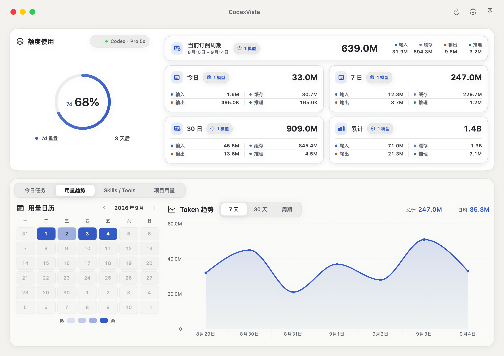
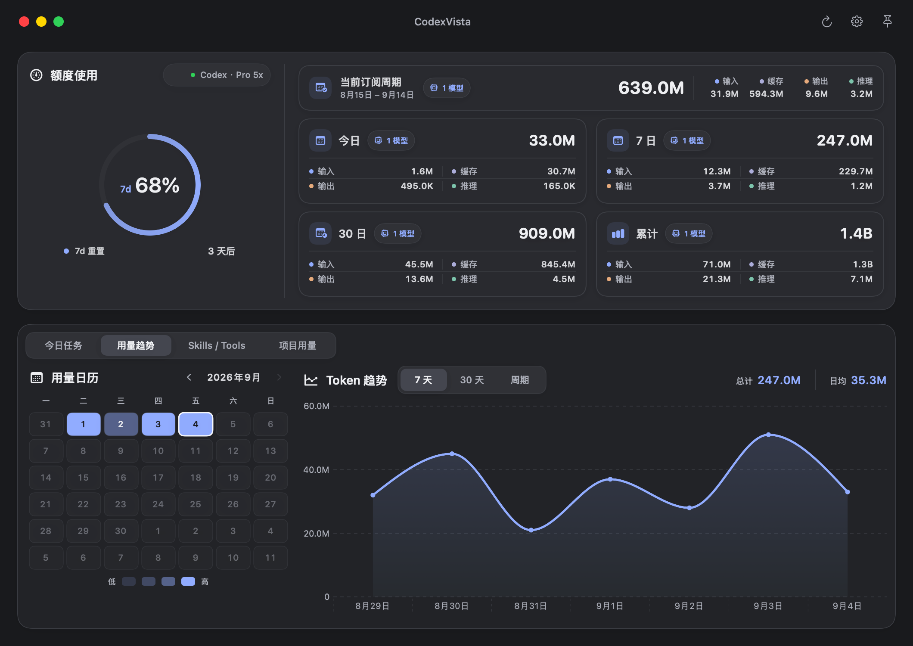
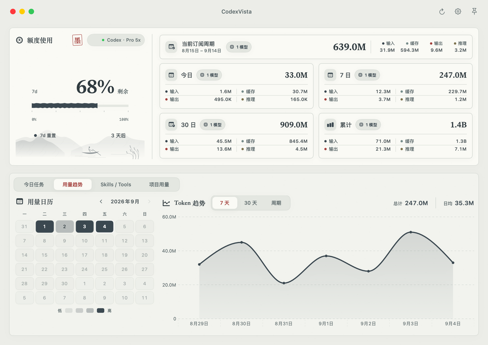
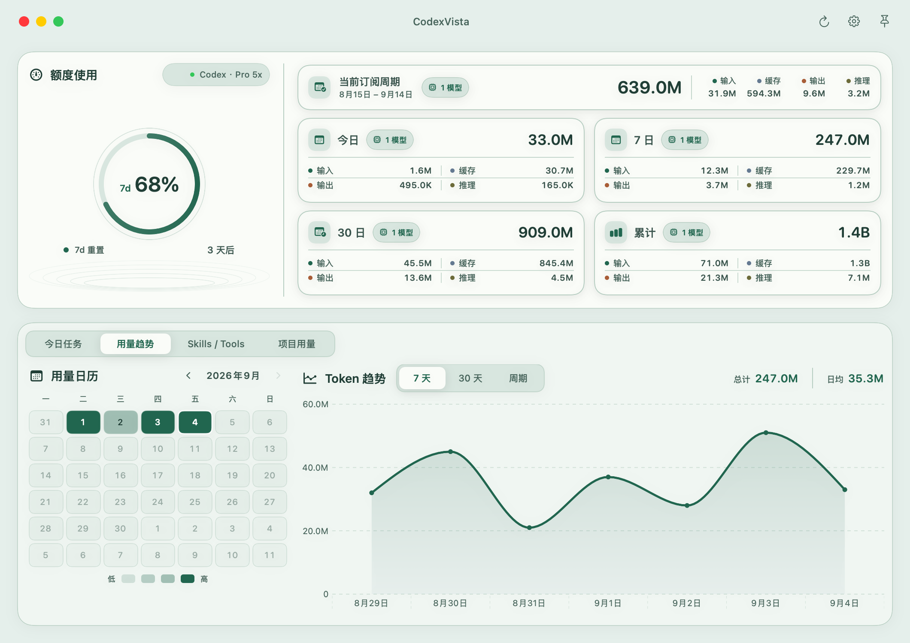
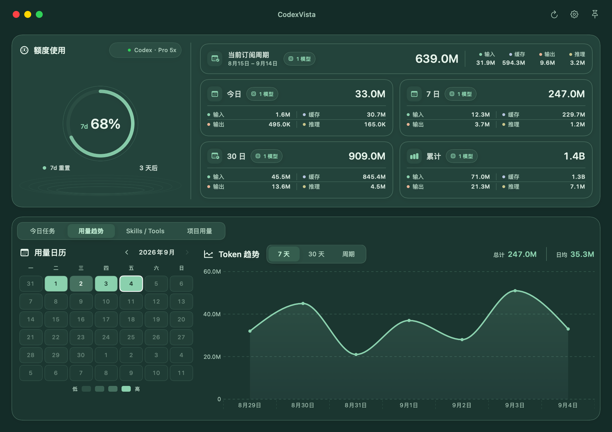
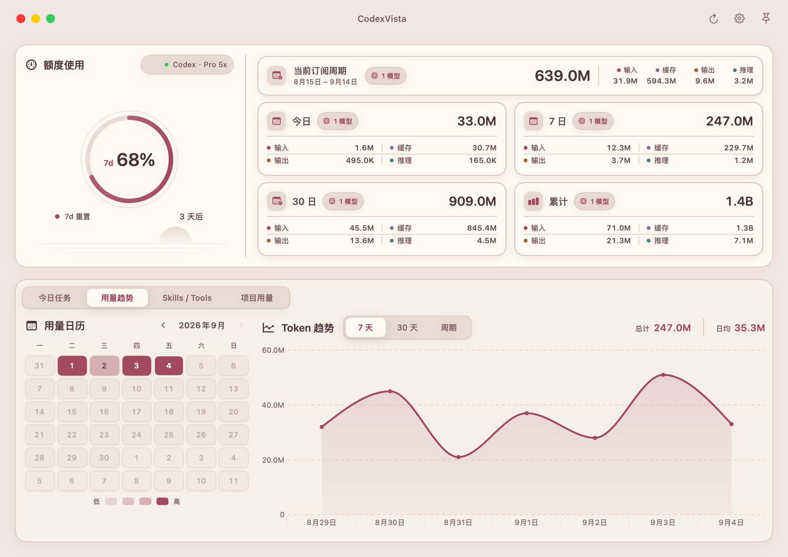
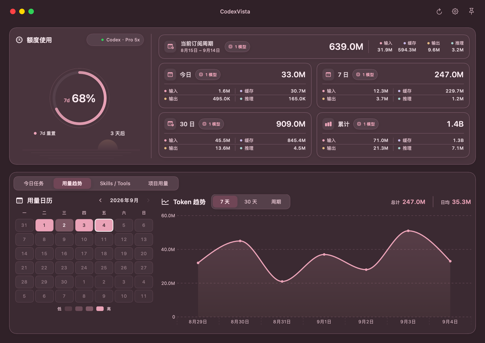
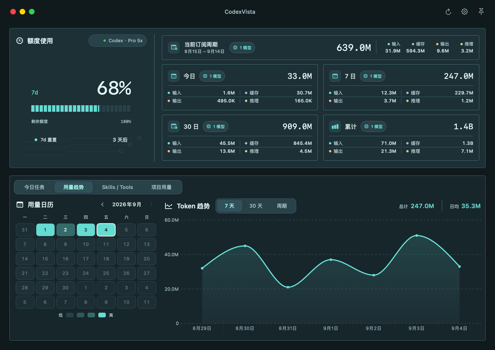
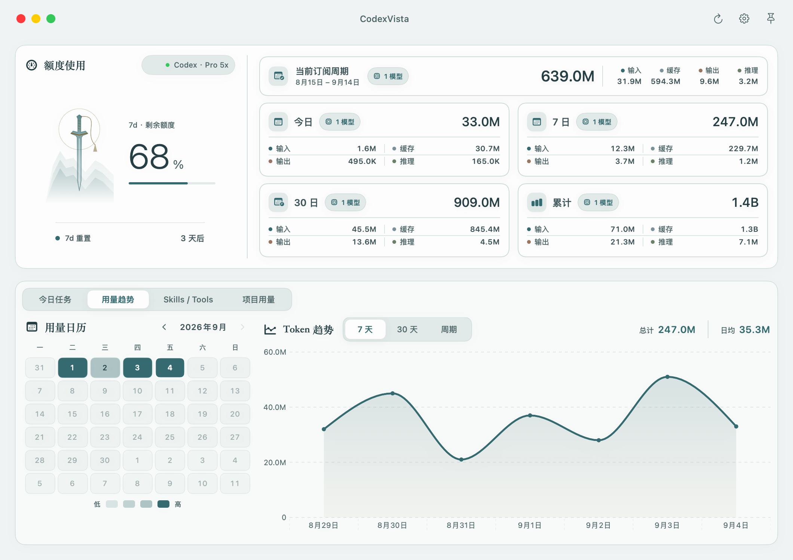
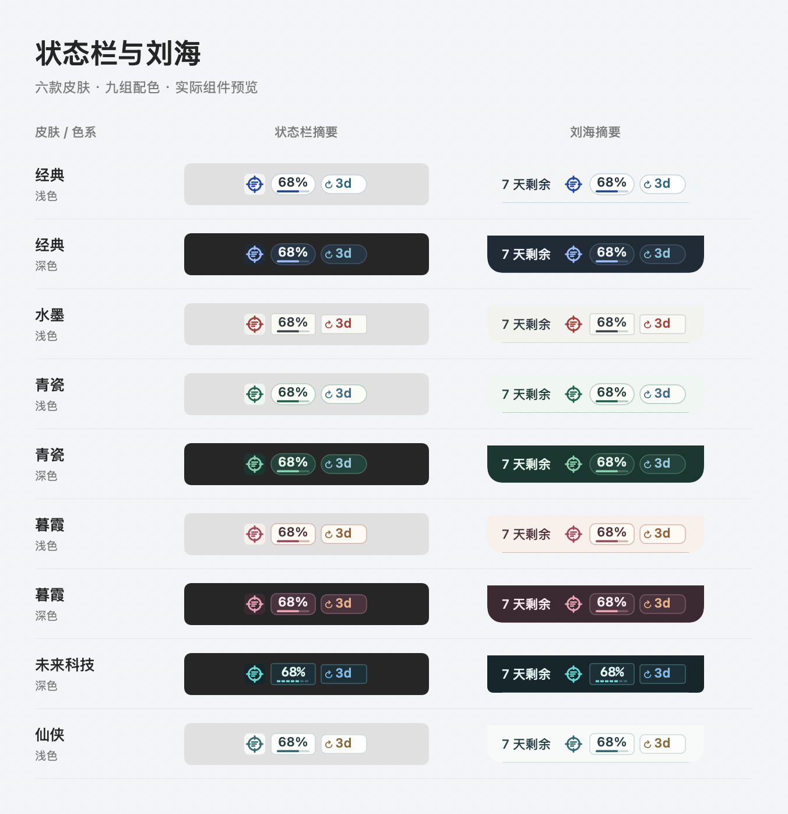

# CodexVista 外观设计

提供「经典」「水墨」「青瓷」「暮霞」「未来科技」「仙侠」六款皮肤。经典、青瓷、暮霞支持浅色、深色和跟随系统；水墨和仙侠固定浅色，未来科技固定深色。固定明暗的皮肤不会覆盖此前保存的色系偏好。保留原有信息结构、皮肤名称与偏好键。看板、菜单栏弹窗、设置与项目详情复用 `DesignSystem.swift`。

| 色彩角色 | 经典浅色 | 经典深色 | 水墨浅色 |
| --- | --- | --- | --- |
| 窗口底色 | `#E9EDF0` | `#19212A` | `#ECEDE8` |
| 面板表面 | `#F2F5F7` | `#202B36` | `#F2F3EE` |
| 数据卡片 | `#FFFFFF` | `#283542` | `#FAFAF5` |
| 主要文字 | `#263440` | `#EDF3F8` | `#303B40` |
| 次要文字 | `#566876` | `#ACBDCC` | `#5B686A` |
| 图表强调 | `#2147A7` | `#9BBCFF` | `#3B4850` |
| 选中文字 | `#2147A7` | `#F0F5FF` | `#A33F3B` |

## 视觉与交互

- 经典：铝灰表面、钴蓝强调、DIN 大数字和额度环外刻度，卡片边角收紧。
- 水墨：以册页留白组织界面。额度名称和大数字居中，细笔触额度条按实际剩余比例绘制；重置时间单独一行，下方预留山水画面，远山、孤舟与两只飞鸟构成横向小景，端正的朱砂印章落在画面右下角。移除苇草、额度刻度及锯齿笔触，右侧统计去掉重复卡片边框和图标底块，保留必要的分组细线。宋体标题、墨色数字与轻微纸纹保持一致。山水仅作装饰，不代表统计数据。
- 套餐列表跟随皮肤：水墨的当前套餐采用浅纸底、朱砂细边框与印章式徽标，说明文字和付费标签使用共享墨色与中性底色。
- 六款皮肤共享清晰的信息分组和 Token 分类文字，皮肤选择使用两列可点击预览卡，展示对应字体、额度图形与 Token 配色，并注明支持的色系；68% 为示例额度。入口仍为「设置 → 外观」。
- 统计区使用平面分组，移除内层卡片的重复边框与阴影；细分隔线保持数据对齐，增加对比度模式下恢复清晰轮廓。仙侠的统计标题与额度标题统一使用宋体。
- 浅色皮肤的 Token 分类色加深，分类文字在面板及卡片底色上达到至少 4.5:1 的对比度。
- 皮肤选择卡提供悬浮描边、加粗选中轮廓与独立键盘焦点环，说明文字允许换行。
- 高频分析页和时间范围即时切换。共享控件提供按压反馈，减少动态效果时不缩放。
- 日历最高等级使用完整强调色及对应高对比文字，其余有效日期使用完整主要文字色。
- 装饰无动画，不拦截操作；皮肤卡提供按钮语义和选中状态，额度条提供剩余量辅助功能标签。

## 设计图

以下 PNG 为本轮细节优化前的 2120 × 1500 设计参考，使用 SwiftUI 看板组件及匿名示例数据渲染；当前版本的平面统计分组、分类色和选择卡以应用实际显示为准。标题栏为导出时补充的静态展示，不包含真实任务名称或本机使用数据。

## 新增皮肤

| 皮肤 | 配色与材质 | 字体与细节 | 色系 |
| --- | --- | --- | --- |
| 青瓷 | 瓷白 `#E5EFEB`、青绿 `#21664F`；深色釉绿 `#142C28` | 圆润数字、更柔和的卡片边角、额度区涟漪 | 浅色／深色／系统 |
| 暮霞 | 暖灰 `#F1E6E3`、胭脂 `#A14960`；深色梅灰 `#302128` | 圆润数字、细环、低处落日余晖 | 浅色／深色／系统 |

青瓷与暮霞装饰均与统计数据无关，位于额度区下沿，辅助功能树忽略装饰。当前套餐、主操作按钮和日历也跟随同一色板。

## 未来科技与仙侠

| 皮肤 | 色彩 | 视觉特征 | 色系 |
| --- | --- | --- | --- |
| 未来科技 | 炭黑 `#10191C`、电光青 `#65DCD3` | 分段额度条、等宽数字、小圆角、电路细线 | 仅深色 |
| 仙侠 | 月白 `#EFF3F3`、青玉 `#356B70`、旧金 `#876C39` | 宋体标题、无衬线数字；左侧长剑月轮与渐隐远山，右侧额度读数，底部独立重置行 | 仅浅色 |

分段额度条与仙侠细额度条来自实际剩余量，电路与剑山小景是静态装饰。仙侠不再叠加额度圆环及底部悬山，长剑、剑穗、月轮、远山统一在左侧竖向构图中，装饰与数据分别占用布局空间。夜航已移除，其旧偏好值自动回退经典。

## 状态栏与刘海

摘要使用各皮肤的底色、强调色、倒计时颜色和边角；所有皮肤的额度数字与倒计时统一使用 11pt 字号；水墨使用系统半粗数字、朱砂倒计时，仙侠使用青玉读数与金色倒计时，未来科技使用等宽读数和分段进度。小尺寸下保留清晰读数，不加入山水背景。额度与倒计时都使用不透明底色，图标单独显示时沿用系统文字色。用量弹窗同步使用主题标题、数字和 Token 分类色。

以下为实际摘要组件与匿名示例数据渲染的九组配色对照图；状态栏底色为模拟系统栏背景，刘海形状和内容为实际组件。

