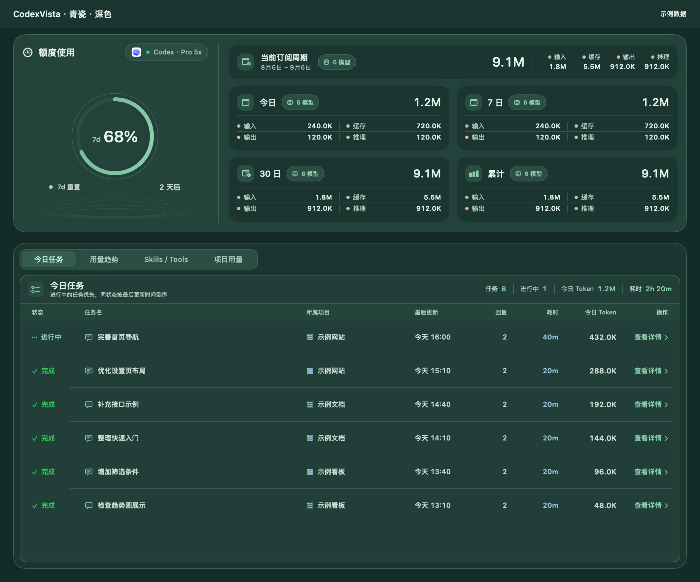
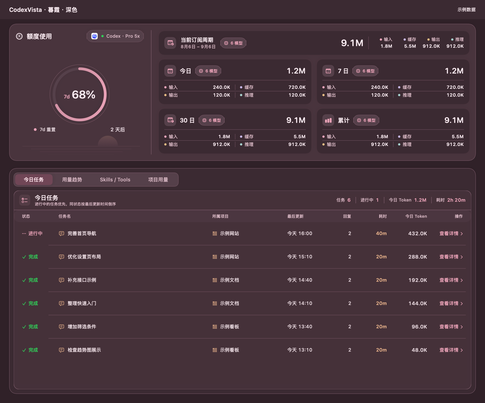
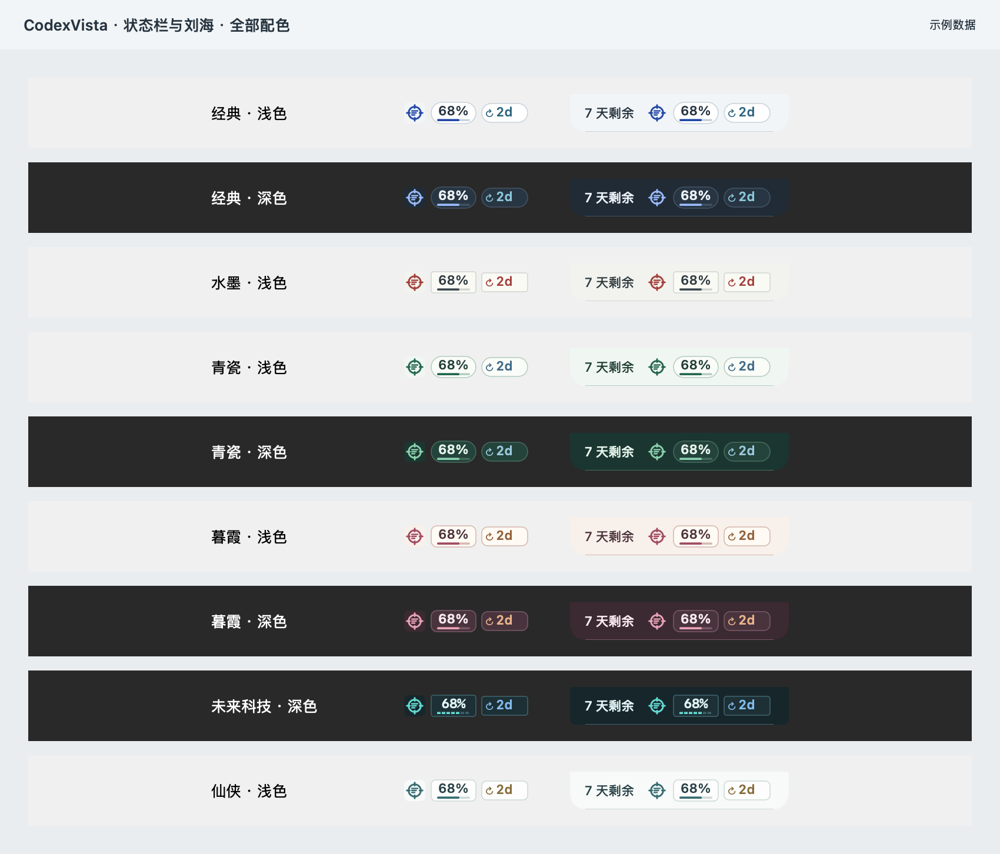

# CodexVista 外观与交互

更新日期：2026-09-04。本文描述当前 `DesignSystem.swift`、看板、设置及摘要组件的实现。图片由当前组件和匿名示例数据导出，全部保存在 `docs/images/themes/`；导出方式见[截图说明](../images/README.md)。

## 皮肤与色系

在“设置 → 外观”通过两列可点击预览卡选择皮肤。皮肤独立于色系保存；固定明暗的皮肤不会覆盖此前的色系偏好，切回支持明暗切换的皮肤时恢复原设置。旧版 `midnight` 和未知皮肤值回退为经典。

| 皮肤 | 色系 | 主要视觉特征 |
| --- | --- | --- |
| 经典 | 浅色、深色、跟随系统 | 铝灰与钴蓝、DIN 数字、额度环外刻度、紧凑圆角 |
| 水墨 | 固定浅色 | 雾白纸面、宋体标题、居中额度数字、细笔触额度条、远山孤舟与朱砂落款 |
| 青瓷 | 浅色、深色、跟随系统 | 瓷白与青绿、圆润数字、柔和边角、额度区涟漪 |
| 暮霞 | 浅色、深色、跟随系统 | 暖灰与胭脂、圆润数字、细额度环与落日余晖 |
| 未来科技 | 固定深色 | 炭黑与电光青、等宽数字、小圆角、分段额度条与电路细线 |
| 仙侠 | 固定浅色 | 月白青玉、宋体标题、无衬线数字、左侧长剑月轮远山与右侧额度读数 |

## 统计层级与可读性

- 看板、菜单栏弹窗、设置与项目详情共用色板、字体、数值格式和 Token 分类颜色。
- 周期统计与订阅周期汇总使用 `CodexVistaMetricSurface` 平面分组，保留必要的主题细分隔线，减少内层重复边框与阴影；系统开启提高对比度时增加清晰轮廓。
- 统计标题统一使用主题标题字体。水墨与仙侠使用宋体；水墨另去除统计图标底块。
- 四类 Token 分别是未缓存输入、缓存输入、可见输出与推理；浅色分类文字使用加深的色板，分类名称和数值不依赖颜色单独传达含义。
- 日历最高等级使用完整强调色及对应高对比文字，其余有效日期使用主要文字色。
- 看板内容区最小为 920 × 618 pt，带订阅周期时为 920 × 680 pt；工具栏与标题栏另计。工具栏布局变化会校正内容尺寸，皮肤切换保留用户已放大的宽高。

基础色板摘录（完整值以源码为准）：

| 色彩角色 | 经典浅色 | 经典深色 | 水墨浅色 |
| --- | --- | --- | --- |
| 窗口底色 | `#E9EDF0` | `#19212A` | `#ECEDE8` |
| 面板表面 | `#F2F5F7` | `#202B36` | `#F2F3EE` |
| 数据表面 | `#FFFFFF` | `#283542` | `#FAFAF5` |
| 主要文字 | `#263440` | `#EDF3F8` | `#303B40` |
| 次要文字 | `#566876` | `#ACBDCC` | `#5B686A` |
| 强调色 | `#2147A7` | `#9BBCFF` | `#3B4850` |
| 选中文字 | `#2147A7` | `#F0F5FF` | `#A33F3B` |

## 额度图形与装饰

额度环、笔触额度条、分段额度条和仙侠细额度条均按实际剩余比例绘制。示例图中的 68% 来自匿名快照；设置中的皮肤选择卡使用固定的 68% 作为样式预览。

水墨将额度名称、大数字和细额度条居中布局，重置时间单独一行，远山、孤舟、飞鸟及右下角朱砂印章位于独立画面。当前套餐采用浅纸底、朱砂细边框和印章式徽标。

仙侠左侧在有明确尺寸的区域绘制月轮、长剑、剑穗和渐隐远山，右侧展示额度读数，底部独立显示重置时间。涟漪、落日、电路、纸纹、剑山和山水均为静态装饰，不表示统计指标，不接收点击，也不进入辅助功能树。

## 交互与辅助功能

- 皮肤预览卡展示对应字体、额度图形及四类 Token 配色，并注明支持的色系。
- 卡片悬浮时显示描边，选中时加粗轮廓，键盘焦点使用独立焦点环；说明允许换行，按钮提供选中状态语义。
- 分析页和时间范围即时切换；共享控件有按压反馈，减少动态效果时关闭缩放。
- 首次加载骨架与正常布局保持一致，减少动态效果时停止循环动画。
- 额度条提供剩余比例的辅助功能标签；装饰不会覆盖数据或阻挡控件。

## 全部九组配色

所有图片均使用相同匿名场景和当前组件，便于对照字体、额度样式与 Token 分类色。文档页头用于标注皮肤和示例数据，不是应用系统标题栏。

| 经典浅色 | 经典深色 |
| --- | --- |
|  |  |

| 青瓷浅色 | 青瓷深色 |
| --- | --- |
|  |  |

| 暮霞浅色 | 暮霞深色 |
| --- | --- |
|  |  |

| 未来科技 | 仙侠 |
| --- | --- |
|  |  |

## 状态栏、刘海与弹窗

摘要共享 `StatusItemTheme`，底色、额度、倒计时与边角跟随皮肤及有效色系。所有皮肤的额度数字和倒计时均为 11 pt；水墨使用系统半粗数字和朱砂倒计时，仙侠使用青玉读数与金色倒计时，未来科技使用等宽数字和分段进度。小尺寸摘要不加入山水等复杂装饰。

额度与倒计时均采用不透明底色。图标单独显示时使用系统文字色。刘海摘要高度为 32 pt，宽度随内容变化，关闭倒计时后收窄；无刘海屏幕自动回退状态栏。设置预览与实际显示共用同一绘制实现，用量弹窗沿用主题标题、数字和分类色。

下图每行依次展示皮肤、状态栏摘要及刘海摘要组件；周围底色仅用于对照，不是桌面截图。

