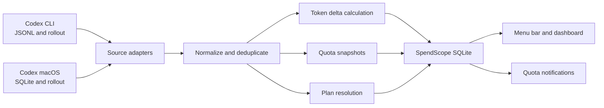

# SpendScope MVP Design

Date: 2026-07-10

## 1. Product definition

SpendScope is a local-only macOS menu bar application for individual developers who want to understand Codex token consumption and quota status. The MVP prioritizes accurate token accounting and timely quota visibility. Cost estimation and billing reconciliation are deferred.

The app is distributed as a signed and notarized DMG through GitHub Releases. The Mac App Store is not an MVP target because automatic discovery of local Codex data is central to the experience.

## 2. Goals

- Automatically discover supported Codex installations and local data.
- Show token usage for today, the last 7 days, and all time.
- Break token usage into input, cached input, output, and reasoning output.
- Analyze usage by time and model.
- Distinguish both current and historical Codex subscription plans.
- Show remaining quota and reset time for the 5-hour and 7-day windows.
- Provide a compact menu bar summary and a detailed dashboard.
- Notify the user when either quota window reaches 20% and 5% remaining.
- Keep all processing and persisted statistics on the Mac.

## 3. Non-goals

- Cost estimation, billing reconciliation, or budget tracking.
- Data sources other than Codex.
- Accounts, cloud sync, team dashboards, or multi-device aggregation.
- Project-level or individual-session drill-down.
- Report export or custom budgets.
- Mac App Store distribution for the MVP.

## 4. Supported Codex sources

The MVP supports both:

1. Codex CLI, including historical and current `~/.codex` JSONL/rollout formats.
2. The current Codex macOS desktop app, including its SQLite metadata and associated rollout storage.

Each source is handled by an independent adapter. Both adapters produce the same internal event model. Records that appear through both sources are deduplicated before aggregation.

Unsupported format versions must fail closed: SpendScope pauses ingestion for that source, preserves previously imported data, and shows a compatibility message. It must not guess field meanings from an unknown schema.

## 5. Privacy boundary

SpendScope reads only the fields required for statistics:

- event timestamp;
- thread, turn, and source identifiers needed for ordering and deduplication;
- model identifier;
- token counters;
- quota percentages, windows, and reset timestamps;
- plan type;
- format and checkpoint metadata.

SpendScope must not persist prompts, responses, summaries, tool calls, file contents, credentials, or authentication data. The normalization boundary discards non-statistical payloads before data reaches the app database.

The app requires no account, backend, analytics service, or network connection for core operation.

## 6. Information architecture

### 6.1 Menu bar item

- Show the Codex icon and a compact summary such as `5h 85% · 7d 84%`.
- Percentages consistently mean remaining quota.
- Use green under normal conditions, orange at or below 20%, and red at or below 5%.
- Show a neutral unavailable state when the latest quota cannot be trusted.

### 6.2 Menu bar popover

- App name, current plan, last successful refresh, and manual refresh action.
- Codex source status.
- 5-hour and 7-day remaining quota, reset time, and freshness state.
- Today's total tokens and a compact category breakdown.
- Actions for opening the dashboard, opening settings, and quitting.

The MVP displays one Codex source card. It does not show placeholder cards for future providers.

### 6.3 Detailed dashboard

- Summary cards for today, the last 7 days, and all-time token usage.
- Token composition for uncached input, cached input, output, and reasoning output.
- A time trend with Today, 7 Days, 30 Days, and All Time ranges.
- A model distribution with token totals and percentages.
- A plan filter for historical usage.
- A quota section for both windows, including remaining percentage, reset countdown, and data freshness.

The dashboard does not show prices, plan prices, cost progress, or budget progress in the MVP.

### 6.4 Settings

- Detected CLI and desktop sources with their paths, format versions, and health.
- Automatic refresh interval, defaulting to 60 seconds.
- Launch at login.
- Separate toggles for 20% and 5% notifications.
- Rebuild local statistics.
- Open diagnostic information.
- A concise local-data privacy explanation.

## 7. Architecture

SpendScope is a native SwiftUI application with a macOS menu bar item, application windows, local notifications, and an app-owned SQLite database.

### 7.1 Components

`SourceDiscovery`

- Locates supported Codex CLI and desktop data.
- Detects source type and format version.
- Reports missing, unreadable, and unsupported sources without crashing the app.

`CLIUsageAdapter`

- Incrementally reads supported CLI JSONL and rollout records.
- Tracks file identity and byte offset.
- Defers incomplete trailing lines until a later refresh.

`DesktopUsageAdapter`

- Opens Codex desktop SQLite data read-only.
- Uses desktop metadata to locate associated rollouts.
- Tracks a stable SQLite watermark and rollout checkpoints.
- Retries transient locks without interfering with Codex.

`EventNormalizer`

- Converts supported source records into a minimal internal representation.
- Tracks the active model for each thread or turn.
- Drops all conversational and authentication fields.

`Deduplicator`

- Builds a stable fingerprint from source-independent identifiers, event time, turn identity, and counter snapshot.
- Prevents duplicate accounting when CLI and desktop storage expose the same record.

`UsageAccumulator`

- Treats token-count records as cumulative snapshots within their session or turn scope.
- Calculates positive deltas between ordered snapshots instead of summing repeated cumulative values.
- Handles counter resets by starting a new accumulation segment rather than producing a negative delta.

`PlanResolver`

- Uses the explicit plan type on a quota event when available.
- Otherwise associates token usage with the nearest valid plan context in the same session or time range.
- Falls back to `Free` when the plan cannot be confirmed, as a product rule.
- Stores the original plan value and an `is_inferred` flag so explicit Free and fallback Free remain diagnosable.
- Keeps historical usage under the plan active at that time; a later plan change does not rewrite history.

`UsageStore`

- Owns the SpendScope SQLite schema and migrations.
- Stores minimal deduplicated usage data, hourly aggregates, quota snapshots, source checkpoints, and notification state.
- Never writes to Codex-owned files.

`DashboardQueryService`

- Provides consistent queries for summary cards, time ranges, token composition, models, plans, and quota status.

`QuotaMonitor`

- Evaluates fresh quota snapshots against alert thresholds.
- Prevents repeat notifications within a quota window.
- Resets alert state when the server-provided window reset identifier or reset time changes.

## 8. Local data model

The exact schema may evolve during implementation, but the following logical tables are required:

### `usage_events`

- stable event fingerprint;
- event timestamp;
- thread and turn identifiers;
- model;
- normalized plan type;
- raw plan type;
- whether the plan was inferred;
- input, cached input, output, reasoning output, and total token deltas;
- source format version.

### `hourly_usage`

- local hour bucket;
- model;
- normalized plan type;
- token category totals.

The aggregation key is time plus model plus plan.

### `quota_snapshots`

- observation time;
- plan type;
- window duration;
- used and remaining percentages;
- reset time;
- source identity.

### `source_checkpoints`

- source identity and format version;
- file identity and byte offset or SQLite watermark;
- last successful import time;
- last error and compatibility state.

### `notification_states`

- quota window identity;
- threshold;
- notification time;
- reset time used for deduplication.

## 9. Import and refresh flow

1. Discover sources and validate supported formats.
2. On first launch, import the latest quota and current-day token records first.
3. Show the menu bar and initial dashboard as soon as recent data is available.
4. Continue historical import in the background and expose progress in the UI.
5. Normalize records, resolve model and plan context, and deduplicate across sources.
6. Calculate token deltas from cumulative snapshots.
7. Persist minimal events and update hourly aggregates transactionally.
8. Save source checkpoints only after the corresponding transaction succeeds.
9. Watch relevant file changes and run a 60-second fallback refresh.
10. Evaluate fresh quota snapshots and send any newly crossed threshold notifications.

A manual refresh runs the same idempotent pipeline. A rebuild deletes only SpendScope-derived statistics and checkpoints, then re-runs the import. It never deletes Codex data.

## 10. Quota semantics and notifications

- The UI always labels the percentage as remaining quota.
- The source may provide used percentage; SpendScope converts it once during normalization.
- Quota is a server-originated snapshot observed through local Codex data, not a continuous server connection.
- Without a new Codex request, SpendScope must not claim that a quota snapshot is live.
- If reset time passes without a newer snapshot, the UI shows `Waiting for Codex refresh` rather than assuming 100% remaining.
- Stale or unsupported quota data does not trigger notifications.
- The 20% and 5% thresholds each notify at most once per quota window.
- Notifications become eligible again only after a new window is observed.
- Disabling system notifications does not disable menu bar warning colors.

## 11. Failure handling

- Ignore and retry incomplete JSONL trailing records.
- Detect file rotation, replacement, truncation, and archival by file identity rather than path alone.
- Retry transient read-only SQLite lock failures with bounded backoff.
- Roll back an import batch if persistence or aggregation fails.
- Preserve the last valid dashboard when a source becomes temporarily unavailable, while clearly marking freshness and error state.
- Pause only the incompatible source when an unknown format is encountered.
- Represent an unresolved model as `Unknown Model`.
- Represent an unresolved plan as inferred `Free`.
- Rebuild date buckets affected by a macOS time zone change.

## 12. Testing strategy

### Parser and compatibility tests

- Anonymized fixtures for supported historical and current CLI formats.
- Anonymized fixtures for supported desktop SQLite and rollout formats.
- Contract tests that verify required fields and fail closed on unknown schemas.

### Accounting tests

- Golden tests for cumulative snapshots to token deltas.
- Counter reset and out-of-order record tests.
- Cross-source duplicate and replay tests.
- Model-switch and plan-switch attribution tests.
- Missing-plan fallback tests that verify inferred `Free` behavior.

### Reliability tests

- Partial lines, corrupt records, file rotation, truncation, and archival.
- SQLite lock, WAL, and transient read failures.
- Import rollback, application restart, checkpoint recovery, and full rebuild consistency.
- Midnight boundaries, time zone changes, and daylight-saving transitions.

### Product behavior tests

- Notification threshold crossing, deduplication, staleness, and window reset.
- Menu bar and dashboard states for loading, fresh, stale, unavailable, and unsupported data.
- Light mode, dark mode, reduced motion, text scaling, VoiceOver labels, and keyboard navigation.

### Performance tests

- Large anonymized histories that exercise progressive import.
- Verification that parsing and aggregation do not block the main actor.
- Memory and database growth checks across repeated incremental refreshes.

## 13. MVP acceptance criteria

- Supported Codex CLI and desktop sources are discovered automatically.
- Today's usage and the latest quota normally appear within 3 seconds; historical import may continue in the background.
- New local token records appear in the UI within 60 seconds.
- Today, 7-day, and all-time totals match the normalized source fixtures.
- Token composition, time trend, model distribution, and plan filter produce internally consistent totals.
- Current plan and historical plan attribution work across a simulated plan change.
- Repeated scanning, app restart, and dual-source ingestion do not change the final total.
- Both quota windows show remaining percentage, reset time, and freshness.
- 20% and 5% notifications occur at most once per window.
- Unsupported formats and unavailable sources are clearly explained without losing prior statistics.
- SpendScope never modifies or persistently locks Codex data.
- The SpendScope database contains no prompt, response, tool-call, file-content, credential, or authentication data.

## 14. Deferred roadmap

After the MVP is stable:

1. Add cost estimation based on model pricing, clearly separated from actual billing.
2. Add project and session drill-down.
3. Add export and custom reporting.
4. Add additional local AI coding tools through the same adapter boundary.
5. Re-evaluate sandboxing and Mac App Store distribution only if the required source-access experience remains viable.
