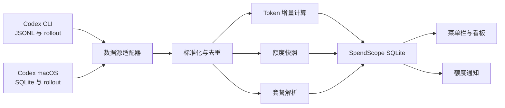

# SpendScope MVP 设计

日期：2026-07-10

## 1. 产品定义

SpendScope 是一款仅在本机运行的 macOS 菜单栏应用，帮助个人开发者了解 Codex 的 Token 消耗和额度状态。MVP 优先保证 Token 统计准确和额度信息及时可见，费用估算与账单对账延后实现。

应用通过 GitHub Releases 以签名并经过 Apple 公证的 DMG 分发。由于自动发现本机 Codex 数据是核心体验，MVP 暂不以 Mac App Store 为发布渠道。

## 2. 产品目标

- 自动发现受支持的 Codex 安装及其本地数据。
- 展示今日、近 7 天和累计 Token 用量。
- 将 Token 拆分为输入、缓存输入、输出和推理输出。
- 按时间和模型分析 Token 用量。
- 区分当前及历史 Codex 套餐版本。
- 展示 5 小时和 7 天窗口的剩余额度与重置时间。
- 提供紧凑的菜单栏摘要和详细看板。
- 任一额度窗口剩余 20% 和 5% 时通知用户。
- 所有处理和统计数据均保留在本机。

## 3. 非目标

- 费用估算、账单对账或预算跟踪。
- Codex 之外的其他数据源。
- 账号系统、云同步、团队看板或多设备汇总。
- 项目级或单会话级下钻分析。
- 报表导出或自定义预算。
- MVP 阶段通过 Mac App Store 分发。

## 4. 支持的 Codex 数据源

MVP 同时支持：

1. Codex CLI，包括历史和当前的 `~/.codex` JSONL/rollout 格式。
2. 当前 Codex macOS 桌面应用，包括其 SQLite 元数据和关联的 rollout 存储。

每种数据源由独立适配器处理，两个适配器输出相同的内部事件模型。同时出现在两个来源中的记录会在聚合前去重。

遇到不支持的数据格式时必须采用安全失败策略：SpendScope 暂停该来源的导入，保留之前已导入的数据，并显示兼容性提示，不得猜测未知结构中字段的含义。

## 5. 隐私边界

SpendScope 只读取统计所需字段：

- 事件时间。
- 排序与去重所需的线程、轮次和来源标识。
- 模型标识。
- Token 计数器。
- 额度百分比、窗口及重置时间。
- 套餐类型。
- 格式及读取检查点元数据。

SpendScope 不得持久化 Prompt、回复、摘要、工具调用、文件内容、凭证或认证数据。数据在进入应用数据库前，标准化层必须丢弃所有非统计载荷。

应用的核心功能不需要账号、后端服务、分析服务或网络连接。

## 6. 信息架构

### 6.1 菜单栏常驻区

- 展示 Codex 图标和类似 `5h 85% · 7d 84%` 的紧凑摘要。
- 所有百分比统一表示剩余额度。
- 正常状态使用绿色，剩余不高于 20% 时使用橙色，不高于 5% 时使用红色。
- 最新额度数据不可信时展示中性的不可用状态。

### 6.2 菜单栏弹窗

- 应用名称、当前套餐、最后成功刷新时间和手动刷新入口。
- Codex 数据源状态。
- 5 小时与 7 天剩余额度、重置时间和数据新鲜度。
- 今日 Token 总量和紧凑的分类明细。
- 打开详细看板、打开设置和退出应用的操作入口。

MVP 只展示一个 Codex 来源卡片，不为未来数据源展示空占位卡片。

### 6.3 详细看板

- 今日、近 7 天和累计 Token 用量摘要卡片。
- 未缓存输入、缓存输入、输出和推理输出的 Token 构成。
- 支持今日、7 天、30 天和全部时间范围的趋势图。
- 展示 Token 总量和占比的模型分布。
- 用于筛选历史数据的套餐筛选器。
- 同时展示两个额度窗口的剩余比例、重置倒计时和数据新鲜度。

MVP 看板不展示价格、套餐金额、费用进度或预算进度。

### 6.4 设置页

- 已检测到的 CLI 与桌面数据源，包括路径、格式版本和健康状态。
- 自动刷新间隔，默认 60 秒。
- 开机启动。
- 20% 和 5% 通知的独立开关。
- 重建本地统计数据。
- 打开诊断信息。
- 简洁的本地数据隐私说明。

## 7. 技术架构

SpendScope 是一款原生 SwiftUI 应用，包含 macOS 菜单栏入口、应用窗口、本地通知和应用自有的 SQLite 数据库。

### 7.1 组件职责

#### `SourceDiscovery`

- 定位受支持的 Codex CLI 与桌面应用数据。
- 检测数据源类型和格式版本。
- 报告数据源缺失、不可读或不受支持的状态，且不导致应用崩溃。

#### `CLIUsageAdapter`

- 增量读取受支持的 CLI JSONL 和 rollout 记录。
- 记录文件身份和字节偏移量。
- 将末尾未写完的行延迟到后续刷新再处理。

#### `DesktopUsageAdapter`

- 以只读方式打开 Codex 桌面应用的 SQLite 数据。
- 使用桌面应用元数据定位关联 rollout。
- 维护稳定的 SQLite 水位与 rollout 检查点。
- 遇到临时锁时重试，且不干扰 Codex。

#### `EventNormalizer`

- 将受支持的来源记录转换为最小化内部表示。
- 跟踪每个线程或轮次使用的模型。
- 丢弃所有对话和认证字段。

#### `Deduplicator`

- 根据跨来源标识、事件时间、轮次身份和计数器快照生成稳定指纹。
- 防止 CLI 与桌面存储暴露同一记录时重复计数。

#### `UsageAccumulator`

- 将 Token 计数记录视为会话或轮次范围内的累计快照。
- 计算有序快照之间的正增量，而不是累加重复的累计值。
- 计数器重置时开启新的累计区段，避免产生负增量。

#### `PlanResolver`

- 优先使用额度事件中明确提供的套餐类型。
- 否则将 Token 用量关联到同一会话或时间范围内最近的有效套餐上下文。
- 无法确认套餐时，按照产品规则归为 `Free`。
- 保存原始套餐值及 `is_inferred` 标记，以便区分明确的 Free 和回退得到的 Free。
- 历史用量归属到当时生效的套餐，后续套餐变更不会重写历史。

#### `UsageStore`

- 管理 SpendScope SQLite 结构和迁移。
- 保存最小化去重用量数据、小时聚合、额度快照、来源检查点和通知状态。
- 永不写入 Codex 自有文件。

#### `DashboardQueryService`

- 为摘要卡片、时间范围、Token 构成、模型、套餐和额度状态提供一致查询。

#### `QuotaMonitor`

- 根据提醒阈值评估新鲜的额度快照。
- 防止同一额度窗口内重复通知。
- 服务端提供的窗口重置标识或时间变化时重置提醒状态。

## 8. 本地数据模型

具体数据库结构可在实现阶段演进，但必须包含以下逻辑数据表。

### `usage_events`

- 稳定事件指纹。
- 事件时间。
- 线程和轮次标识。
- 模型。
- 标准化和原始套餐类型。
- 套餐是否为推断结果。
- 输入、缓存输入、输出、推理输出和总 Token 增量。
- 来源格式版本。

### `hourly_usage`

- 本地小时分桶。
- 模型。
- 标准化套餐类型。
- 各类 Token 合计。

聚合键由时间、模型和套餐共同组成。

### `quota_snapshots`

- 观测时间。
- 套餐类型。
- 窗口时长。
- 已用和剩余百分比。
- 重置时间。
- 来源标识。

### `source_checkpoints`

- 来源标识和格式版本。
- 文件身份及字节偏移量，或 SQLite 水位。
- 最后成功导入时间。
- 最后错误和兼容性状态。

### `notification_states`

- 额度窗口标识。
- 阈值。
- 通知时间。
- 用于去重的重置时间。

## 9. 导入与刷新流程

1. 发现数据源并验证格式是否受支持。
2. 首次启动时优先导入最新额度和当日 Token 记录。
3. 最新数据可用后立即展示菜单栏和首屏看板。
4. 在后台继续导入历史数据，并在界面展示进度。
5. 标准化记录，解析模型和套餐上下文，并对不同来源的数据去重。
6. 根据累计快照计算 Token 增量。
7. 在事务中保存最小化事件并更新小时聚合。
8. 仅在对应事务成功后保存来源检查点。
9. 监听相关文件变化，并以 60 秒轮询作为兜底刷新机制。
10. 评估新鲜额度快照，并为新跨越的阈值发送通知。

手动刷新运行同一套幂等流程。重建操作只删除 SpendScope 派生的统计数据和检查点，然后重新导入，绝不删除 Codex 数据。

## 10. 额度语义与通知

- 界面中的百分比始终表示剩余额度。
- 数据源可能提供已用百分比，SpendScope 在标准化时统一转换一次。
- 额度是通过本地 Codex 数据观测到的服务端快照，而不是持续的服务端连接。
- 没有新的 Codex 请求时，SpendScope 不得宣称额度快照为实时数据。
- 重置时间已过但没有新快照时，界面显示“等待 Codex 刷新”，而不是假设额度已恢复至 100%。
- 过期或不受支持的额度数据不触发通知。
- 20% 和 5% 阈值在每个额度窗口内最多各通知一次。
- 仅在观测到新额度窗口后重新允许通知。
- 关闭系统通知不会禁用菜单栏警示颜色。

## 11. 异常处理

- 忽略未写完的 JSONL 尾部记录，并在后续重试。
- 根据文件身份而非仅根据路径识别轮转、替换、截断和归档。
- SQLite 只读访问遇到临时锁时采用有界退避重试。
- 持久化或聚合失败时回滚该批次导入。
- 数据源暂时不可用时保留最后有效看板，同时明确标注新鲜度和错误状态。
- 遇到未知格式时只暂停不兼容的数据源。
- 无法解析的模型标记为 `Unknown Model`。
- 无法解析的套餐标记为推断得到的 `Free`。
- macOS 时区变化时重建受影响的日期分桶。

## 12. 测试策略

### 12.1 解析与兼容性测试

- 为受支持的历史和当前 CLI 格式提供匿名化样本。
- 为受支持的桌面 SQLite 和 rollout 格式提供匿名化样本。
- 使用契约测试验证必需字段，并确保未知结构安全失败。

### 12.2 计数测试

- 累计快照转换为 Token 增量的黄金测试。
- 计数器重置和记录乱序测试。
- 跨来源重复与重放测试。
- 模型切换和套餐切换归属测试。
- 验证缺失套餐回退为推断 `Free` 的测试。

### 12.3 可靠性测试

- 半行、损坏记录、文件轮转、截断和归档。
- SQLite 锁、WAL 和临时读取失败。
- 导入回滚、应用重启、检查点恢复和完整重建一致性。
- 跨午夜、时区变化和夏令时切换。

### 12.4 产品行为测试

- 通知阈值跨越、去重、过期和窗口重置。
- 菜单栏和看板在加载、新鲜、过期、不可用和不受支持状态下的表现。
- 浅色模式、深色模式、减少动态效果、文本缩放、VoiceOver 标签和键盘导航。

### 12.5 性能测试

- 使用大体量匿名历史数据验证渐进式导入。
- 验证解析和聚合不会阻塞主 Actor。
- 检查重复增量刷新过程中的内存和数据库增长。

## 13. MVP 验收标准

- 自动发现受支持的 Codex CLI 和桌面应用数据源。
- 今日用量和最新额度通常在 3 秒内出现，历史导入可在后台继续。
- 新的本地 Token 记录在 60 秒内反映到界面。
- 今日、7 天和累计总量与标准化来源样本一致。
- Token 构成、时间趋势、模型分布和套餐筛选产生内部一致的总量。
- 在模拟套餐切换时，当前套餐和历史套餐归属均正确。
- 重复扫描、应用重启和双来源导入不会改变最终总量。
- 两个额度窗口均展示剩余比例、重置时间和数据新鲜度。
- 20% 和 5% 通知在每个窗口内最多各出现一次。
- 不支持的格式和不可用数据源得到明确说明，且不会丢失已有统计。
- SpendScope 永不修改或持续锁定 Codex 数据。
- SpendScope 数据库不包含 Prompt、回复、工具调用、文件内容、凭证或认证数据。

## 14. 后续路线图

MVP 稳定后：

1. 根据模型价格增加费用估算，并与实际账单明确区分。
2. 增加项目和会话维度的下钻分析。
3. 增加导出和自定义报表。
4. 通过相同的适配器边界接入其他本地 AI 编程工具。
5. 仅在能够保留所需数据访问体验的前提下，重新评估沙箱和 Mac App Store 分发。
