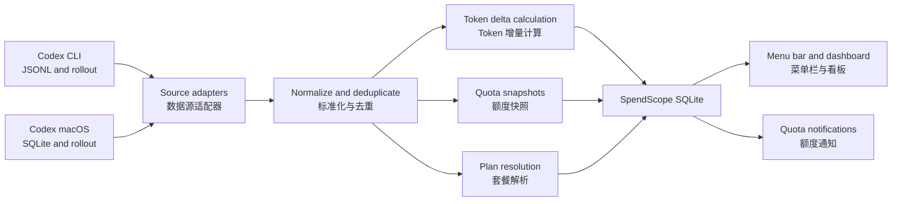

# SpendScope MVP Design / SpendScope MVP 设计

Date / 日期: 2026-07-10

This document is maintained in English and Simplified Chinese. Both versions describe the same product requirements. English identifiers in code, schemas, and UI examples remain unchanged.

本文档使用英文和简体中文共同维护，两种语言描述相同的产品需求。代码、数据结构和界面示例中的英文标识保持不变。

## 1. Product definition / 产品定义

SpendScope is a local-only macOS menu bar application for individual developers who want to understand Codex token consumption and quota status. The MVP prioritizes accurate token accounting and timely quota visibility. Cost estimation and billing reconciliation are deferred.

SpendScope 是一款仅在本机运行的 macOS 菜单栏应用，帮助个人开发者了解 Codex 的 Token 消耗和额度状态。MVP 优先保证 Token 统计准确和额度信息及时可见，费用估算与账单对账延后实现。

The app is distributed as a signed and notarized DMG through GitHub Releases. The Mac App Store is not an MVP target because automatic discovery of local Codex data is central to the experience.

应用通过 GitHub Releases 以签名并经过 Apple 公证的 DMG 分发。由于自动发现本机 Codex 数据是核心体验，MVP 暂不以 Mac App Store 为发布渠道。

## 2. Goals / 产品目标

- Automatically discover supported Codex installations and local data.
  自动发现受支持的 Codex 安装及其本地数据。
- Show token usage for today, the last 7 days, and all time.
  展示今日、近 7 天和累计 Token 用量。
- Break token usage into input, cached input, output, and reasoning output.
  将 Token 拆分为输入、缓存输入、输出和推理输出。
- Analyze usage by time and model.
  按时间和模型分析 Token 用量。
- Distinguish both current and historical Codex subscription plans.
  区分当前及历史 Codex 套餐版本。
- Show remaining quota and reset time for the 5-hour and 7-day windows.
  展示 5 小时和 7 天窗口的剩余额度与重置时间。
- Provide a compact menu bar summary and a detailed dashboard.
  提供紧凑的菜单栏摘要和详细看板。
- Notify the user when either quota window reaches 20% and 5% remaining.
  任一额度窗口剩余 20% 和 5% 时通知用户。
- Keep all processing and persisted statistics on the Mac.
  所有处理和统计数据均保留在本机。

## 3. Non-goals / 非目标

- Cost estimation, billing reconciliation, or budget tracking.
  费用估算、账单对账或预算跟踪。
- Data sources other than Codex.
  Codex 之外的其他数据源。
- Accounts, cloud sync, team dashboards, or multi-device aggregation.
  账号系统、云同步、团队看板或多设备汇总。
- Project-level or individual-session drill-down.
  项目级或单会话级下钻分析。
- Report export or custom budgets.
  报表导出或自定义预算。
- Mac App Store distribution for the MVP.
  MVP 阶段通过 Mac App Store 分发。

## 4. Supported Codex sources / 支持的 Codex 数据源

The MVP supports both:

MVP 同时支持：

1. Codex CLI, including historical and current `~/.codex` JSONL/rollout formats.
   Codex CLI，包括历史和当前的 `~/.codex` JSONL/rollout 格式。
2. The current Codex macOS desktop app, including its SQLite metadata and associated rollout storage.
   当前 Codex macOS 桌面应用，包括其 SQLite 元数据和关联的 rollout 存储。

Each source is handled by an independent adapter. Both adapters produce the same internal event model. Records that appear through both sources are deduplicated before aggregation.

每种数据源由独立适配器处理，两个适配器输出相同的内部事件模型。同时出现在两个来源中的记录会在聚合前去重。

Unsupported format versions must fail closed: SpendScope pauses ingestion for that source, preserves previously imported data, and shows a compatibility message. It must not guess field meanings from an unknown schema.

遇到不支持的数据格式时必须采用安全失败策略：SpendScope 暂停该来源的导入，保留之前已导入的数据，并显示兼容性提示，不得猜测未知结构中字段的含义。

## 5. Privacy boundary / 隐私边界

SpendScope reads only the fields required for statistics:

SpendScope 只读取统计所需字段：

- Event timestamp. / 事件时间。
- Thread, turn, and source identifiers needed for ordering and deduplication. / 排序与去重所需的线程、轮次和来源标识。
- Model identifier. / 模型标识。
- Token counters. / Token 计数器。
- Quota percentages, windows, and reset timestamps. / 额度百分比、窗口及重置时间。
- Plan type. / 套餐类型。
- Format and checkpoint metadata. / 格式及读取检查点元数据。

SpendScope must not persist prompts, responses, summaries, tool calls, file contents, credentials, or authentication data. The normalization boundary discards non-statistical payloads before data reaches the app database.

SpendScope 不得持久化 Prompt、回复、摘要、工具调用、文件内容、凭证或认证数据。数据在进入应用数据库前，标准化层必须丢弃所有非统计载荷。

The app requires no account, backend, analytics service, or network connection for core operation.

应用的核心功能不需要账号、后端服务、分析服务或网络连接。

## 6. Information architecture / 信息架构

### 6.1 Menu bar item / 菜单栏常驻区

- Show the Codex icon and a compact summary such as `5h 85% · 7d 84%`.
  展示 Codex 图标和类似 `5h 85% · 7d 84%` 的紧凑摘要。
- Percentages consistently mean remaining quota.
  所有百分比统一表示剩余额度。
- Use green under normal conditions, orange at or below 20%, and red at or below 5%.
  正常状态使用绿色，剩余不高于 20% 时使用橙色，不高于 5% 时使用红色。
- Show a neutral unavailable state when the latest quota cannot be trusted.
  最新额度数据不可信时展示中性的不可用状态。

### 6.2 Menu bar popover / 菜单栏弹窗

- App name, current plan, last successful refresh, and manual refresh action.
  应用名称、当前套餐、最后成功刷新时间和手动刷新入口。
- Codex source status.
  Codex 数据源状态。
- 5-hour and 7-day remaining quota, reset time, and freshness state.
  5 小时与 7 天剩余额度、重置时间和数据新鲜度。
- Today's total tokens and a compact category breakdown.
  今日 Token 总量和紧凑的分类明细。
- Actions for opening the dashboard, opening settings, and quitting.
  打开详细看板、打开设置和退出应用的操作入口。

The MVP displays one Codex source card. It does not show placeholder cards for future providers.

MVP 只展示一个 Codex 来源卡片，不为未来数据源展示空占位卡片。

### 6.3 Detailed dashboard / 详细看板

- Summary cards for today, the last 7 days, and all-time token usage.
  今日、近 7 天和累计 Token 用量摘要卡片。
- Token composition for uncached input, cached input, output, and reasoning output.
  未缓存输入、缓存输入、输出和推理输出的 Token 构成。
- A time trend with Today, 7 Days, 30 Days, and All Time ranges.
  支持今日、7 天、30 天和全部时间范围的趋势图。
- A model distribution with token totals and percentages.
  展示 Token 总量和占比的模型分布。
- A plan filter for historical usage.
  用于筛选历史数据的套餐筛选器。
- A quota section for both windows, including remaining percentage, reset countdown, and data freshness.
  同时展示两个额度窗口的剩余比例、重置倒计时和数据新鲜度。

The dashboard does not show prices, plan prices, cost progress, or budget progress in the MVP.

MVP 看板不展示价格、套餐金额、费用进度或预算进度。

### 6.4 Settings / 设置页

- Detected CLI and desktop sources with their paths, format versions, and health.
  已检测到的 CLI 与桌面数据源，包括路径、格式版本和健康状态。
- Automatic refresh interval, defaulting to 60 seconds.
  自动刷新间隔，默认 60 秒。
- Launch at login.
  开机启动。
- Separate toggles for 20% and 5% notifications.
  20% 和 5% 通知的独立开关。
- Rebuild local statistics.
  重建本地统计数据。
- Open diagnostic information.
  打开诊断信息。
- A concise local-data privacy explanation.
  简洁的本地数据隐私说明。

## 7. Architecture / 技术架构

SpendScope is a native SwiftUI application with a macOS menu bar item, application windows, local notifications, and an app-owned SQLite database.

SpendScope 是一款原生 SwiftUI 应用，包含 macOS 菜单栏入口、应用窗口、本地通知和应用自有的 SQLite 数据库。

### 7.1 Components / 组件职责

#### `SourceDiscovery`

- Locates supported Codex CLI and desktop data. / 定位受支持的 Codex CLI 与桌面应用数据。
- Detects source type and format version. / 检测数据源类型和格式版本。
- Reports missing, unreadable, and unsupported sources without crashing the app. / 报告数据源缺失、不可读或不受支持的状态，且不导致应用崩溃。

#### `CLIUsageAdapter`

- Incrementally reads supported CLI JSONL and rollout records. / 增量读取受支持的 CLI JSONL 和 rollout 记录。
- Tracks file identity and byte offset. / 记录文件身份和字节偏移量。
- Defers incomplete trailing lines until a later refresh. / 将末尾未写完的行延迟到后续刷新再处理。

#### `DesktopUsageAdapter`

- Opens Codex desktop SQLite data read-only. / 以只读方式打开 Codex 桌面应用的 SQLite 数据。
- Uses desktop metadata to locate associated rollouts. / 使用桌面应用元数据定位关联 rollout。
- Tracks a stable SQLite watermark and rollout checkpoints. / 维护稳定的 SQLite 水位与 rollout 检查点。
- Retries transient locks without interfering with Codex. / 遇到临时锁时重试，且不干扰 Codex。

#### `EventNormalizer`

- Converts supported source records into a minimal internal representation. / 将受支持的来源记录转换为最小化内部表示。
- Tracks the active model for each thread or turn. / 跟踪每个线程或轮次使用的模型。
- Drops all conversational and authentication fields. / 丢弃所有对话和认证字段。

#### `Deduplicator`

- Builds a stable fingerprint from source-independent identifiers, event time, turn identity, and counter snapshot. / 根据跨来源标识、事件时间、轮次身份和计数器快照生成稳定指纹。
- Prevents duplicate accounting when CLI and desktop storage expose the same record. / 防止 CLI 与桌面存储暴露同一记录时重复计数。

#### `UsageAccumulator`

- Treats token-count records as cumulative snapshots within their session or turn scope. / 将 Token 计数记录视为会话或轮次范围内的累计快照。
- Calculates positive deltas between ordered snapshots instead of summing repeated cumulative values. / 计算有序快照之间的正增量，而不是累加重复的累计值。
- Handles counter resets by starting a new accumulation segment rather than producing a negative delta. / 计数器重置时开启新的累计区段，避免产生负增量。

#### `PlanResolver`

- Uses the explicit plan type on a quota event when available. / 优先使用额度事件中明确提供的套餐类型。
- Otherwise associates token usage with the nearest valid plan context in the same session or time range. / 否则将 Token 用量关联到同一会话或时间范围内最近的有效套餐上下文。
- Falls back to `Free` when the plan cannot be confirmed, as a product rule. / 无法确认套餐时，按照产品规则归为 `Free`。
- Stores the original plan value and an `is_inferred` flag so explicit Free and fallback Free remain diagnosable. / 保存原始套餐值及 `is_inferred` 标记，以便区分明确的 Free 和回退得到的 Free。
- Keeps historical usage under the plan active at that time; a later plan change does not rewrite history. / 历史用量归属到当时生效的套餐，后续套餐变更不会重写历史。

#### `UsageStore`

- Owns the SpendScope SQLite schema and migrations. / 管理 SpendScope SQLite 结构和迁移。
- Stores minimal deduplicated usage data, hourly aggregates, quota snapshots, source checkpoints, and notification state. / 保存最小化去重用量数据、小时聚合、额度快照、来源检查点和通知状态。
- Never writes to Codex-owned files. / 永不写入 Codex 自有文件。

#### `DashboardQueryService`

- Provides consistent queries for summary cards, time ranges, token composition, models, plans, and quota status. / 为摘要卡片、时间范围、Token 构成、模型、套餐和额度状态提供一致查询。

#### `QuotaMonitor`

- Evaluates fresh quota snapshots against alert thresholds. / 根据提醒阈值评估新鲜的额度快照。
- Prevents repeat notifications within a quota window. / 防止同一额度窗口内重复通知。
- Resets alert state when the server-provided window reset identifier or reset time changes. / 服务端提供的窗口重置标识或时间变化时重置提醒状态。

## 8. Local data model / 本地数据模型

The exact schema may evolve during implementation, but the following logical tables are required.

具体数据库结构可在实现阶段演进，但必须包含以下逻辑数据表。

### `usage_events`

- Stable event fingerprint. / 稳定事件指纹。
- Event timestamp. / 事件时间。
- Thread and turn identifiers. / 线程和轮次标识。
- Model. / 模型。
- Normalized and raw plan types. / 标准化和原始套餐类型。
- Whether the plan was inferred. / 套餐是否为推断结果。
- Input, cached input, output, reasoning output, and total token deltas. / 输入、缓存输入、输出、推理输出和总 Token 增量。
- Source format version. / 来源格式版本。

### `hourly_usage`

- Local hour bucket. / 本地小时分桶。
- Model. / 模型。
- Normalized plan type. / 标准化套餐类型。
- Token category totals. / 各类 Token 合计。

The aggregation key is time plus model plus plan.

聚合键由时间、模型和套餐共同组成。

### `quota_snapshots`

- Observation time. / 观测时间。
- Plan type. / 套餐类型。
- Window duration. / 窗口时长。
- Used and remaining percentages. / 已用和剩余百分比。
- Reset time. / 重置时间。
- Source identity. / 来源标识。

### `source_checkpoints`

- Source identity and format version. / 来源标识和格式版本。
- File identity and byte offset or SQLite watermark. / 文件身份及字节偏移量，或 SQLite 水位。
- Last successful import time. / 最后成功导入时间。
- Last error and compatibility state. / 最后错误和兼容性状态。

### `notification_states`

- Quota window identity. / 额度窗口标识。
- Threshold. / 阈值。
- Notification time. / 通知时间。
- Reset time used for deduplication. / 用于去重的重置时间。

## 9. Import and refresh flow / 导入与刷新流程

1. Discover sources and validate supported formats.
   发现数据源并验证格式是否受支持。
2. On first launch, import the latest quota and current-day token records first.
   首次启动时优先导入最新额度和当日 Token 记录。
3. Show the menu bar and initial dashboard as soon as recent data is available.
   最新数据可用后立即展示菜单栏和首屏看板。
4. Continue historical import in the background and expose progress in the UI.
   在后台继续导入历史数据，并在界面展示进度。
5. Normalize records, resolve model and plan context, and deduplicate across sources.
   标准化记录，解析模型和套餐上下文，并对不同来源的数据去重。
6. Calculate token deltas from cumulative snapshots.
   根据累计快照计算 Token 增量。
7. Persist minimal events and update hourly aggregates transactionally.
   在事务中保存最小化事件并更新小时聚合。
8. Save source checkpoints only after the corresponding transaction succeeds.
   仅在对应事务成功后保存来源检查点。
9. Watch relevant file changes and run a 60-second fallback refresh.
   监听相关文件变化，并以 60 秒轮询作为兜底刷新机制。
10. Evaluate fresh quota snapshots and send any newly crossed threshold notifications.
    评估新鲜额度快照，并为新跨越的阈值发送通知。

A manual refresh runs the same idempotent pipeline. A rebuild deletes only SpendScope-derived statistics and checkpoints, then re-runs the import. It never deletes Codex data.

手动刷新运行同一套幂等流程。重建操作只删除 SpendScope 派生的统计数据和检查点，然后重新导入，绝不删除 Codex 数据。

## 10. Quota semantics and notifications / 额度语义与通知

- The UI always labels the percentage as remaining quota. / 界面中的百分比始终表示剩余额度。
- The source may provide used percentage; SpendScope converts it once during normalization. / 数据源可能提供已用百分比，SpendScope 在标准化时统一转换一次。
- Quota is a server-originated snapshot observed through local Codex data, not a continuous server connection. / 额度是通过本地 Codex 数据观测到的服务端快照，而不是持续的服务端连接。
- Without a new Codex request, SpendScope must not claim that a quota snapshot is live. / 没有新的 Codex 请求时，SpendScope 不得宣称额度快照为实时数据。
- If reset time passes without a newer snapshot, the UI shows `Waiting for Codex refresh` rather than assuming 100% remaining. / 重置时间已过但没有新快照时，界面显示 `等待 Codex 刷新`，而不是假设额度已恢复至 100%。
- Stale or unsupported quota data does not trigger notifications. / 过期或不受支持的额度数据不触发通知。
- The 20% and 5% thresholds each notify at most once per quota window. / 20% 和 5% 阈值在每个额度窗口内最多各通知一次。
- Notifications become eligible again only after a new window is observed. / 仅在观测到新额度窗口后重新允许通知。
- Disabling system notifications does not disable menu bar warning colors. / 关闭系统通知不会禁用菜单栏警示颜色。

## 11. Failure handling / 异常处理

- Ignore and retry incomplete JSONL trailing records. / 忽略未写完的 JSONL 尾部记录，并在后续重试。
- Detect file rotation, replacement, truncation, and archival by file identity rather than path alone. / 根据文件身份而非仅根据路径识别轮转、替换、截断和归档。
- Retry transient read-only SQLite lock failures with bounded backoff. / SQLite 只读访问遇到临时锁时采用有界退避重试。
- Roll back an import batch if persistence or aggregation fails. / 持久化或聚合失败时回滚该批次导入。
- Preserve the last valid dashboard when a source becomes temporarily unavailable, while clearly marking freshness and error state. / 数据源暂时不可用时保留最后有效看板，同时明确标注新鲜度和错误状态。
- Pause only the incompatible source when an unknown format is encountered. / 遇到未知格式时只暂停不兼容的数据源。
- Represent an unresolved model as `Unknown Model`. / 无法解析的模型标记为 `Unknown Model`。
- Represent an unresolved plan as inferred `Free`. / 无法解析的套餐标记为推断得到的 `Free`。
- Rebuild date buckets affected by a macOS time zone change. / macOS 时区变化时重建受影响的日期分桶。

## 12. Testing strategy / 测试策略

### 12.1 Parser and compatibility tests / 解析与兼容性测试

- Anonymized fixtures for supported historical and current CLI formats. / 为受支持的历史和当前 CLI 格式提供匿名化样本。
- Anonymized fixtures for supported desktop SQLite and rollout formats. / 为受支持的桌面 SQLite 和 rollout 格式提供匿名化样本。
- Contract tests that verify required fields and fail closed on unknown schemas. / 使用契约测试验证必需字段，并确保未知结构安全失败。

### 12.2 Accounting tests / 计数测试

- Golden tests for cumulative snapshots to token deltas. / 累计快照转换为 Token 增量的黄金测试。
- Counter reset and out-of-order record tests. / 计数器重置和记录乱序测试。
- Cross-source duplicate and replay tests. / 跨来源重复与重放测试。
- Model-switch and plan-switch attribution tests. / 模型切换和套餐切换归属测试。
- Missing-plan fallback tests that verify inferred `Free` behavior. / 验证缺失套餐回退为推断 `Free` 的测试。

### 12.3 Reliability tests / 可靠性测试

- Partial lines, corrupt records, file rotation, truncation, and archival. / 半行、损坏记录、文件轮转、截断和归档。
- SQLite lock, WAL, and transient read failures. / SQLite 锁、WAL 和临时读取失败。
- Import rollback, application restart, checkpoint recovery, and full rebuild consistency. / 导入回滚、应用重启、检查点恢复和完整重建一致性。
- Midnight boundaries, time zone changes, and daylight-saving transitions. / 跨午夜、时区变化和夏令时切换。

### 12.4 Product behavior tests / 产品行为测试

- Notification threshold crossing, deduplication, staleness, and window reset. / 通知阈值跨越、去重、过期和窗口重置。
- Menu bar and dashboard states for loading, fresh, stale, unavailable, and unsupported data. / 菜单栏和看板在加载、新鲜、过期、不可用和不受支持状态下的表现。
- Light mode, dark mode, reduced motion, text scaling, VoiceOver labels, and keyboard navigation. / 浅色模式、深色模式、减少动态效果、文本缩放、VoiceOver 标签和键盘导航。

### 12.5 Performance tests / 性能测试

- Large anonymized histories that exercise progressive import. / 使用大体量匿名历史数据验证渐进式导入。
- Verification that parsing and aggregation do not block the main actor. / 验证解析和聚合不会阻塞主 Actor。
- Memory and database growth checks across repeated incremental refreshes. / 检查重复增量刷新过程中的内存和数据库增长。

## 13. MVP acceptance criteria / MVP 验收标准

- Supported Codex CLI and desktop sources are discovered automatically. / 自动发现受支持的 Codex CLI 和桌面应用数据源。
- Today's usage and the latest quota normally appear within 3 seconds; historical import may continue in the background. / 今日用量和最新额度通常在 3 秒内出现，历史导入可在后台继续。
- New local token records appear in the UI within 60 seconds. / 新的本地 Token 记录在 60 秒内反映到界面。
- Today, 7-day, and all-time totals match the normalized source fixtures. / 今日、7 天和累计总量与标准化来源样本一致。
- Token composition, time trend, model distribution, and plan filter produce internally consistent totals. / Token 构成、时间趋势、模型分布和套餐筛选产生内部一致的总量。
- Current plan and historical plan attribution work across a simulated plan change. / 在模拟套餐切换时，当前套餐和历史套餐归属均正确。
- Repeated scanning, app restart, and dual-source ingestion do not change the final total. / 重复扫描、应用重启和双来源导入不会改变最终总量。
- Both quota windows show remaining percentage, reset time, and freshness. / 两个额度窗口均展示剩余比例、重置时间和数据新鲜度。
- 20% and 5% notifications occur at most once per window. / 20% 和 5% 通知在每个窗口内最多各出现一次。
- Unsupported formats and unavailable sources are clearly explained without losing prior statistics. / 不支持的格式和不可用数据源得到明确说明，且不会丢失已有统计。
- SpendScope never modifies or persistently locks Codex data. / SpendScope 永不修改或持续锁定 Codex 数据。
- The SpendScope database contains no prompt, response, tool-call, file-content, credential, or authentication data. / SpendScope 数据库不包含 Prompt、回复、工具调用、文件内容、凭证或认证数据。

## 14. Deferred roadmap / 后续路线图

After the MVP is stable:

MVP 稳定后：

1. Add cost estimation based on model pricing, clearly separated from actual billing.
   根据模型价格增加费用估算，并与实际账单明确区分。
2. Add project and session drill-down.
   增加项目和会话维度的下钻分析。
3. Add export and custom reporting.
   增加导出和自定义报表。
4. Add additional local AI coding tools through the same adapter boundary.
   通过相同的适配器边界接入其他本地 AI 编程工具。
5. Re-evaluate sandboxing and Mac App Store distribution only if the required source-access experience remains viable.
   仅在能够保留所需数据访问体验的前提下，重新评估沙箱和 Mac App Store 分发。
