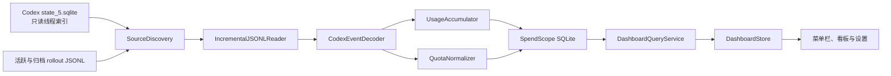

# SpendScope Codex 数据抓取设计

日期：2026-07-14

## 1. 目标

本设计定义 SpendScope 第一版真实数据抓取链路。实现完成后，菜单栏、菜单栏弹窗、详细看板和设置页直接消费本机 Codex 数据，不再以静态预览数据作为生产环境的数据来源。

第一版需要：

- 同时覆盖 Codex CLI 和当前 Codex Desktop 产生的本地会话数据。
- 统计今日、近 7 天、近 30 天和累计 Token。
- 按未缓存输入、缓存输入、可见输出和推理输出拆分 Token。
- 按时间、模型和产生时的套餐聚合。
- 展示 5 小时和 7 天额度剩余比例及重置时间。
- 在约 266 MB 的现有 rollout 数据规模下保持快速启动和低开销刷新。
- 全程只在本机读取、计算和保存统计数据。

费用、通知、导出和 Codex 之外的数据源不属于本次实现范围。

## 2. 已验证的本地数据格式

本设计基于 2026-07-14 对本机 Codex 数据结构的只读检查。检查过程只查看事件类型、字段名和统计值，没有读取对话正文或认证信息。

### 2.1 数据位置

标准 Codex 根目录为 `~/.codex`，当前可用数据包括：

- 活跃会话：`~/.codex/sessions/YYYY/MM/DD/rollout-*.jsonl`
- 归档会话：`~/.codex/archived_sessions/rollout-*.jsonl`
- 线程索引：`~/.codex/state_5.sqlite`

`state_5.sqlite` 中的 `threads` 表包含线程 ID、rollout 路径、来源、模型、更新时间和总 Token 等索引字段。它不包含完整的 Token 分类历史和额度快照，因此只能作为发现与校验的辅助索引，不能作为精细统计的唯一来源。

### 2.2 来源识别

CLI 和 Codex Desktop 当前共用 rollout JSONL 结构，通过 `session_meta` 区分来源：

- CLI 通常表现为 `source = "cli"`、`originator = "codex-tui"`。
- Codex Desktop 通常表现为 `source = "vscode"`、`originator = "Codex Desktop"`。
- 子代理线程的 `source` 可能是结构化对象，但 `originator` 仍可用于归属客户端。

SpendScope 将来源标准化为 `cli`、`desktop` 和 `unknown`。子代理实际消耗 Token，因此纳入统计，并按其 `originator` 归入 CLI 或 Desktop。

### 2.3 统计事件

抓取器只需要解析三类记录：

- `session_meta`：线程 ID、来源、格式版本和模型提供方。
- `turn_context`：当前轮次模型。
- `event_msg` 且 `payload.type = "token_count"`：累计 Token 和额度快照。

`token_count` 已验证包含：

- `info.total_token_usage.input_tokens`
- `info.total_token_usage.cached_input_tokens`
- `info.total_token_usage.output_tokens`
- `info.total_token_usage.reasoning_output_tokens`
- `info.total_token_usage.total_tokens`
- `rate_limits.plan_type`
- `rate_limits.primary` 与 `rate_limits.secondary` 的窗口、使用比例和重置时间

解码器只声明以上最小字段。Swift `Decodable` 自动忽略其他字段，确保 Prompt、回复、推理文本、工具调用和文件内容不会进入标准化模型。

## 3. 方案选择

### 3.1 不采用：刷新时全量扫描

本机活跃与归档 rollout 已约 266 MB，单文件最大约 63 MB。每 60 秒全量扫描会带来持续 CPU、磁盘和内存开销，数据量增长后启动时间也会线性变差。

### 3.2 不采用：只读取 Codex SQLite

`threads.tokens_used` 可快速获得线程总量，但无法可靠恢复 Token 分类、事件时间、轮次模型和历史额度。因此该方案无法驱动当前看板。

### 3.3 采用：索引辅助的增量 JSONL 导入

SpendScope 使用 Codex SQLite 辅助发现线程和 rollout 路径，以 rollout JSONL 作为统计事实来源，并将标准化结果增量写入应用自有 SQLite。



Codex SQLite 缺失或暂时不可读时，文件系统发现仍可继续工作；SQLite 是加速器，不是单点依赖。

## 4. 组件设计

### 4.1 `CodexRootLocator`

- 默认定位用户主目录下的 `~/.codex`。
- 验证根目录、sessions、archived_sessions 和 state 数据库的可读性。
- 返回结构化的发现结果，不因单个路径缺失而终止整个导入。
- 第一版不读取 `auth.json`、`history.jsonl`、配置中的凭证或任何网络数据。

### 4.2 `CodexThreadIndex`

- 使用 `sqlite3_open_v2` 的只读模式短暂打开 `state_5.sqlite`。
- 读取 `threads` 中的 ID、rollout 路径、source、model、created/updated 时间和 archived 状态。
- 设置短 `busy_timeout`，遇到 Codex 正在写入或格式不兼容时返回可恢复错误。
- 不执行迁移、PRAGMA 写操作或长事务，不持有持续连接。
- 数据库不可用时由文件系统扫描补充 rollout 清单。

### 4.3 `RolloutSourceDiscovery`

- 合并线程索引和两个 rollout 目录中的文件清单。
- 使用文件系统 device ID 与 inode 组成稳定文件身份，路径只作为可更新属性。
- 同一文件从 sessions 移动到 archived_sessions 时更新路径，不重新导入。
- 文件被复制、替换或恢复时，最终仍由事件指纹阻止重复计数。
- 初次导入按优先级排序：当天更新的线程、最新额度候选、其他历史线程。

### 4.4 `IncrementalJSONLReader`

- 按固定大小数据块读取，不一次性加载整个文件。
- 每个文件保存最后成功提交的换行符后字节偏移量。
- 文件末尾没有换行的半条 JSON 留到下一次刷新，不保存越过半条记录的检查点。
- 文件大小小于已保存偏移量时视为截断或替换，创建新的读取代次并从头验证。
- 文件身份变化但内容事件重复时，依靠标准化事件指纹保持幂等。
- 一批记录的业务数据和检查点必须在同一个 SpendScope SQLite 事务中提交。

### 4.5 `CodexEventDecoder`

解码器输出仅包含统计所需字段的内部事件：

```swift
enum CodexStatEvent {
    case session(SessionContext)
    case turn(TurnContext)
    case token(TokenCounterSnapshot)
}
```

未知顶层事件直接忽略。已知 `token_count` 事件如果缺少 Token 信息但仍有额度信息，只导入额度；反之亦然。字段类型发生不兼容变化时暂停对应文件，并在来源状态中显示格式错误，不猜测字段含义。

### 4.6 `UsageAccumulator`

rollout 中的 `total_token_usage` 是线程内累计快照，不能逐行直接相加。每个线程保存上一份累计计数：

```text
delta_input    = current.input    - previous.input
delta_cached   = current.cached   - previous.cached
delta_output   = current.output   - previous.output
delta_reasoning = current.reasoning - previous.reasoning
```

第一份有效累计快照相对零值计算。全零快照不生成用量事件。

若任一累计分量发生回退，则视为计数器进入新分段，当前累计值相对零值计算，不产生负增量。累计状态和文件检查点在同一事务中保存。

界面四类 Token 的标准化规则为：

```text
未缓存输入 = max(delta_input - delta_cached, 0)
缓存输入   = max(delta_cached, 0)
可见输出   = max(delta_output - delta_reasoning, 0)
推理输出   = max(delta_reasoning, 0)
总量       = 未缓存输入 + 缓存输入 + 可见输出 + 推理输出
```

已观察到个别初始事件的 `last_token_usage.total_tokens` 与分类分量不一致，因此统计不依赖 `last_token_usage.total_tokens`；它仅可用于诊断，不能进入聚合。

### 4.7 模型解析

- 使用 Token 快照之前最近一条 `turn_context.model`。
- 缺失时使用线程索引中的 `threads.model`。
- 再缺失时保存为 `Unknown Model`。
- 累计计数跨模型切换时，将两个累计快照之间的增量归属到当前 Token 快照对应的模型。

### 4.8 套餐解析

- 优先使用同一 `token_count` 中明确的 `rate_limits.plan_type`。
- 原始字符串原样保存，同时保存标准化展示值。
- 已识别值包括 `free`、`plus` 和 `prolite`，分别展示为 Free、Plus 和 Pro Lite。
- 后续只有明确匹配的套餐值才增加映射；无法确认的值按产品规则归为 Free，并将 `plan_is_inferred` 标记为 true。
- 用量归属到事件产生时的套餐，当前套餐改变不重写历史数据。

### 4.9 额度解析

额度窗口按 `window_minutes` 识别，不依赖 primary 或 secondary 的位置：

- 300 分钟：5 小时额度。
- 10080 分钟：7 天额度。
- 其他窗口保留原始快照，但第一版不在两个额度环中展示。

数据源提供的是已用百分比，标准化后：

```text
remaining = clamp(1 - used_percent / 100, 0, 1)
```

`resets_at` 按 Unix 时间保存。每个窗口查询最新观测快照；若重置时间已过且没有新快照，状态为“等待 Codex 刷新”，不得自动显示 100%。

当前套餐取所有受支持额度快照中观测时间最新且套餐明确的一条；不存在明确套餐时使用推断 Free。

## 5. 标准化数据模型

所有 Token 使用 `Int64`，所有时间以 Unix 毫秒 UTC 保存，查询周期时再按 macOS 当前日历和时区计算边界。

### 5.1 `usage_events`

| 字段 | 含义 |
| --- | --- |
| `fingerprint` | 稳定事件指纹，主键 |
| `observed_at_ms` | Token 快照时间 |
| `thread_id` | Codex 线程 ID |
| `source_kind` | cli、desktop 或 unknown |
| `model` | 标准化模型名 |
| `plan` | 标准化套餐 |
| `plan_raw` | 原始套餐值 |
| `plan_is_inferred` | 是否为回退推断 |
| `uncached_input_tokens` | 未缓存输入增量 |
| `cached_input_tokens` | 缓存输入增量 |
| `visible_output_tokens` | 排除推理后的输出增量 |
| `reasoning_tokens` | 推理增量 |
| `total_tokens` | 四类增量之和 |
| `source_file_id` | 来源文件身份 |
| `source_offset` | 记录结束偏移量 |

事件指纹由线程 ID、事件时间、累计计数、计数器分段和事件类型生成。模型和套餐不作为唯一性基础，避免上下文补全变化导致同一 Token 快照重复。

### 5.2 `hourly_usage`

按本地小时、模型和套餐聚合四类 Token。插入新的 `usage_events` 后在同一事务内执行 upsert；事件指纹冲突时不更新聚合。

### 5.3 `quota_snapshots`

保存观测时间、线程 ID、窗口分钟数、已用比例、剩余比例、重置时间、原始与标准化套餐、推断标志和来源。使用稳定指纹去重。

### 5.4 `source_files`

保存 device ID、inode、当前路径、文件大小、已提交偏移量、读取代次、格式状态、最后成功时间和最后错误。

### 5.5 `thread_checkpoints`

保存线程当前模型、上一份四类累计计数、计数器分段和最后 Token 事件时间，用于应用重启后的增量计算。

### 5.6 `source_status`

保存 CLI、Desktop 和线程索引的检测状态、最后成功刷新时间、格式版本、已处理文件数及可展示错误，供设置页使用。

## 6. 查询与页面接入

### 6.1 `DashboardQueryService`

从 SpendScope SQLite 生成现有 `DashboardSnapshot`：

- 今日：本地当天零点至当前时间。
- 7 日：包含今天在内的最近 7 个本地自然日。
- 30 日：包含今天在内的最近 30 个本地自然日。
- 累计：全部已导入事件。
- 趋势：按本地自然日汇总。
- 模型：按当前趋势范围统计 Token 总量及占比。
- 额度：分别选择 300 与 10080 分钟窗口的最新可信快照。

系统时区变化时，基于 UTC 原始事件重新生成受影响的日聚合，避免历史日期错位。

### 6.2 `DashboardStore`

`DashboardStore` 运行在 Main Actor，向 SwiftUI 发布：

```swift
enum DashboardLoadState {
    case loading
    case loaded(DashboardSnapshot)
    case empty(SourceSummary)
    case stale(DashboardSnapshot, SourceIssue)
    case failed(SourceIssue)
    case unsupported(SourceIssue)
}
```

导入和数据库查询在后台 actor 中执行，主线程只接收最终快照。菜单栏、弹窗、看板和设置页共享同一个 store，手动刷新也调用同一条幂等导入链路。

生产环境没有真实数据时显示空状态或错误状态，不回退成静态数字。`DashboardSnapshot.preview` 只保留给 SwiftUI Preview 和单元测试。

### 6.3 启动和刷新顺序

1. 打开 SpendScope 自有数据库并执行迁移。
2. 立即查询上次成功导入的快照；存在时先展示并标注刷新中。
3. 发现 Codex 数据源。
4. 优先导入当天更新的文件和最新额度候选。
5. 发布首份真实快照。
6. 后台补齐未导入历史。
7. 历史导入完成后再次发布快照。
8. 默认每 60 秒执行一次增量刷新；手动刷新复用同一流程。

同一时刻只允许一个导入任务。新的自动刷新请求在已有任务运行时合并，不并发扫描相同文件。

## 7. 失败与兼容策略

- Codex 根目录不存在：显示“未检测到 Codex 数据”。
- 单个 rollout 不可读：保留其他来源和上次数据，记录该文件错误。
- JSON 尾行未完成：等待下一次刷新，不视为错误。
- 单行 JSON 损坏：暂停该文件在损坏偏移量之后的导入，避免越过未知数据导致累计状态错误。
- Codex SQLite 被锁：短暂重试后退回文件发现，不阻塞 Codex。
- 未知事件：忽略。
- 已知统计事件结构不兼容：将来源标记为 unsupported，保留已导入数据。
- SpendScope SQLite 事务失败：回滚业务数据、累计状态和文件检查点。
- 模型缺失：使用 `Unknown Model`。
- 套餐缺失或无法确认：使用推断 Free。

## 8. 隐私与文件访问

- Codex 文件和数据库始终只读。
- SpendScope 不读取 `auth.json`，不需要 OpenAI 登录态。
- 不保存 Prompt、回复、摘要、推理文本、工具调用参数、文件内容或工作目录内容。
- 应用数据库位于用户的 Application Support/SpendScope 目录。
- 第一版继续采用非 Mac App Store 分发路径，以便在用户授权的本机账户范围内自动读取 `~/.codex`。
- 诊断信息只包含路径可读性、格式版本、偏移量、计数和错误类型，不包含对话载荷。

## 9. 测试设计

测试数据全部使用手写的最小匿名 JSONL，不复制真实对话记录。

### 9.1 解码测试

- CLI、Desktop 和子代理 `session_meta` 来源识别。
- `turn_context` 模型切换。
- token_count 同时包含 Token 和双额度窗口。
- 只有 Token、只有额度、字段缺失及额外未知字段。

### 9.2 计数测试

- 多个累计快照转换为正确增量。
- 未缓存输入与缓存输入拆分。
- 可见输出与推理输出拆分。
- 首个零快照不产生事件。
- 累计计数回退后开启新分段。
- 模型切换时增量归属正确。
- 缺失套餐回退为推断 Free。

### 9.3 增量读取测试

- 从字节偏移量继续读取。
- 半行跨两次刷新。
- 文件追加、截断、替换和移动到归档目录。
- 同一事件从不同文件身份重放时不重复计数。
- 数据事务失败时不推进检查点。

### 9.4 查询与页面状态测试

- 今日、7 日、30 日和累计边界。
- 四类 Token 合计始终等于总量。
- 模型占比与当前时间范围一致。
- 额度按窗口分钟数而非 primary/secondary 顺序匹配。
- loading、loaded、empty、stale、failed 和 unsupported 状态转换。

### 9.5 性能测试

- 使用生成式匿名大文件验证流式读取不会一次加载全部内容。
- 验证第二次无新增刷新只读取文件元数据，不重新解析历史。
- 验证后台历史导入不阻塞 Main Actor 和菜单栏交互。

## 10. 验收标准

- 首次启动后直接展示本机真实 Codex 数据，不出现静态预览数值。
- CLI 与当前 Codex Desktop 的用户线程和子代理用量均可识别。
- 重复刷新、应用重启和会话归档不会改变既有总量。
- 新增 token_count 在下一次 60 秒刷新内进入看板。
- 今日、7 日、30 日、累计和趋势的四类 Token 内部一致。
- 模型归属与事件当时的 turn_context 一致。
- 套餐明确时正确区分，无法确认时显示推断 Free。
- 5 小时与 7 天额度按窗口时长正确匹配，并展示真实重置时间。
- 读取异常不会修改 Codex 数据，也不会破坏上一次有效看板。
- SpendScope SQLite 中不包含任何对话或认证载荷。

## 11. 实现顺序

1. 建立匿名 fixture、最小事件模型和解码器。
2. 实现累计计数转增量、模型/套餐/额度标准化。
3. 接入 SQLite、迁移、事件去重和查询。
4. 实现来源发现、线程索引和增量 JSONL reader。
5. 建立后台导入 actor 与 DashboardStore。
6. 将菜单栏、详细看板和设置页切换到真实状态。
7. 完成错误状态、手动刷新、60 秒刷新和大文件验证。
